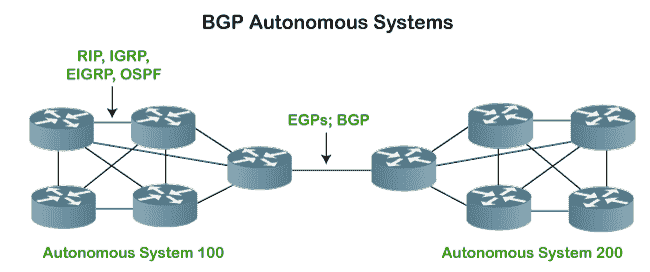
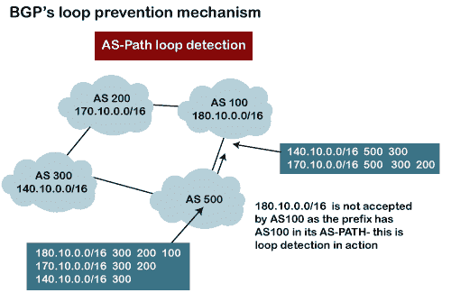
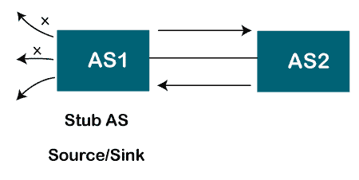
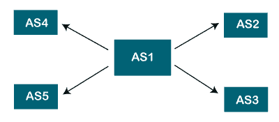
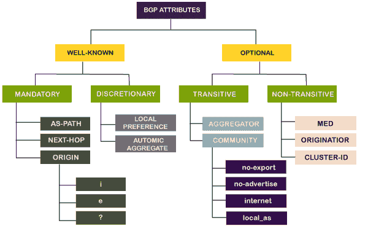

# 边界网关协议

> 原文：<https://www.javatpoint.com/border-gateway-protocol>

它是一种域间路由协议，使用路径矢量路由。它是一种网关协议，用于在互联网上的自治系统之间交换路由信息。

因为我们知道边界网关协议在不同的自治系统上工作，所以我们应该知道 BGP 的历史、自治系统的类型等。

### BGP 的历史

第一个网络是美国国防部开发的 ARPANET，由高级研究计划局设计。在 Arpanet 中，只存在一个网络，由单一管理员处理。所有路由器都是单个网络的一部分，路由是在 GGP(网关到网关路由协议)的帮助下进行的。GGP 协议是所有路由协议中的第一个协议。GGP 协议中没有使用自治系统编号。

当互联网进入市场时，GGP 开始制造问题。随着互联网主干网变大，路由表也随之变大，这就导致了维护问题。为了解决这个问题，阿帕网被分成多个域，称为自治系统。每个自治系统都可以单独处理，每个系统都有自己的路由策略，自治系统包含小型路由数据库。当自治系统的概念被实现时，第一个路由协议被称为 RIP，它运行在单个自治系统上。为了将一个自治系统与另一个自治系统连接起来，开发了 EGP(外部网关协议)协议。EGP 协议于 1984 年启动，在 RFC 904 中进行了定义。EGP 协议使用了五年，但它有某些缺陷，因此在 1989 年开发了被称为边界网关协议(BGP)的新协议，该协议在 RFC 1105 中进行了定义。

BGP 有许多版本，例如:

*   BGP 版本 1:该版本于 1989 年发布，在 RFC 1105 中进行了定义。
*   BGP 版本 2:在 RFC 1163 中定义。
*   BGP 版本 3:在 RFC 1267 中定义。
*   BGP 版本 4:是 RFC 1771 中定义的 BGP 的当前版本。

### 自治系统



自治系统是单一公共管理域下的网络集合。或者我们可以说它是单一管理域下的路由器集合。例如，一个组织可以包含多个具有不同位置的路由器，但是单个自治号码系统会识别它们。在同一个自治系统或组织中，我们通常使用像 RIP、IGRP、EIGRP、OSPF 这样的 IGP(内部网关协议)协议。假设我们想在两个自治系统之间进行通信。在这种情况下，我们使用 EGP(外部网关协议)。运行在互联网上或用于在两个不同的自治号码系统之间通信的协议被称为边界网关协议。BGP 是唯一运行在互联网主干网上或用于在两个不同的自治号码系统之间交换路由的协议。互联网服务提供商使用 BGP 协议来控制所有的路由信息。

### BGP 特性

**以下是 BGP 协议的特征:**

*   **开启标准**

这是一个标准协议，可以在任何窗口设备上运行。

*   **外部网关协议**

它是一种外部网关协议，用于在两个或多个自治系统号码之间交换路由信息。

*   **域间路由**

它是专门为域间路由设计的，其中域间路由意味着在两个或多个自治号码系统之间交换路由信息。

*   **支持互联网**

它是唯一在互联网主干网上运行的协议。

*   **无类**

这是一个无类协议。

*   **增量和触发更新**

和 IGP 一样，BGP 也支持增量和触发更新。

*   **路径矢量协议**

BGP 是一种路径矢量协议。这里，路径向量是一种发送路由和路由信息的方法。

*   **配置邻域关系**

它发送更新来手动配置邻居关系。假设有两台路由器 R1 和 R2。然后，R1 必须发送配置命令，说你是我的邻居。另一方面，R2 也不得不向 R1 发送 configure 命令，称 R1 是 R1 的邻国。如果两个配置命令都匹配，那么这两台路由器之间的邻居关系将会发展。

*   **应用层协议**

它是一个应用层协议，使用 TCP 协议来保证可靠性。

*   **公制**

它有很多属性，如权重属性、来源等。BGP 支持非常丰富的属性，可以影响路径操作过程。

*   **行政距离**

如果信息来自外部自治系统，则它使用 20 个管理距离。如果信息来自同一个自治系统，那么它使用 200 个管理距离。

### BGP 的环路防止机制



有一种可能性是，当你连接到互联网时，你可能会将路由 10.0.0.0 广告到某个自治系统，然后再将它广告到某个其他自治系统。那么有可能同样的路线又回来了。这就形成了一个循环。但是，在 BGP 中，有一个规则，当路由器看到自己的 AS 号时，比如上图所示，网络 180.10.0.0/16 是从 AS 100 发起的，当它发送到 AS 200 时，会携带自己的路径信息，即 180.10.0.0/16 和 AS 100。当 AS 200 发送到 AS 300 时，AS 200 将发送其路径信息 180.10.0.0/16，AS 路径为 100，然后是 200，这意味着路由从 AS 100 开始，然后到达 200，最后到达 300。当 AS 300 发送到 AS 500 时，会发送网络信息 180.10.0.0/16，AS 路径为 100，200，然后是 300。如果 AS 500 发送给 AS 100，而 AS 100 在更新中看到了自己的自主号，它将不会接受。这样，BGP 防止了循环的产生。

### 自治系统的类型

**以下是自治系统的类型:**

*   **Stub 自治系统**



它是一个只包含一个从一个自治系统到另一个自治系统的连接的系统。数据流量不能通过存根自治系统。存根组件可以是源，也可以是宿。如果我们有一个自治系统，即 AS1，那么它将与另一个自治系统 AS2 有一个单一的连接。AS1 既可以作为源，也可以作为宿。如果它充当源，那么数据将从 AS1 移动到 AS2。如果 AS1 充当接收器，意味着数据在来自 AS2 的 AS1 中被消耗，但数据不会从 AS1 向前移动。

*   **多宿主自治系统**


它是一个自治系统，可以与另一个自治系统有多个连接，但它仍然可以是数据流量的源或宿。没有瞬时数据流量，这意味着数据可以从一个自治系统中传递。

*   **暂态自治系统**



瞬态自治系统是一个多宿主自治系统，但它也提供瞬态流量。

### 路径属性

BGP 根据路径的属性选择最佳路由。

我们知道，路径矢量路由用于边界网关路由协议，它包含显示路径信息的路由表。路径属性提供路径信息。显示或存储路径信息的属性称为路径属性。该属性列表有助于接收路由器在应用任何策略时做出更好的决定。让我们看看不同类型的属性。路径属性大致分为两类:



**1。知名属性:**是每个 BGP 路由器都应该识别的属性。

众所周知的属性进一步分为两类:

*   **众所周知的强制:**当 BGP 打算通告任何网络，但它也通告额外的信息，并且那个信息带有路径属性信息。该信息包括 AS 路径信息、起点信息、下一跳信息。这里，强制意味着它必须出现在所有的 BGP 路由更新中。
*   **知名自主:**被所有 BGP 路由器识别，并传递给其他 BGP 路由器，但不强制出现在更新中。

**2。可选属性:**不一定每个 BGP 路由器都能识别的属性。简而言之，我们可以说它不是一个强制属性。

可选属性进一步分为两类:

*   **可选传递:** BGP 可以识别也可以不识别这个属性，但是会传递给其他 BGP 邻居。这里，传递意味着如果属性不被识别，那么它被标记为部分。
*   **可选不可传递:**如果 BGP 无法识别属性，则忽略更新，不会通告给另一个 BGP 路由器。

### BGP 邻居

BGP 邻国关系与 OSPF 邻国关系相似，但差别不大。BGP 借助端口号 179 上的 [TCP](https://www.javatpoint.com/tcp) 连接形成相邻关系，然后交换 BGP 更新。它们在形成邻居关系后交换更新。在 BGP 中，邻居关系是手动配置的。BGP 邻居也被称为 BGP 对等体或 BGP 扬声器。

**邻居关系有两种类型:**

*   IBGP(内部 BGP):如果所有路由器都是彼此的邻居，并且属于同一个自治号码系统，则这些路由器被称为 IBGP。


*   EBGP(外部 BGP):如果所有路由器都是彼此的邻居，并且它们属于不同的自治号码系统，那么这些路由器被称为 EBGP。


### BGP 表格

**BGP 表有三种类型:**

*   **邻居表:**包含管理员手动配置的邻居。必须使用邻居命令手动配置邻居关系。

为了进行验证，使用了以下命令:

```

#show ip bgp summary
# show ip bgp neighbors

```

以上命令对于验证邻居关系是否正常非常有用。

*   **BGP 转发表:**它包含 BGP 中通告的所有路由，可以使用以下命令进行验证:

```

# show ip bgp

```

*   **IP 路由表:**IP 路由表包含到达目的地所需的最佳路径路由。以下命令显示了最佳路由路径:

```

#SH ip route

```

### 边界网关协议会话

当我们谈论 BGP 时，这意味着自治系统之间的通信。让我们考虑两个自治系统，每个系统有五个节点。

**BGP 会话分为两类:**

**1。内部整编会议**

内部 BGP 会话用于在自治系统内部的路由器之间交换信息。简而言之，我们可以说路由信息是在同一自治系统的路由器之间交换的。

**2。外部 BGP 会话**

外部 BGP 会话是不同自治系统的节点或路由器相互通信的会话。

### 数据包类型

**BGP 中存在四种不同类型的数据包:**

*   **Open:** 当路由器想要与另一台路由器建立邻居关系时，它会发送 Open 数据包。
*   **更新:**更新包可用于以下两种情况:

1.  它可以用来撤回目的地，这个目的地之前已经公布过了。
2.  它还可以用来宣布到达新目的地的路线。

*   **保持活动:**保持活动数据包会定期交换，以告知其他路由器是否活动。例如，有两台路由器，即 R1 和 R2。R1 向 R2 发送保持活动数据包，而 R2 向 R1 发送保持活动数据包，这样 R1 可以知道 R2 还活着，R2 可以知道 R1 还活着。
*   **通知:**当路由器检测到错误情况或关闭连接时，发送通知数据包。

### 数据包格式

**现在我们将看到数据包传输的格式。以下是 BGP 数据包格式中的字段:**


1.  **标记:**这是一个 32 位字段，用于身份验证目的。
2.  **长度:**它是一个 16 位字段，定义了消息的总长度，包括报头。
3.  **类型:**这是一个 8 位字段，用于定义数据包的类型。

* * *