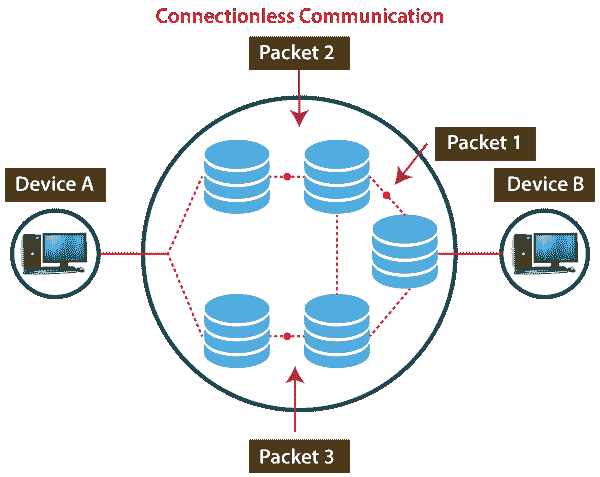

# 面向连接和无连接服务的区别

> 原文：<https://www.javatpoint.com/connection-oriented-vs-connectionless-service>

数据通信是通过相同或不同的网络在两台或多台计算机之间发送和接收数据的电信网络。在将数据从一台设备发送到另一台设备之前，有两种方法可以建立连接，即**面向连接的**和**无连接服务**。面向连接的服务包括创建和终止连接，以便在两个或多个设备之间发送数据。相比之下，无连接服务不需要建立任何连接和终止过程来通过网络传输数据。

## 面向连接的服务

面向连接的服务是在电话系统之后设计和开发的网络服务。面向连接的服务用于在相同或不同的网络上传输数据之前，在发送方和接收方之间创建端到端的连接。在面向连接的服务中，数据包按照发送方发送的顺序发送给接收方。它使用握手方法，在用户和发送方之间建立连接，以便通过网络传输数据。因此，它也被称为可靠的网络服务。

假设，发送方想要向接收方发送数据。然后，首先，发送方以 **SYN** 包的形式向接收方发送请求包。之后，接收者用一个(同步确认)信号/数据包来响应发送者的请求。它表示接收方收到确认，开始发送方和接收方之间的通信。现在，发送者可以将消息或数据发送给接收者。

类似地，接收者可以响应或将数据以数据包的形式发送给发送者。成功交换或传输数据后，发送方可以通过向接收方发送信号来终止连接。这样，我们可以说它是一个可靠的网络服务。

### 什么是 TCP？

[TCP(传输控制协议)](https://www.javatpoint.com/tcp)是一种面向连接的协议，通过在相同或不同的网络中建立连接，允许两个或多个计算机设备之间进行通信。使用**互联网协议**将数据从一端传输到另一端是最重要的协议。因此，它有时被称为 TCP/IP。它确保建立并保持连接，直到数据包在发送方和接收方之间传输完成。

## 无连接服务

连接类似于**邮政系统**，在这种系统中，每封信都沿着不同的路径从源地址到达目的地地址。无连接服务在网络系统中用于在不创建任何连接的情况下将数据从一端传输到另一端。因此，在将数据从发送方发送到接收方之前，不需要建立连接。它不是一种可靠的网络服务，因为它不能保证数据包传输到接收器，并且数据包可以以任何顺序接收到接收器。因此，我们可以说数据包没有遵循**定义的**路径。在无连接服务中，由于网络拥塞，发送的数据包没有被接收方接收，数据可能会丢失。

例如，发送方可以直接向接收方发送任何数据，而无需建立任何连接，因为这是一种无连接服务。发送方发送的数据将包含在包含接收方地址的数据包或数据流中。在无连接服务中，数据可以以任何顺序传输和接收。但是，它不能保证将数据包传输到正确的目的地。

### 什么是 UDP？

[UDP(用户数据报协议)](https://www.javatpoint.com/udp-protocol)是一种无连接协议，允许两个或多个设备之间在不建立任何连接的情况下进行通信。在该协议中，发送方将数据包发送给持有目的地址的接收方。UDP 不能确保将数据包传送到正确的目的地，也不会生成任何关于发送方数据的确认。同样，它不会向接收方确认数据。因此，这是一个不可靠的协议。

## 面向连接与无连接服务

| 南不 | 比较参数 | 面向连接的服务 | 无连接服务 |
| 1. | 相关系统 | 它是基于电话系统设计开发的。 | 它是基于邮政系统的服务。 |
| 2. | 定义 | 它用于在相同或不同的网络上传输数据之前，在发送者和接收者之间建立端到端的连接。 | 它用于在发送方与接收方之间传输数据包，而不创建任何连接。 |
| 3. | 虚拟路径 | 它在发送方和接收方之间创建了一个虚拟路径。 | 它不会在发送方和接收方之间创建任何虚拟连接或路径。 |
| 4. | 证明 | 在将数据包传输到接收器之前，它需要进行身份验证。 | 它在传输数据包之前不需要身份验证。 |
| 5. | 数据包路径 | 所有数据包的接收顺序与发送方发送的顺序相同。 | 并非所有数据包的接收顺序都与发送方发送的顺序相同。 |
| 6. | 带宽要求 | 传输数据包需要更高的带宽。 | 传输数据包需要低带宽。 |
| 7. | 数据可靠性 | 这是一种更可靠的连接服务，因为它通过连接保证数据包从一端传输到另一端。 | 它不是一种可靠的连接服务，因为它不能保证数据包从一端传输到另一端以建立连接。 |
| 8. | 拥挤 | 没有拥塞，因为它在数据传输期间提供了发送方和接收方之间的端到端连接。 | 由于没有在发送数据包的源和接收器之间提供端到端连接，可能会出现拥塞。 |
| 9. | 例子 | 传输控制协议是面向连接服务的一个例子。 | 用户数据报协议、互联网协议和互联网控制消息协议都是无连接服务的例子。 |

* * *