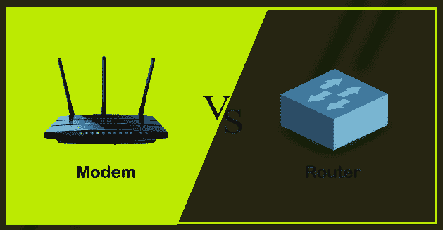
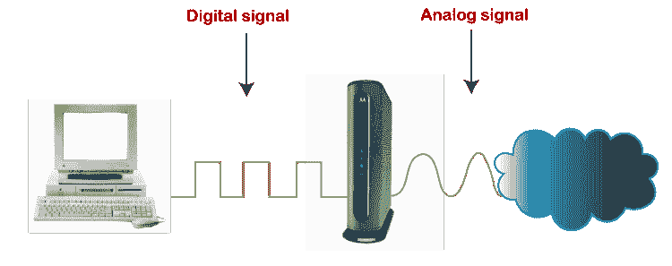
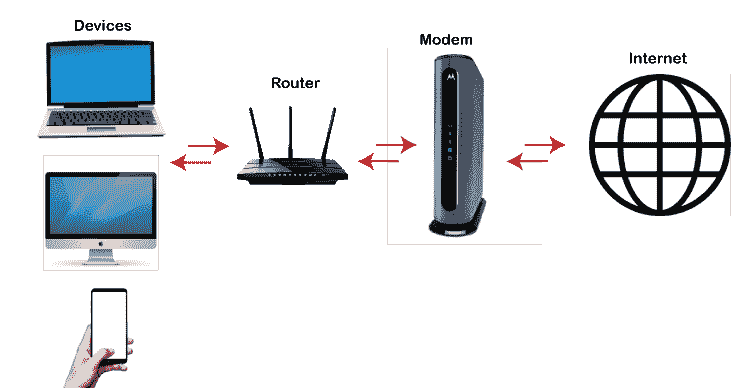

# 调制解调器与路由器|调制解调器与路由器的区别

> 原文：<https://www.javatpoint.com/modem-vs-router>

调制解调器是一种将家庭/办公室网络直接连接到互联网的盒式设备。路由器也是一种箱式设备，可使多个计算机系统(有线或无线)同时使用互联网。如今，这两种设备都是集成的，通常在我们采取新的互联网计划时由 [ISP(互联网服务提供商)](https://www.javatpoint.com/isp-full-form)提供。但是要为我们的家庭/办公室网络获得互联网连接，我们需要集成或独立的调制解调器和路由器。尽管大多数时候人们会对这两种设备感到困惑，但这两种设备在网络中有两种不同的角色，我们将在本主题中了解这一点。在本主题中，我们将了解调制解调器和路由器之间的区别，但在了解主要区别之前，我们将首先了解什么是调制解调器和路由器、它们的功能、它们的工作原理以及是什么功能使它们不同。

## 什么是调制解调器？

*   *调制解调器是调制或解调信号的设备。*它与互联网服务提供商保持专用连接，为家庭或企业提供互联网连接。
    T3】
*   它充当互联网/电话线和计算机之间的桥梁。
*   使用调制解调器进行互联网连接的原因是互联网和计算机接收两种不同的信号。它意味着互联网发送模拟信号，但计算机系统只能理解数字信号。因此，我们需要一种能将模拟信号转换成数字信号的设备，反之亦然。为此，我们需要一个调制解调器。
*   它将从互联网传入的模拟信号调制成数字信号，并将其导向计算机，反之亦然。
*   通常，只有当我们采取新的互联网计划时，我们才会从互联网服务提供商那里获得调制解调器。
*   它还执行数据压缩、纠错和控制信息流。它通过将数据分组并一次性发送来加快数据传输的过程。

## 调制解调器是如何工作的？

到目前为止，您一定已经了解调制解调器负责调制和解调信号。调制解调器的工作原理基于相同的过程。

调制解调器位于电话线和计算机系统或路由器之间。它用给定的以太网端口连接设备。它将 ISP(互联网服务提供商)直接连接到单个 PC 的家庭网络。或者与路由器连接，连接多台设备。

下图是将来自电话线/光纤的输入模拟信号转换成数字信号并将其发送到电脑。没有调制解调器，我们无法连接到互联网。

## 调制解调器的类型

根据数据传输和安装方式，调制解调器可以是各种类型。这些类型如下所示:

### 1.外部调制解调器:

*   外部调制解调器通过串行电缆连接到计算机系统外部。
*   安装非常容易，并且它还提供了高数据传输速率。
*   它价格昂贵，但由于其在办公室的高速数据传输，仍在使用，主要是为了避免网络连接中断。

### 2.内部调制解调器:

*   顾名思义，内置调制解调器安装在电脑主板上，称为内置调制解调器。
*   它看起来像一个电子电路，安装在主板的扩展槽中。
*   安装复杂，数据传输速度也慢；因此，它被用于家庭和/或小空间中的专用计算机。

### 3.无线调制解调器

*   无线调制解调器无需任何电缆就能连接到计算机系统，大多数人将这些调制解调器用于个人用途。
*   这些调制解调器使用无线电频率通过空中传输数据，并提供良好的传输速度。

### 4.拨号调制解调器

*   拨号调制解调器通过使用常规电话线将 ISP 连接到计算机来建立互联网连接。
*   它使用 PSTN 设施(公共交换电话网)，传输速度为**56kb/秒**。

### 5.有线通

*   电缆调制解调器被称为宽带设备，因为它允许计算机通过陆线连接与互联网服务提供商通信。
*   它使用同轴电缆与固定电话连接，并使用以太网与计算机连接。

### 6.宽带调制解调器

*   DSL 代表**数字用户线路**，允许通过普通电话线传输数据。
*   它提供了高数据传输速度，因此广泛用于办公室/家庭。
*   它可用于连接到计算机或路由器，通过以太网端口或 USB 端口提供互联网连接。
*   DSL 调制解调器有两种类型:
    *   **ADSL 调制解调器**
    *   **SDSL 调制解调器**

### 7.卫星调制解调器

*   卫星调制解调器是昂贵的调制解调器，不需要任何互联网电话连接。
*   它使用卫星技术发送或接收数据。
*   调制解调器的速度相对比 DSL 或电缆调制解调器慢。

### 8.半双工调制解调器

*   顾名思义，它允许一次只向一个方向传输数据。
*   意思是如果它是从一端接收信号，那时候，它就会在另一端停止接收信号。一旦一端的传输完成，那么只有另一端可以传输数据。

### 9.全双工调制解调器

*   全双工调制解调器可以同时从两端传输数据。

*   这意味着它可以同时从一端和另一端接收数据，没有任何中断。

### 10.四线调制解调器

*   它将输入和输出数据载体的线对分开。
*   通过这种分离，它可以在两端传输相同的频率。

### 11.双线调制解调器

*   它使用一对电线，因此被称为双线调制解调器。只有这两条线用于输入和输出载波。

## 调制解调器的功能

调制解调器主要执行两种功能，如下所示:

*   调制和解调电信号从模拟到数字和数字到模拟。
*   提供安全连接，防止线路过载和其他连接问题。

## 调制解调器的优点

*   调制解调器使我们能够使用互联网连接来连接整个世界。
*   速度取决于调制解调器的成本。

## 什么是路由器？

顾名思义，[路由器](https://www.javatpoint.com/router)是一种网络设备，负责通过网络将数据包从源路由到目的地。 ***它将互联网连接从调制解调器分发或路由到所有有线或无线网络设备，如电脑、笔记本电脑、手机、平板电脑等。*** 它还支持多个设备通过同一网络相互通信。

早期，家里只有单一的计算机系统。如今，多台设备需要互联网才能工作，因此，为了向家庭/办公室内的所有可用设备提供互联网连接，我们需要路由器。

路由器主要有两种类型；**有线和无线。**

在有线路由器中，我们需要一根以太网电缆与之连接，以实现[互联网](https://www.javatpoint.com/internet)连接。然而，在无线路由器中，我们不需要任何电缆，在无线网络技术的帮助下，我们可以用它连接我们的网络设备。

它还为我们提供了安全功能，并使我们的设备在给定的网络上免受任何威胁。

## 路由器是如何工作的？

*   路由器首先将调制解调器连接到其他设备，以允许这些设备与互联网之间的通信。
*   路由器将具有定义的 IP 地址的数据包从一个网络路由/传输到另一个网络或网络内。它通过在互联网上为每台设备提供一个本地 IP 地址来做到这一点；它确保正确的目的地，以便数据到达正确的位置，而不是在网络中丢失。
*   它找出最佳和最快的路径，然后将数据包从该路径发送到网络设备。
*   它的工作原理类似于具有定义地址的投递包，因此它只能到达正确的收件人。

## 路由器的功能

*   路由器的主要功能是保持网络正常运行。
*   为此，他们连接计算机和其他网络设备，如移动设备、平板电脑、打印机等。，互相交流。

## 路由器的类型

路由器有不同的类型；下面给出了一些流行的类型:

### 1.无线路由器

*   无线路由器是办公室和家庭中最常用的路由器，因为它们不需要任何电线或电缆来连接网络设备。
*   它提供了一个安全的连接，只有经过身份验证的用户才能使用 id & password 访问网络。
*   它可以被指定范围内的 n 个用户访问。

### 2.有线路由器/宽带路由器

*   顾名思义，它需要电线或电缆来连接网络设备。
*   这种路由器主要用于学校或小型办公室，通过以太网电缆连接电脑。
*   它还有一个无线接入点，手机可以使用网络电话技术连接到它。
*   它连接到 ADSL 调制解调器，从调制解调器获取传输数据，并将其分发到另一个网络。

### 3.边缘路由器

*   边缘路由器可以是有线/无线类型，在两个或多个网络之间传输数据包，而不是在一个网络内。
*   这些路由器位于网络的边缘，因此称为边缘路由器，并与互联网服务提供商或组织中的另一个网络连接。
*   边缘路由器的主要任务是保持网络之间的通信畅通。

### 4.核心路由器

*   核心路由器也是有线/无线路由器，它们在网络内分发数据包，而不是在两个网络之间分发。
*   它们被设计成网络的主干，并允许大量的数据传输。

### 5.虚拟路由器

*   该软件允许计算机和服务器像路由器一样运行，并共享类似于物理路由器的数据包。
*   这些比物理更灵活，因为它们可以根据业务需求进行扩展。

## 路由器的优势

*   无线路由器最常用于使大多数网络设备能够随时轻松连接，而无需担心一堆电线。
*   它可以连接不同架构的网络，如以太网电缆、无线网络或无线局域网。
*   它通过密码保护提供高度安全的网络访问。
*   它借助碰撞功能减少了网络流量。
*   它使用路由表和智能信息，以最佳路由将数据包发送到正确的目的地。

## 调制解调器和路由器之间的差异图

| 因素 | 调制解调器 | 路由器 |
| **定义** | 调制解调器是一种对电信号进行调制和解调，并在互联网和家庭/办公室网络之间保持专用连接的设备。 | 路由器是一种联网设备，可使多台设备连接到有线或无线网络。 |
| **OSI 模型的操作层。** | 它在现场视察模型的数据链路层工作。 | 它在现场视察模型的**物理、数据链路和网络**层工作。 |
| **它是如何工作的？** | 它的作用就像一个信号调制解调器，这意味着它将电信号调制成数字信号，并将其发送到个人电脑或计算机，将信号从数字解调成模拟，并将其发送到互联网。 | 它通过遵循路由表，将数据包从一个源路由到定义的目的地。它使多个网络设备能够通过给定的网络进行连接。 |
| **安全** | 调制解调器在没有任何认证的情况下传输数据；因此它是不安全的。 | 路由器通过密码提供完全的安全性，并在通过给定网络传输数据包之前检查每个数据包。 |
| **使用的电缆** | RJ45 用路由器连接，RJ11 用电话线连接。 | 使用 RJ45 电缆。 |
| **放置** | 调制解调器放置在电话线和计算机或路由器之间。 | 路由器位于调制解调器和其他网络设备之间。 |
| **互联网接入** | 有一个调制解调器接入互联网是很重要的，因为它将互联网服务提供商连接到我们的电脑。 | 我们不用路由器就能上网。 |
| **主要用途** | 它将请求的信息从互联网传送到计算机。 | 它将信息从调制解调器分发到给定的网络。 |
| **连接设备数量** | 它只能直接连接到一台设备，可以是个人电脑，也可以是路由器。 | 路由器可以使用以太网电缆或无线网络连接到多个网络设备。 |
| **港口** | 两个端口用于连接电话线/互联网服务提供商，一个用于路由器。 | 端口数量不等，最少可以有 **2 到 4 个端口。** |

## 结论

在对调制解调器和路由器进行了大量讨论后，我们可以得出结论，要在办公室/家庭中建立互联网连接，我们需要一个调制解调器，但它仅适用于单个网络设备。因此，为了将这些数据分发到其他网络设备，我们需要路由器。如今，两个设备以集成的形式结合在一起，这意味着调制解调器和路由器在一个设备中，因此我们不需要两个不同的设备。

* * *