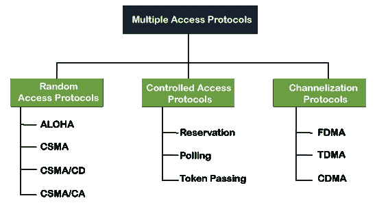
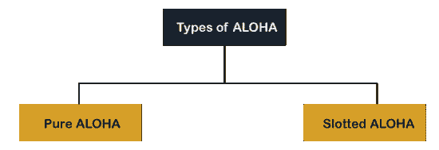
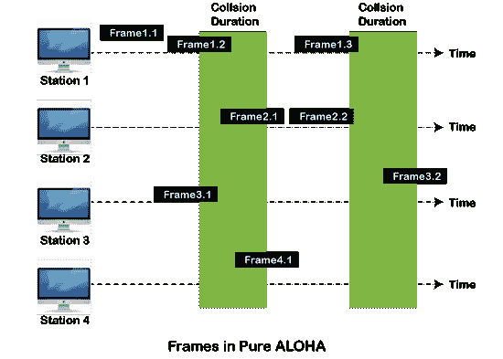
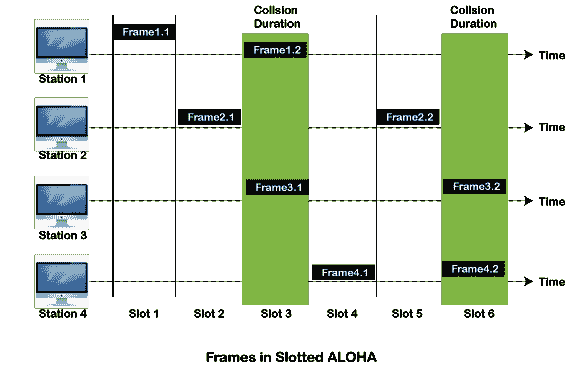
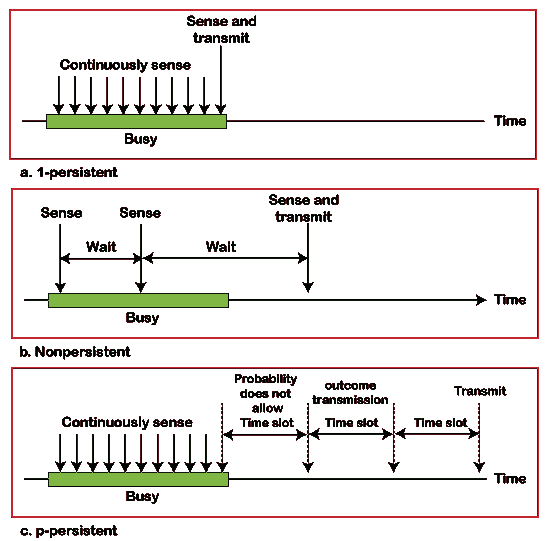
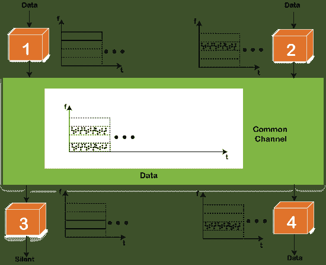

# 多址协议- ALOHA、CSMA、CSMA/加州和 CSMA/光盘

> 原文：<https://www.javatpoint.com/multiple-access-protocols>

## 数据链路层

[数据链路层](https://www.javatpoint.com/data-link-layer)用于计算机网络中，在两个设备或节点之间传输数据。它将该层划分为**数据链路控制**和**多址解析/协议**等部分。上层负责数据链路层的流量控制和错误控制，因此被称为数据链路层控制的**逻辑**。而较低的子层用于处理和减少信道上的冲突或多址接入。因此，它被称为 **[媒体访问控制](https://www.javatpoint.com/mac-full-form)** 或多重访问分辨率。

## 数据链路控制

A [数据链路控制](https://www.javatpoint.com/data-link-controls)是一个可靠的信道，用于在计算机网络中使用各种技术(如数据分组的成帧、错误控制和流量控制)在专用链路上传输数据。

## 什么是多路访问协议？

当发送方和接收方有专用链路来传输数据包时，数据链路控制足以处理信道。假设没有专用路径在两台设备之间通信或传输数据。在这种情况下，多个站接入信道，并通过信道同时传输数据。它可能会产生碰撞和串扰。因此，需要多址协议来减少冲突并避免信道之间的串扰。

例如，假设有一个教室挤满了学生。当老师提问时，班里所有的学生(小通道)同时开始回答问题(同时传输数据)。由于数据重叠或丢失，所有学生同时响应。因此，管理学生并让他们回答一个问题是教师(多址协议)的责任。

以下是可细分为不同进程的多址协议类型:

### A.随机接入协议

在这个协议中，所有的站都有同等的优先权通过信道发送数据。在随机接入协议中，一个或多个站不能依赖于另一个站，也不能由任何站控制另一个站。根据信道的状态(空闲或忙碌)，每个站发送数据帧。但是，如果多个站点通过一个信道发送数据，可能会发生冲突或数据冲突。由于冲突，数据帧数据包可能会丢失或更改。因此，它不被接收端接收。

以下是随机接入协议在信道上广播帧的不同方法。

*   欢迎
*   载波侦听多路访问(Carrier Sense Multiple Access)
*   CSMA/CD
*   csma/AC

### 随机接入协议

它是为无线局域网设计的，但也可以在共享介质中传输数据。使用这种方法，当数据帧集可供传输时，任何站点都可以通过网络同时传输数据。

**阿罗哈规则**

1.  任何站都可以在任何时间向一个信道传输数据。
2.  它不需要任何载波侦听。
3.  在通过多个站点传输数据的过程中，冲突和数据帧可能会丢失。
4.  阿罗哈存在对帧的确认。因此，没有冲突检测。
5.  它需要在一段随机的时间后重新传输数据。

**纯阿洛哈**

每当数据可以通过电台的频道发送时，我们就使用 Pure Aloha。在纯 Aloha 中，当每个站在不检查信道是否空闲的情况下向信道传输数据时，可能会发生冲突，数据帧可能会丢失。当任何一个站将数据帧发送到一个信道时，纯阿洛哈等待接收方的确认。如果在指定时间内没有确认接收端，基站会等待一段随机的时间，称为退避时间(Tb)。并且该站可以假设该帧已经丢失或被破坏。因此，它会重新传输帧，直到所有数据都成功传输到接收器。

1.  纯 Aloha 的总易损时间为 2 * Tfr。
2.  当 G = 1/ 2，即 18.4%时，吞吐量最大。
3.  数据帧的成功传输是 S = G * e ^ - 2 G

从上图中我们可以看到，有四个站点用于访问共享信道和传输数据帧。有些帧会发生冲突，因为大多数电台会同时发送帧。只有两个帧，帧 1.1 和帧 2.2，被成功发送到接收端。同时，其他帧会丢失或被破坏。每当两个帧同时落在一个共享信道上时，就会发生冲突，两者都会受到损害。如果新帧的第一位在完成第二帧的最后一位之前进入通道。两个帧都完成了，两个站都必须重新传输数据帧。

**开槽 Aloha**

开槽阿洛哈的设计是为了克服纯阿洛哈的效率，因为纯阿洛哈有很高的击中帧的可能性。在时隙 Aloha 中，共享信道被分成称为**时隙**的固定时间间隔。因此，如果一个站想要向共享信道发送帧，该帧只能在时隙的开始发送，并且每个时隙只允许发送一个帧。并且如果站不能发送数据到时隙的开始，则站将不得不等到下一次时隙的开始。然而，当试图在两个或更多站时隙的开始发送帧时，冲突的可能性仍然存在。

1.  当 G = 1，即 37%时，最大吞吐量出现在时隙 Aloha 中。
2.  在时隙 Aloha 中成功传输数据帧的概率是 S = G * e ^ - 2 G
3.  时隙 Aloha 中所需的总易受攻击时间为 Tfr。

### CSMA(载波侦听多路访问)

它是一种基于媒体访问协议的**载波侦听多路访问**，在传输数据之前侦听信道上的流量(空闲或繁忙)。这意味着如果信道空闲，站可以向信道发送数据。否则，它必须等到通道空闲。因此，它减少了在传输介质上发生冲突的机会。

**CSMA 接入模式**

**1-持久:**在定义每个节点的 CSMA 1-持久模式中，首先感知共享信道，如果信道空闲，它会立即发送数据。否则，它必须等待并跟踪信道空闲的状态，并且一旦信道空闲就无条件地广播帧。

**非持久:**正是 CSMA 的接入方式定义了在传输数据之前，每个节点必须感知信道，如果信道不活动，则立即发送数据。否则，站必须等待一个随机时间(不是连续的)，当发现信道空闲时，它就发送帧。

**P-持久:**是 1-持久和非持久模式的组合。P-Persistent 模式定义了每个节点感知信道，如果信道不活动，它发送一个具有 **P** 概率的帧。如果数据没有被传输，它等待一个( **q = 1-p 概率**)随机时间，并以下一个时隙恢复帧。

**O- Persistent:** 它是一种 O- Persistent 方法，定义了在共享信道上传输帧之前站的优势。如果发现信道不活动，每个站等待轮到它重发数据。

### CSMA/ CD

传输数据帧是**载波侦听多路访问/冲突检测**网络协议。CSMA/光盘协议与媒体访问控制层一起工作。因此，它首先在广播帧之前感测共享信道，并且如果信道空闲，它发送帧来检查传输是否成功。如果帧被成功接收，站发送另一帧。如果在 CSMA/光盘中检测到任何冲突，该站向共享信道发送阻塞/停止信号，以终止数据传输。之后，它会等待一段随机时间，然后向信道发送帧。

### csma/AC

这是一种用于数据帧载波传输的**载波侦听多路访问/冲突避免**网络协议。这是一种与媒体访问控制层一起工作的协议。当一个数据帧被发送到一个信道时，它会收到一个确认来检查信道是否畅通。如果基站只接收到一个(自己的)确认，这意味着数据帧已经成功发送到接收机。但是如果它得到两个信号(它自己的信号和另一个帧冲突的信号)，共享信道中就会发生帧冲突。当发送方收到确认信号时，检测帧冲突。

以下是在 [CSMA/加州](https://www.javatpoint.com/csma-ca-vs-csma-cd)中避免碰撞的方法:

**帧间间隔**:在这种方法中，站等待信道空闲，如果得到信道空闲，则不立即发送数据。相反，它会等待一段时间，这段时间称为**帧间**空间或 IFS。然而，国际单项体育联合会的时间经常被用来确定该站的优先级。

**争用窗口**:在争用窗口中，总时间分为不同的时隙。当站/发送器准备发送数据帧时，它选择一个随机的时隙数作为**等待时间**。如果通道仍然繁忙，它不会重新启动整个过程，只是在通道不活动时重新启动计时器以发送数据包。

**确认**:在确认方式中，如果没有提前收到确认，发送站将数据帧发送到共享信道。

### B.受控访问协议

这是一种减少共享信道上数据帧冲突的方法。在受控接入方法中，每个站相互作用，并决定由所有其他站认可的特定站发送数据帧。这意味着，除非所有其他站点都不被批准，否则单个站点无法发送数据帧。它有三种类型的受控访问:**预约、轮询**和**令牌传递**。

### C.信道化协议

它是一种信道化协议，允许共享信道中的总可用带宽根据时间、距离和代码在多个站点之间共享。它可以同时访问所有站点，将数据帧发送到信道。

以下是根据时间、距离和代码访问频道的各种方法:

1.  FDMA(频分多址)
2.  时分多址
3.  码分多址

FDMA

这是一种频分多址( **FDMA** )方法，用于将可用带宽划分为相等的频带，以便多个用户可以通过不同的频率向子信道发送数据。每个站都保留有特定的频带，以防止信道间的串扰和站间的干扰。

**时分多址**

时分多址( **TDMA** )是一种信道接入方式。它允许多个站点共享相同的频率带宽。为了避免共享信道中的冲突，它将信道划分为不同的频率时隙，分配站点来传输数据帧。相同的**频率**带宽进入共享信道，通过把信号分成不同的时隙来传输它。然而，时分多址有一个同步开销，它通过向每个时隙添加同步比特来指定每个站的时隙。

**码分多址**

[码分多址(CDMA)](https://www.javatpoint.com/cdma-full-form) 是一种信道接入方法。在码分多址中，所有的站都可以在同一信道上同时发送数据。这意味着它允许每个站始终在共享信道上以全频传输数据帧。它不需要基于时隙在共享信道上划分带宽。如果多个站同时向一个信道发送数据，它们的数据帧由一个唯一的代码序列分开。每个站都有不同的唯一代码，用于在共享信道上传输数据。例如，一个房间中有多个用户在连续说话。如果只有两个人使用相同的语言相互交流，用户就可以接收数据。同样，在网络中，如果不同的站点同时用不同的代码语言相互通信。

* * *