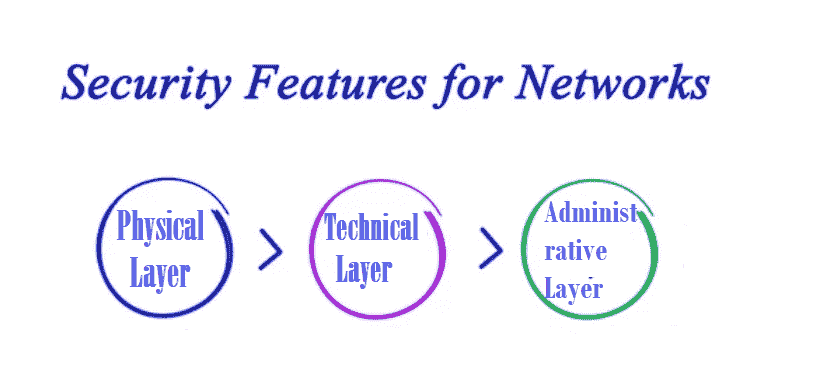

# 什么是网络安全

> 原文：<https://www.javatpoint.com/what-is-network-security>

包括重要的组织信息、客户的个人数据和法律文件，如果泄露出去，可能会给公司带来大问题和数据泄露。只有通过执行有益的网络安全策略和技术，才能实现数据的安全性。

## 网络安全的定义

网络安全是旨在保护网络完整性免受未经授权的访问和威胁的安全措施。网络管理员负责采取各种防御措施来保护他们的网络免受可能的安全风险。

计算机网络在需要安全的政府、私人或公司内部的日常交易和通信中是相互联系的。保护网络支持的最常见和最直接的策略是为其分配唯一的名称和相应的密码。网络安全包括:

1.  **保护**:用户应该能够准确配置自己的设备和网络。
2.  **检测**:用户必须检测配置是否有变化，如果网络流量有问题，必须得到通知。
3.  **反应**:检测到问题后，用户必须做出反应，必须尽快回到保护位置。

## 网络安全是如何工作的？

网络安全在网络边缘和网络之间使用多层保护。所有安全层都执行一些策略并遵循特定的策略。只有授权用户才能获得网络资源的访问权限，非法用户将被阻止进行利用和恶意活动。

在处理关联的任何网络安全问题时，需要分析不同的层。虽然攻击可能发生在网络安全模型的任何一层，但与硬件、软件和策略不同，网络的所有组成设备必须同步组成，才能接近每个部分。

网络安全模型由三种不同的控件组成:物理控件、技术控件和管理控件。让我们简单分析一下网络安全，并了解每个控件的工作原理。

**1。物理网络安全**

物理安全网络旨在限制未经授权的用户访问各种物理网络设备，这与路由器、电缆橱柜等不同。与锁、生物密码和其他组件不同，每个组织还需要检查受控访问。

**2。技术网络安全**

技术安全控制，保护信息，放在网络上或通过、进入或离开网络传输。保护是双工的；它需要保护信息和设备免受非官方团体的攻击，还需要防范工人的非官方演习。

**3。管理网络安全**

管理网络安全控制最终用户的行为，包括他们的身份验证、访问级别，以及任何组织的 IT 人员如何对其基础架构实施改革。管理安全性包括与其功能相关的各种安全策略和流程。

## 网络安全的类型

以下是我们日常生活中常用的一些保护计算机网络安全的不同方法:

**1。有源器件**

主动安全小工具解决剩余流量。例如，防火墙、防病毒扫描工具和内容过滤设备是最常用的活动设备。

**2。无源器件**

被动设备用于识别和阻止不需要的流量，例如入侵检测设备。

**3。预防装置**

预防性设备用于扫描网络并检测可能的安全威胁。渗透测试设备和漏洞评估设备是预防性设备的常见示例。

**4。统一威胁管理(UTM)**

UTM 设备充当一体化安全工具。防火墙、内容过滤、网络缓存是统一威胁管理的常见示例。

**5。网络访问控制**

NAC 是一种在最基本的层面上应用计算机安全网络的技术。例如，用户可以允许管理员完全访问网络，但拒绝访问特定的机密文件或限制他们的系统连接任何网络。这是一种试图将支持网络安全实施的端点安全技术结合起来的方法。

**6。反病毒和反恶意软件**

防病毒软件旨在保护系统免受一系列恶意软件和恶意软件的侵害，包括病毒、蠕虫、软件和特洛伊木马。最好的软件扫描恶意软件，隔离它，并在它对系统造成任何损害之前阻止它。

**7。防火墙保护**

防火墙充当您的可信内部网络和不可信外部网络(如病毒、蠕虫、特洛伊木马、暴力攻击)之间的防御屏障。与路由器不同，防火墙可以是任何形式，即软件或硬件。虽然这两种方法执行相同的功能，扫描进入的网络流量，以确保它不包含黑名单数据。

**8。虚拟专用网络**

虚拟专用网支持用户在他的计算机或设备使用的网络与互联网上的另一个网络之间创建安全可靠的专用连接。它处理加密过程，并使用其他技术来保护您的所有互联网活动的安全，防止攻击者或网络犯罪分子在您将设备与任何公共无线网络连接时偷偷摸摸。例如，在家工作的用户通常通过虚拟专用网络连接到公司的网络。

**9。内容过滤**

内容过滤设备用于过滤令人不快和讨厌的电子邮件或网页。这种技术是作为防火墙的一部分以及在公司的计算机中实现的。如果任何未经授权的用户试图访问任何官方网页或电子邮件，内容过滤设备会生成显示“拒绝访问”的拒绝弹出消息。

放在网上的内容通常会被筛选出淫秽内容或传播暴力的内容，或者可能包含仇恨导向的信息。一些组织还筛选和删除购物和工作相关的内容。

内容过滤可分为以下几类

1.  网页过滤
2.  扫描网站或网页
3.  电子邮件过滤
4.  垃圾邮件的筛选
5.  各种不良内容
6.  惯性导航系统或入侵检测系统

**10。入侵检测系统**

入侵检测系统或入侵检测或防御系统是主动监控网络中恶意活动、记录这些活动的信息、在系统检测到攻击时向公司发出警报并采取措施防止攻击的设备或应用程序。

入侵检测系统保存恶意软件签名列表，并将传入的威胁与列表进行比较。它会立即阻止任何攻击，重新发送配置与列表匹配的数据包，并重置连接以保护 IP 地址免受任何阻塞。入侵检测系统执行的各种其他操作如下:

*   它检查循环冗余校验错误。
*   它有助于防止各种 TCP 排序问题。
*   它清除了不需要的传输层和网络层选项。

## 网络安全和云

云是时代的需要。每个组织都希望扩展其数据存储能力，以便员工之间轻松维护、共享和访问。物理存储介质很难管理，过一段时间就会失效。因此，越来越多的企业将其数据和计算需求转移到云服务提供商。云提供商构建混合基础架构，使其内部网络可以与第三方服务器安全运行。为了管理网络安全，各种云提供商在其平台上实施了集中的安全控制策略。

* * *