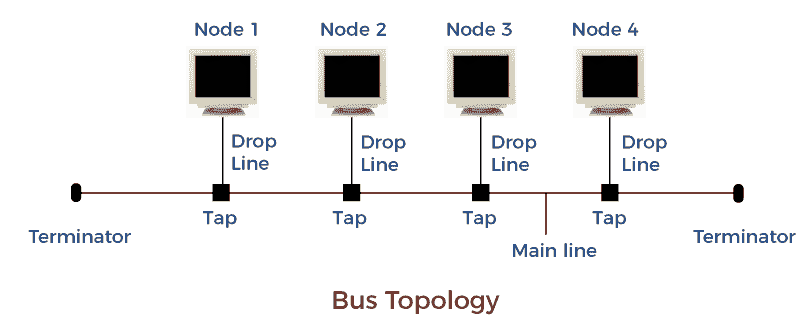

# 总线拓扑和环形拓扑的区别

> 原文：<https://www.javatpoint.com/bus-topology-vs-ring-topology>

本文将详细讨论总线拓扑和环形拓扑之间的区别。首先，我们将学习总线和环形拓扑的含义。之后，我们将了解这两种拓扑之间的一些差异。

### 总线拓扑:

在总线拓扑中，网络中的所有节点通过引入线和分接头共享一条通信线路或电缆，如下图所示:

在上图中，引入线连接节点和主线，使用分接头将另一个设备添加到主电缆。当一台计算机通过电缆发送信号时，网络上的所有计算机都会收到信息。尽管如此，消息只被地址在消息地址字段中指定的计算机接受，其余节点拒绝该消息。

### 环形拓扑:

在环内拓扑中，各种节点以环或圆的形式连接，其中数据以圆的形式从一个站点流向另一个站点。它在网络中没有需要终止的起点或终点。下图显示了环形拓扑的工作原理。

环形拓扑中的一些环形网络进行令牌传递。环中的每台计算机都按顺序接收令牌。环形拓扑中的每个节点都有一个中继器，当一个特定设备接收到要发送给另一个设备的信号时，中继器会重新生成网络中的比特和信号。

### 以下是总线拓扑和环形拓扑之间的比较

| -你好。不，不 | 基础 | 总线拓扑 | 环形拓扑 |
| **1** | **节点连接** | 在总线拓扑中，所有节点都通过引入线和分接头连接到一条通信线上。 | 在环形拓扑中，所有节点都以环的形式连接。 |
| **2** | **节点扩展** | 在总线拓扑中，扩展更容易。可以使用连接器轻松添加新节点。 | 在环形拓扑中，扩展很困难。增加一个新节点会破坏整个网络。 |
| **3** | **数据科利森的机会** | 在总线拓扑中，数据冲突的几率非常高。 | 在环形拓扑中，数据冲突的几率很低。 |
| **4** | **节点故障** | 在总线拓扑中，节点的故障不会影响整个网络。 | 节点故障会破坏环形拓扑中的环，通信会停止。 |
| **5** | **故障识别和隔离** | 在总线拓扑中，故障识别和隔离很困难。 | 在环形拓扑中，故障识别和隔离相对容易。 |
| **6** | **接入速率** | 共享一个通道会导致总线拓扑中的访问速率降低。 | 在环形拓扑中，通信延迟随着网络中节点数量的增加而增加。 |
| **7** | **布线成本** | 在总线拓扑中，布线成本较低，因为连接 n 个节点只需要一根电缆。 | 在环形拓扑中，布线成本非常高，因为连接 n 个节点需要 n 根电缆。 |
| **8** | **拥堵** | 在总线拓扑中，信号从源发送到广播，并传播到连接到电缆的所有工作站，因此不会出现拥塞。 | 在环形拓扑中，由于流量仅在一个方向上流动，因此冲突的几率会降低。 |
| **9** | **安全** | 在总线拓扑中，任何连接到网络的计算机都能够看到所有其他计算机上的所有数据传输。所以没有安全的可能。 | 在环形拓扑中，数据从一台设备传输到另一台设备，直到到达目的地，因此安全性很高。 |
| **10** | **路由方法** | 在总线拓扑中，当一个设备在电缆上发送广播消息时，所有其他设备都会看到该消息，只有预期的接收方会接受该消息 | 在环形拓扑中，所有节点都连接到另外两个
节点，就像一个圆上的点
。 |
| **11** | **复杂性** | 在总线拓扑中，复杂性更低，因为节点很容易在网络中连接或移除，而不会影响网络中的任何其他节点。 | 在环形拓扑中，复杂性的产生是因为简单的设备数据传输。 |

* * *