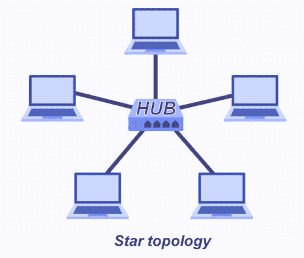

# 总线拓扑和星型拓扑的区别

> 原文：<https://www.javatpoint.com/bus-topology-vs-star-topology>

本文将详细讨论总线拓扑和星型拓扑之间的区别。首先，我们将学习总线和星型拓扑的含义。之后，我们将了解这两种拓扑之间的一些差异。

### 总线拓扑:

在总线拓扑中，网络中的所有节点通过引入线和分接头共享一条通信线路或电缆，如下图所示:

在上图中，引入线连接节点和主线，使用分接头将另一个设备添加到主电缆。当一台计算机通过电缆发送信号时，网络上的所有计算机都会收到信息。尽管如此，消息只被地址在消息地址字段中指定的计算机接受，其余节点拒绝该消息。

### 星型拓扑:

在星型拓扑中，有一个称为集线器的中央控制器。在这种拓扑中，网络中的每个节点都有一条专用的点对点链路连接到这个中央控制器设备，也称为集线器。下图显示了星型拓扑的工作原理:

上图中的节点之间没有直接链接，所有这些节点都只通过集线器进行通信。

### 以下是总线拓扑和星型拓扑之间的比较

| -你好。不，不 | 基础 | 总线拓扑 | 星形布局 |
| **1** | **节点连接** | 在总线拓扑中，所有节点都通过引入线和分接头连接到一条通信线上。 | 在星型拓扑中，所有节点都通过专用的点对点链路连接到一个称为集线器的中央控制器。 |
| **2** | **节点扩展** | 在总线拓扑中，扩展更容易。可以使用连接器轻松添加新节点。 | 在星型拓扑中，扩展非常容易。使用中央集线器可以轻松连接新节点。 |
| **3** | **数据科利森的机会** | 在总线拓扑中，数据冲突的几率非常高。 | 在星型拓扑中，数据冲突的几率非常低。 |
| **4** | **节点故障** | 在总线拓扑中，节点的故障不会影响整个网络。 | 在星型拓扑中，一个节点的故障会影响整个网络。 |
| **5** | **故障识别和隔离** | 在总线拓扑中，故障识别和隔离很困难。 | 在星型拓扑中，故障识别和隔离非常容易。 |
| **6** | **接入速率** | 共享一个通道会导致总线拓扑中的访问速率降低。 | 接入速率非常快，因为在星型拓扑中，每个节点都有专用的点对点链路。 |
| **7** | **布线成本** | 在总线拓扑中，布线成本较低，因为连接 n 个节点只需要一根电缆。 | 在星型拓扑中，布线成本很高，因为需要 n-1 根电缆来连接 n 个节点。 |
| **8** | **信号传输** | 在总线拓扑中，信号的传输是单向的 | 在星型拓扑中，信号的传输不是单向的。 |
| **9** | **网络定向** | 在总线拓扑中，网络方向是线性的。 | 在星型拓扑中，网络方向是非线性的 |
| **10** | **数据传输速度** | 在总线拓扑中，数据传输速率较慢。 | 在星型拓扑中，数据传输速率很快。 |
| **11** | **拥塞控制** | 在总线拓扑中，信号从源发送到广播，并传播到连接到电缆的所有工作站，因此不会出现拥塞。 | 星型拓扑提供了更好的性能，因为信号不一定会传输到连接到网络的所有工作站。 |
| **12** | **安全** | 在总线拓扑中，任何连接到网络的计算机都能够看到所有其他计算机上的所有数据传输。所以没有安全的可能。 | 在星型拓扑中，安全性取决于中央设备。 |
| **13** | **响应时间** | 在总线拓扑中，响应时间很慢。 | 在星型拓扑中，响应时间很长。 |
| **14** | **复杂性** | 在总线拓扑中，易于连接或移除网络中的节点，而不会影响网络中的任何其他节点。 | 在星型拓扑中，平均复杂性，因为每个设备仅通过一条链路连接到中央设备。 |

* * *