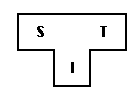
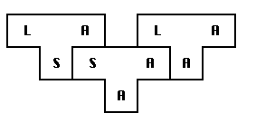

# 拔靴带

> 原文：<https://www.javatpoint.com/bootstrapping>

*   自举在编译开发中被广泛使用。
*   引导用于生成自宿主编译器。自宿主编译器是一种可以编译自己源代码的编译器。
*   Bootstrap 编译器用于编译编译器，然后您可以使用这个编译的编译器来编译其他所有内容以及它自己的未来版本。

编译器可以用三种语言来描述:

1.  源语言
2.  目标语言
3.  工具语言

T 图显示了一个编译器SCIT4 用于源 S，目标 T，在 I 中实现

按照以下步骤为机器 **A** 生成新语言 **L** :

1.使用语言“A”创建一个编译器SCAT4】A 用于所需语言 L 的子集 S，该编译器在机器 A 上运行

2.为用 L 的子集编写的语言 L 创建一个编译器

3.使用编译器SCAT10】A 编译LCST4】A 得到LCAT16】A。LCAT22】A 是语言 L 的编译器，运行在机器 A 上，为机器 A 产生代码。

由 T 图描述的过程称为自举。