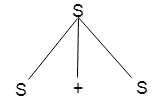
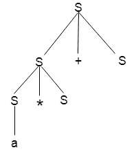
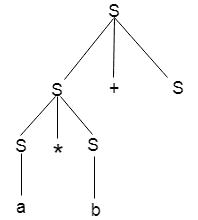

# 解析树

> 原文：<https://www.javatpoint.com/parse-tree>

*   解析树是符号的图形表示。符号可以是终端或非终端。
*   在解析中，字符串是使用开始符号派生的。解析树的根是开始符号。
*   它是符号的图形表示，可以是终端，也可以是非终端。
*   解析树遵循运算符的优先级。首先遍历最深的子树。因此，父节点中的运算符的优先级低于子树中的运算符。

## 解析树遵循以下几点:

*   所有叶节点都必须是终端。
*   所有内部节点必须是非终端。
*   有序遍历给出原始输入字符串。

### 示例:

**生产规则:**

```

T= T + T | T * T
T = a|b|c

```

输入:

```
a * b + c

```

### 第一步:



### 第二步:


### 第三步:



### 第四步:



### 第五步:

