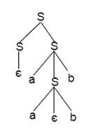
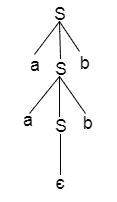

# 含糊

> 原文：<https://www.javatpoint.com/ambiguity>

如果给定的输入字符串存在一个以上最左边的派生、一个以上最右边的派生或一个以上的解析树，则称语法不明确。如果语法不模棱两可，那么它被称为不含糊。

### 示例:

```

S = aSb | SS
S = ∈

```

对于字符串 aabb，上面的语法生成了两个解析树:

 

如果语法有歧义，那么它对编译器的构造就不好。没有任何方法可以自动检测和消除歧义，但你可以通过重写整个语法来消除歧义，而不会产生歧义。