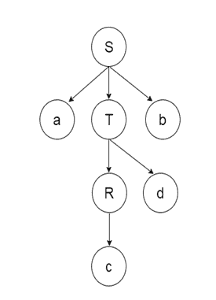
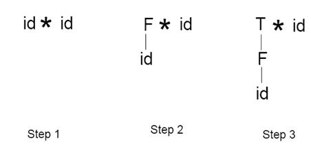

# 句法分析程序

> 原文：<https://www.javatpoint.com/parser>

解析器是一个编译器，用于将来自词法分析阶段的数据分解成更小的元素。

解析器以标记序列的形式接收输入，并以解析树的形式产生输出。

解析有两种类型:自顶向下解析和自底向上解析。


## 自上而下削皮

*   自顶向下的解析被称为递归解析或预测解析。
*   自底向上解析用于构建输入字符串的解析树。
*   在自上而下的解析中，解析从开始符号开始，并将其转换为输入符号。

输入字符串“acdb”的解析树表示如下:



## 自底向上句型分析

*   自底向上解析也称为移位-缩减解析。
*   自底向上解析用于构建输入字符串的解析树。
*   在自下而上的解析中，解析从输入符号开始，并通过反向追踪字符串最右边的派生来构建解析树，直到开始符号。

### 例子

**生产**

```

E → T
T → T * F
T → id
F → T
F → id

```

输入字符串“id * id”的解析树表示如下:




自下而上的解析分为各种解析。这些措施如下:

1.  移位-缩减解析
2.  运算符优先解析
3.  表驱动 LR 解析

1.  左后(1)
2.  单反(1)
3.  CLR ( 1)
4.  拉尔(1)