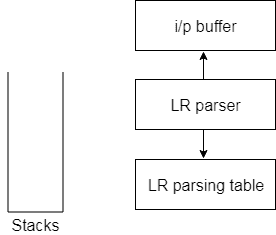

# LR 解析器

> 原文：<https://www.javatpoint.com/lr-parser>

LR 解析是一种自下而上的解析。它用于解析一大类语法。

在 LR 解析中，“L”代表从左到右扫描输入。

“R”代表反向构造最右导数。

“K”是用于做出解析决策的前瞻输入符号数。

LR 解析分为 LR (0)解析、SLR 解析、CLR 解析和 LALR 解析四个部分。


## LR 算法:

LR 算法需要堆栈、输入、输出和解析表。在所有类型的 LR 解析中，输入、输出和堆栈是相同的，但解析表是不同的。



**图:LR 解析器**框图

输入缓冲区用于指示输入结束，它包含要解析的字符串，后跟一个$ Symbol。

堆栈用于包含一系列语法符号，堆栈底部有一个$号。

解析表是一个二维数组。它包含两个部分:操作部分和转到部分。

### LR (1)解析

LR 中涉及的各种步骤(1)解析:

*   对于给定的输入字符串，编写一个上下文无关的语法。
*   检查语法的歧义。
*   在给定的语法中添加扩充生成。
*   创建 LR (0)项的规范集合。
*   绘制数据流图(DFA)。
*   构造一个 LR (1)解析表。

### 扩充语法

如果我们在给定的语法 g 中再添加一个产品，就会生成扩充语法 g’。它有助于解析器识别何时停止解析并宣布接受输入。

### 例子

给定语法

```
S → AA
A → aA | b

```

扩充语法 G’由下式表示

```
S`→ S
S → AA
A → aA | b

```