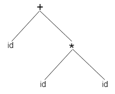
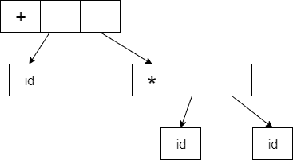

# 解析树和语法树

> 原文：<https://www.javatpoint.com/parse-tree-and-syntax-tree>

当您创建解析树时，它包含比实际需要的更多的细节。所以，编译器解析解析树是非常困难的。以下面的解析树为例:

*   在解析树中，大多数叶节点是其父节点的单个子节点。
*   在语法树中，我们可以消除这些额外的信息。
*   语法树是解析树的变体。在语法树中，内部节点是运算符，叶子是操作数。
*   语法树通常用于以树结构表示程序。

一个句子 **id + id * id** 会有下面的语法树:

抽象语法树可以表示为:

抽象语法树是编译器中重要的数据结构。它包含最少不必要的信息。

抽象语法树比解析树更紧凑，编译器可以轻松使用。