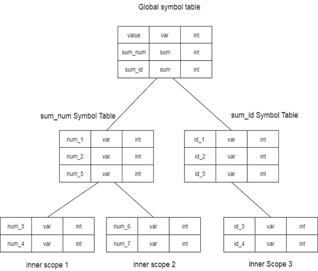

# 符号表的数据结构

> 原文：<https://www.javatpoint.com/data-structure-for-symbol-table>

*   编译器包含两种类型符号表:全局符号表和范围符号表。
*   全局符号表可以被所有程序和范围符号表访问。

名称和符号表的范围在层次结构中排列如下:

```

int value=10;

void sum_num()
     {
       int num_1;
       int num_2;

            {
             int num_3;
             int num_4;
            }

       int num_5;

            {
             int_num 6;
             int_num 7;
            }
     }

Void sum_id
     {
       int id_1;
       int id_2;

            {
             int id_3;
             int id_4;
            }

       int num_5;
     }

```

上述语法可以用符号表的分层数据结构来表示:



全局符号表包含一个全局变量和两个过程名。sum_num 表中提到的名称不适用于 sum_id 及其子表。

Data structure hierarchy of symbol table is stored in the semantic analyzer. If you want to search the name in the symbol table then you can search it using the following algorithm:

*   首先，在当前符号表中搜索符号。
*   如果找到该名称，则搜索完成，否则将在父代的符号表中搜索该名称，
*   找到名称或搜索全局符号。