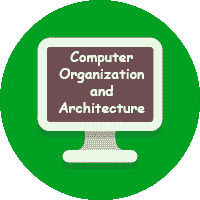

# 计算机组织与架构教程

> 原文：<https://www.javatpoint.com/computer-organization-and-architecture-tutorial>

计算机组织和架构教程提供了计算机系统内部工作、结构和实现的深入知识。

然而，组织定义了系统的结构方式，以便所有这些编目工具都可以正确使用。

我们的《计算机组织与体系结构教程》包含了所有的主题，如介绍、er 模型、键、关系模型、连接操作、SQL、函数依赖、事务、并发控制等。

## 什么是计算机体系结构和组织？

一般而言，计算机系统的体系结构可以被认为是用户可见的工具或属性的目录，例如指令集、用于数据的位数、寻址技术等。

然而，计算机系统的组织定义了系统的结构，以便所有这些编目工具都可以使用。计算机组织的重要组成部分是算术逻辑单元、中央处理器、内存和内存组织。

## 先决条件

在学习计算机体系结构和组织的概念之前，你应该具备计算机体系结构、计算机系统的基本功能单元等基础知识。

## 观众

我们的 COA 教程旨在帮助初学者和专业人士。

## 问题

我们可以向您保证，您在本教程中不会发现任何问题。但是，如果您找到任何问题，您可以在联系人表单中发布这些问题。