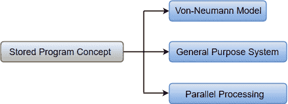

# 商店程序控制概念

> 原文：<https://www.javatpoint.com/store-program-control-concept>

术语**存储程序控制概念**是指将指令存储在计算机内存中，使其能够顺序或间歇地执行各种任务。

这个想法是在 19 世纪 40 年代末由约翰·冯·诺依曼提出的，他建议将一个程序以二进制数的格式电子存储在存储设备中，这样计算机就可以根据中间计算结果修改指令。

**ENIAC(电子数值积分器和计算机)**是 20 世纪 40 年代初设计的第一个计算系统。它基于存储程序概念，其中机器使用内存来处理数据。

### 存储程序概念可以进一步分为三种基本方式:

1.  [冯·诺依曼模型](von-neumann-model)
2.  [通用系统](general-purpose-system)
3.  [并行处理](parallel-processing)

