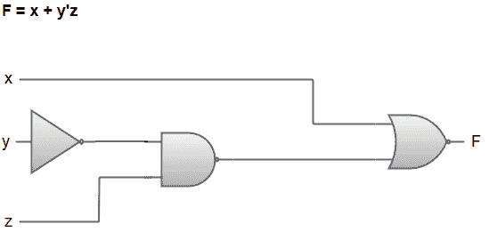
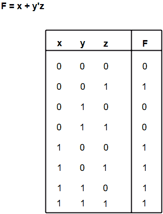

# 布尔代数

> 原文：<https://www.javatpoint.com/boolean-algebra>

布尔代数可以被认为是处理二进制变量和逻辑运算的代数。布尔代数变量由字母如 A、B、x 和 y 表示。执行的基本操作是 and、OR 和补码。

布尔代数函数大多用二进制变量、逻辑运算符号、括号和等号表示。对于给定的变量值，布尔函数可以是 1 或 0。例如，考虑布尔函数:

F = x + y'z

布尔函数 F = x + y'z 的逻辑图可以表示为:

*   布尔函数 F = x + y'z 从一个代数表达式转换成由 AND、OR 和反相器门组成的逻辑图。
*   输入“y”处的反相器产生其补码“y”。
*   术语 y'z 有一个“与”门，而“或”门用于组合这两个术语(x 和 y'z)。
*   函数的变量作为电路的输入，函数的变量符号作为电路的输出。

#### 注意:真值表可以表示函数与其二进制变量之间的关系。为了在真值表中表示一个函数，我们需要 n 个二进制变量的 2^n 组合列表。

布尔函数 F = x+y’z 的真值表可以表示为:

