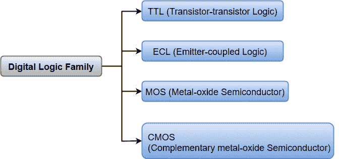
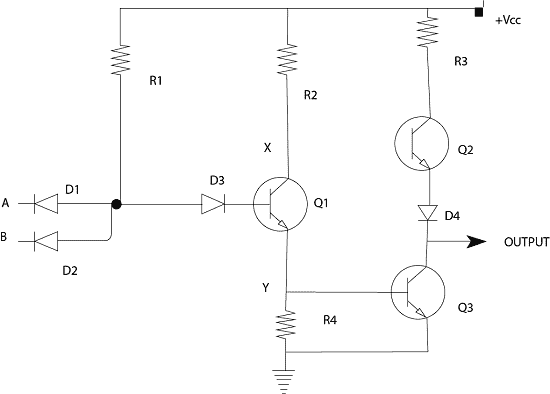
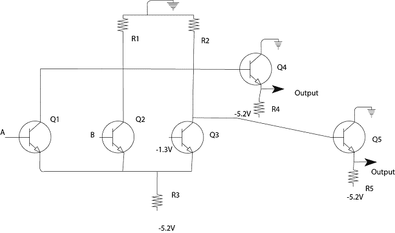
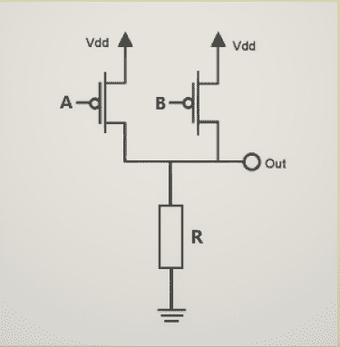
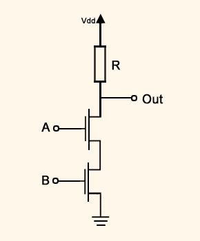
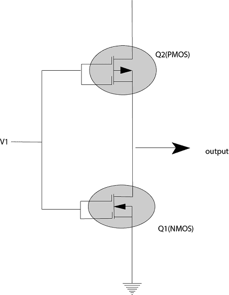

# 集成电路

> 原文：<https://www.javatpoint.com/integrated-circuits>

集成电路是用硅材料制造的，安装在陶瓷或塑料容器(称为芯片)中。集成电路的基本元件由数字门的电子电路组成。各种门在集成电路内部相互连接，形成所需的电路。

以下类别可以对集成电路进行广泛分类:

### 小规模集成器件

这些类型的器件在单个封装中包含几个独立的门。这些门的输入和输出直接连接到封装中的引脚。逻辑门的数量通常少于 10 个，并受到集成电路中可用引脚数量的限制。

### 中型集成设备

这些类型的器件在单个封装中具有大约 10 到 200 个门的复杂性。基本组件包括解码器、加法器和寄存器。

### 大规模集成器件

大规模集成电路器件在一个封装中包含大约 200 到几千个门。大规模集成电路设备的基本组件包括数字系统，如处理器、存储芯片和可编程模块。

### 超大规模集成器件

这种类型的器件在一个封装中包含数千个栅极。超大规模集成电路器件最常见的例子是复杂的微型计算机芯片。

数字集成电路也按其所属的特定电路技术进行分类。电路技术通常被称为数字逻辑家族。每种技术都有自己的基本电子电路和要执行的功能。

每种技术中最常见的组件是与非门、或非门或反相器门。

数字逻辑系列中最受欢迎的包括:

1.  [晶体管-晶体管逻辑](#ttl)
2.  [ECL(发射极耦合逻辑)](#ecl)
3.  [金属氧化物半导体](#mos)
4.  [互补金属氧化物半导体](#cmos)

* * *

## 晶体管-晶体管逻辑

TTL 技术是以前称为 DTL(二极管-晶体管逻辑)技术的升级版本。DTL 技术曾经有二极管和晶体管作为基本的与非门。当这些二极管被晶体管取代以改善电路运行时，TTL 就出现了。

TTL 有几种变体，如高速 TTL、低功耗 TTL、肖特基 TTL、低功耗肖特基 TTL 和高级肖特基 TTL。

下面的电路图显示了一个标准 TTL 电路及其配置。

### TTL 系列的特点:

*   TTL 电路的总电源电压为 5 伏，两个逻辑电平约为 0 伏和 3.5 伏。
*   一个 TTL 电路在其输出端最多可以支持 10 个门。
*   TTL 电路的平均传播延迟约为 9ns。

### TTL 应用

*   TTL 用作驱动灯和继电器的开关器件。
*   TTL 在控制器应用中用于提供 0 到 5V。
*   TTL 系列主要用于像 DEC VAX 这样的小型计算机的处理器。
*   它也用于打印机和视频显示终端。

* * *

## ECL(发射极耦合逻辑)

ECL 技术以集成形式提供最高速度的数字电路。ECL 电路用于超级计算机和信号处理器，高速是必不可少的。

ECL 门的晶体管工作在非饱和状态，这种状态允许实现 1 到 2 纳秒的传播延迟。

### ECL 家族的特征

*   即使在非活动状态下，逻辑门也会持续汲取电流。因此，与其他逻辑系列相比，功耗更高。
*   ECL 使用双极晶体管逻辑，其中晶体管不在饱和区工作。
*   ECL 门的平均传播延迟约为 0.5 至 2 纳秒。

* * *

# 金属氧化物半导体

金属氧化物半导体是一种单极晶体管，它只依赖于一种载流子的流动，这种载流子可能是电子(n 沟道)或空穴(p 沟道)。

金属氧化物半导体技术通常分为两种基本形式:

1.  p 沟道金属氧化物半导体被称为 PMOS。
2.  n 沟道金属氧化物半导体被称为 NMOS。

## 项目管理办公室

由 PMOS 逻辑族执行的操作可以通过考虑 PMOS 与非门来解释。

下图显示了一个双输入 PMOS 与非门。

当低逻辑被施加到 A 或 B 时，晶体管被激活。这在电源和输出端之间建立了连接。

当施加逻辑低电平时，输出上升到逻辑高电平。否则，在其他情况下，它将保持逻辑低电平。

下拉电阻“R”保持低逻辑，除非低逻辑被施加到 A 或 B。

## 场效应管

NMOS 逻辑的结构类似于 PMOS。然而，这里我们将使用 NMOS 晶体管和一个上拉电阻 r，而不是使用 PMOS 晶体管

下图显示了一个双输入 NMOS 与非门。

如电路图所示，NMOS 与非门有两个 NMOS 晶体管，从输出端串联到接地端。

上拉电阻从输出端连接到电源。

当两个输入端都施加高逻辑时，两个晶体管都被激活。这就在输出端和地之间建立了连接。

在这种情况下，任何一个输入处于逻辑高电平，而另一个处于逻辑低电平，晶体管就会失效。这终止了输出端和地之间的路径。

* * *

## 互补金属氧化物半导体

互补金属氧化物半导体或互补金属氧化物半导体技术使用在所有电路中以互补方式连接的 PMOS 和 NMOS 晶体管。

CMOS 逻辑系列因其高抗噪性和低功耗而在大规模集成电路中备受青睐。

下图显示了标准互补金属氧化物半导体电路及其配置。

Q1 和 Q2 分别是以互补方式连接的 NMOS 和 PMOS 晶体管。