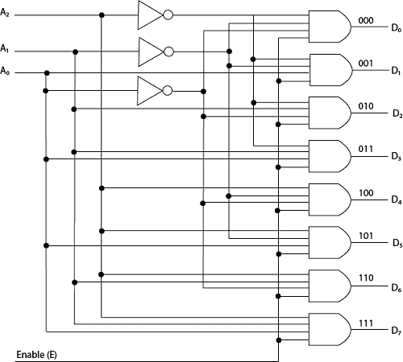
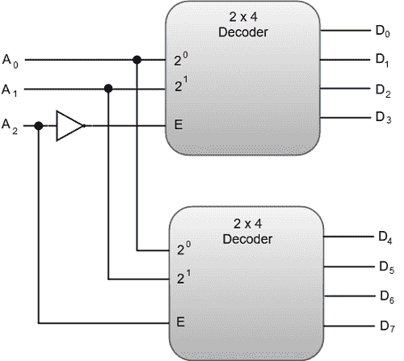

# 解码器

> 原文：<https://www.javatpoint.com/decoders>

解码器可以被描述为将来自“n”个编码输入的二进制信息转换成最大 2^n 不同输出的组合电路。

#### 注:一个 n 位的二进制码能够代表编码信息中最多 2^n 的不同元素。

最优选或最常用的解码器是 n 对 m 解码器，其中 m<= 2^n.

n-m 解码器具有 n 个输入和 m 个输出，也称为 n * m 解码器。

下图显示了一个 3 到 8 行解码器，它有三个输入变量，这些变量被解码成八个输出，每个输出代表三个二进制输入变量的组合之一。

三个反相器门提供输入的补码，相应地，输出端的八个与门为每个输入产生一个二进制组合。

这种解码器最常见的应用是二进制到八进制的转换。

3 至 8 线解码器的真值表可以表示为:

| x | y | z | D0 | D1 | D2 | D3 | D4 | D5 | D6 | D7 |
| Zero | Zero | Zero | one | Zero | Zero | Zero | Zero | Zero | Zero | Zero |
| Zero | Zero | one | Zero | one | Zero | Zero | Zero | Zero | Zero | Zero |
| Zero | one | Zero | Zero | Zero | one | Zero | Zero | Zero | Zero | Zero |
| Zero | one | one | Zero | Zero | Zero | one | Zero | Zero | Zero | Zero |
| one | Zero | Zero | Zero | Zero | Zero | Zero | one | Zero | Zero | Zero |
| one | Zero | one | Zero | Zero | Zero | Zero | Zero | one | Zero | Zero |
| one | one | Zero | Zero | Zero | Zero | Zero | Zero | Zero | one | Zero |
| one | one | one | Zero | Zero | Zero | Zero | Zero | Zero | Zero | one |

让我们考虑一个 2 到 4 线与非门解码器的例子，它在中央逻辑中使用与非门而不是与门。

下图显示了带有与非门的 2 至 4 线解码器。

2 至 4 线解码器的真值表可以表示为:

| E | 一流的 | A0 | D0 | D1 | D2 | D3 |
| Zero | Zero | Zero | Zero | one | one | one |
| Zero | Zero | one | one | Zero | one | one |
| Zero | one | Zero | one | one | Zero | one |
| Zero | one | one | one | one | one | Zero |
| one | Zero | Zero | one | one | one | one |

还可以在需要时组合两个或更多解码器以形成一个大解码器。例如，我们可以通过组合两个 2 *4 解码器来构建一个 3 * 8 解码器。

下图显示了由两个 2 * 4 解码器构成的 3 * 8 解码器。

