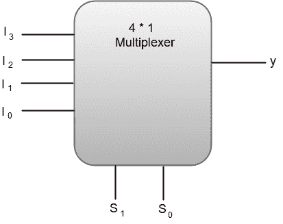
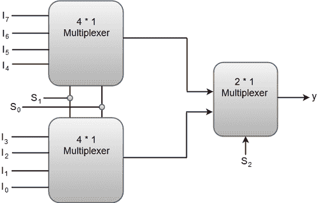

# 多路器

> 原文：<https://www.javatpoint.com/multiplexers>

多路复用器(MUX)可以被描述为组合电路，其从 2^n 输入数据线之一接收二进制信息并将其导向单个输出线。

基于选择线来决定为输出选择特定的输入数据线。

多路复用器通常被称为数据选择器，因为它只选择许多数据输入中的一个。

#### 注意:2^n-to-1 多路复用器具有 2^n 输入数据线和 n 条输入选择线，它们的位组合决定了为输出选择哪些输入数据。

下图显示了 4 * 1 多路复用器的框图。



在这四条输入数据线中，一条特定的输入数据线将根据这两条选择线的输入组合连接到输出端。

#### 注:描述电路的真值表需要 64 行，因为六个输入变量可以有 2^n 二进制组合。这将导致表格过长。因此，描述多路复用器操作的更方便的方法是使用函数表。

4 * 1 多路复用器的功能表可以表示为:

| S1 | S0 | y |
| Zero | Zero | I0 |
| Zero | one | I1 |
| one | Zero | I2 |
| one | one | Thirteen |

从函数表中，我们可以将输出(y)的布尔函数写成:

```
y = S1'S0'I0 + S1' S0'I1 + S1S0'I2 + S1S0I3

```

输出“y”的上述等式可以使用反相器、三输入与门和或门来实现。


我们也可以使用低阶多路复用器来实现高阶多路复用器。例如，让我们使用两个 4*1 多路复用器和一个 2*1 多路复用器来实现一个 **8 *1 多路复用器**。

第一级需要两个 4*1 多路复用器来获得 8 条输入数据线。

第二级需要一个 2*1 多路复用器，以便将第一级产生的输出汇聚成单个输出。

下图显示了使用两个 4*1 多路复用器和一个 2*1 多路复用器设计的 8*1 多路复用器的框图。



一组公共选择线(S1 和 S2)应用于两个 4*1 多路复用器。

两个 4*1 多路复用器产生的输出作为 2*1 多路复用器的输入。

8*1 多路复用器的功能表可以表示为:

| S2 | S1 | S0 | y |
| Zero | Zero | Zero | Ten |
| Zero | Zero | one | I1 |
| Zero | one | Zero | I2 |
| Zero | one | one | I3 |
| one | Zero | Zero | I4 |
| one | Zero | one | I5 |
| one | one | Zero | I6 |
| one | one | one | Seventeen |