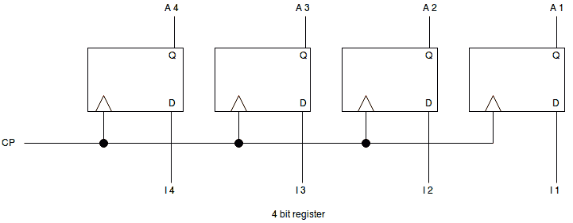

# 登记

> 原文：<https://www.javatpoint.com/registers>

*   寄存器是一种快速存储器，用于接受、存储和传输中央处理器正在立即使用的数据和指令。
*   寄存器也可以被认为是一组触发器，每个触发器能够存储一位信息。
*   具有 *n 个触发器*的寄存器能够存储 n 位的二进制信息。
*   触发器包含二进制信息，而门控制信息流，即信息何时以及如何流动？被转移到寄存器中。
*   市场上有不同类型的寄存器。一个简单的寄存器只由触发器组成，没有外部门。
*   将新数据传输到寄存器中称为加载寄存器。

*   上图显示了由四个 D 型触发器和一个公共时钟脉冲输入构成的寄存器。
*   时钟脉冲输入 CP 使能所有触发器，以便将四个输入端当前可用的信息传输到四位寄存器中。