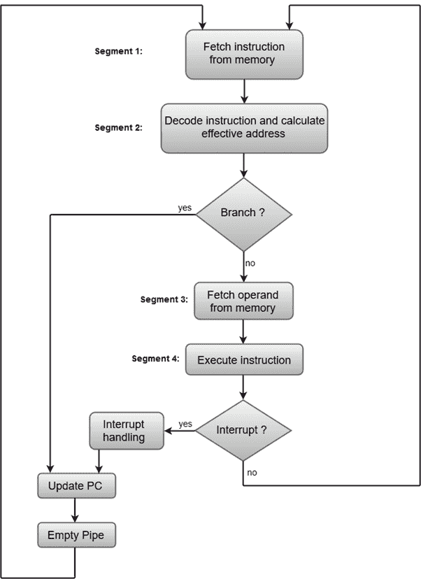

# 指令流水线

> 原文：<https://www.javatpoint.com/instruction-pipeline>

流水线处理不仅可以发生在数据流中，也可以发生在指令流中。

大多数具有复杂指令的数字计算机需要指令流水线来执行诸如获取、解码和执行指令的操作。

一般来说，计算机需要按照以下步骤顺序处理每条指令。

1.  从内存中获取指令。
2.  解码指令。
3.  计算有效地址。
4.  从内存中获取操作数。
5.  执行指令。
6.  将结果储存在适当的地方。

每个步骤都在特定的段中执行，并且有时不同的段可能需要不同的时间来处理传入的信息。此外，有时两个或多个段可能需要同时访问内存，导致一个段等待另一个段完成内存。

如果指令周期被分成相等持续时间的段，则指令流水线的组织将更加有效。这种组织形式最常见的例子之一是**四段指令流水线。**

一条**四段指令**流水线将两个或多个不同的段组合成一个单独的段。例如，指令的解码可以与有效地址的计算结合成一个段。

下面的框图显示了一个四段指令流水线的典型示例。指令周期分四个部分完成。

#### 第 1 部分:

取指令段可以使用先进先出(FIFO)缓冲器来实现。

#### 第 2 部分:

从存储器中取出的指令在第二段中被解码，最终，有效地址在单独的算术电路中被计算。

#### 第 3 部分:

内存中的操作数在第三个段中提取。

#### 第 4 部分:

指令最终在流水线组织的最后一段执行。