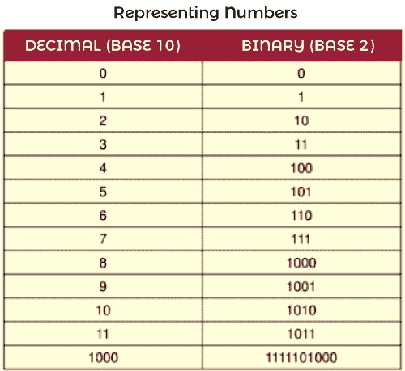
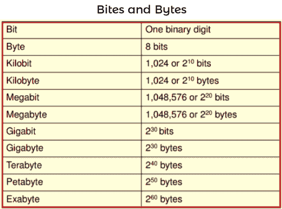
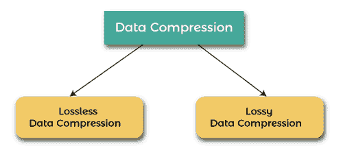

# 计算机组织中的数据表示

> 原文：<https://www.javatpoint.com/data-representation-in-computer-organization>

在计算机组织中，数据是指用来表示事件、人、事物和思想的符号。

### 数据表示法

数据可以通过以下方式表示:

**数据**

**数据**可以是任何东西，如数字、名字、音乐作品中的音符或照片中的颜色。数据表示可以被称为我们存储、处理和传输数据的形式。为了以数字格式存储数据，我们可以使用任何设备，如电脑、智能手机和 iPads。电子电路用于处理存储的数据。

**数字化**

**数字化**是一种将照片、音乐、数字、文本等信息转换为数字数据的过程。电子设备被用来处理这些类型的数据。数字革命在 4 个阶段的帮助下发展，从大型、昂贵的独立计算机开始，发展到今天的数字世界。在世界各地，小而便宜的设备正在到处传播。

**二进制数字**

**二进制数字**或位用于显示数字数据，由 0 和 1 表示。二进制数字可以称为计算机中最小的信息单位。二进制数字的主要用途是它可以以 0 和 1 的形式存储信息或数据。它包含一个值，可以是开/关或真/假。On 或 true 将由 1 表示，off 或 false 将由 0 表示。数字文件是一个简单的文件，用于收集存储介质(如闪存盘、光盘、硬盘或 DVD)中包含的数据。

### 代表数字

该数字可以用以下方式表示:

**数值数据**

**数字数据**用来包含数字，帮助我们进行算术运算。数字设备使用二进制数字系统，因此它们可以表示数字数据。二进制数字系统只能用两位数字 0 和 1 来表示。系统中不能有其他类似 2 的数字。如果我们想用二进制表示数字 2，那么我们将把它写成 10。

### 表示文本

文本可以通过以下方式表示:

**字符数据**

**字符数据**可以借助符号、字母、数字形成，但它们可以吗？不能用于计算。使用字符数据，我们可以形成我们的地址，头发颜色，名字等。字符数据通常采用文本形式的数据。借助课文，我们可以描述很多事情，比如我们的父亲名字，母亲名字等。

**数字设备**

**数字设备**使用几种类型的代码来表示字符数据，包括 Unicode、ASCII 和其他类型的变体。ASCII 的完整形式是美国信息交换标准代码。它是一种字符编码标准，用于电子通信。借助电信设备、计算机和许多其他设备，ASCII 码可以表示文本。ASCII 码每个字符需要 7 位，其中唯一的字符由每一位表示。对于大写字母 A，ASCII 码表示为 1000001。

**扩展 ASCII**

**扩展 ASCII** 可以描述为 ASCII 的超集。ASCII 集使用 7 位来表示每个字符，但扩展 ASCII 使用 8 位来表示每个字符。扩展 ASCII 包含 7 位 ASCII 字符和 1 位附加字符。使用 7 位，ASCII 码提供 128 个唯一符号或字符的代码，但扩展 ASCII 码提供 256 个唯一符号或字符的代码。对于大写字母 A，扩展 ASCII 码表示为 01000001。

**Unicode**

**Unicode** 也被称为通用字符编码标准。Unicode 提供了一种以网页、文本文件和其他文档的形式表示单个字符的方法。使用 ASCII，我们只能表示基本的英语字符，但是在 Unicode 的帮助下，我们可以表示来自世界各地所有语言的字符。

ASCII 码提供 128 个字符的代码，而 Unicode 在 16 位的帮助下提供大约 65，000 个字符的代码。为了表示每个字符，ASCII 码只使用 1 位，而 Unicode 最多支持 4 个字节。Unicode 编码有几种不同的类型，但 UTF-8 和 UTF-16 是最常用的。UTF-8 是一种可变长度编码方案。它也成为了标准的字符编码，在网络上使用。许多软件程序也将 UTF-8 设置为默认编码。

ascii 码

**ASCII 码**可用于电话号码、社保号码等数字。ASCII 文本包含纯文本和无格式文本。这种类型的文件将以文本文件格式保存，其中包含以. txt 结尾的名称。这些文件在不同的系统上有不同的标签，例如 Windows 操作系统将这些文件标记为“文本文档”，苹果设备将这些文件标记为“纯文本”。ASCII 文本文件中没有格式。如果我们想让文档具有样式和格式，那么我们必须在文本中嵌入格式代码。

**微软 Excel**

Microsoft word 用于创建格式化文本和文档。它使用 **DOCX 格式**来做到这一点。如果我们使用 Microsoft Word 2007 或更高版本创建新文档，那么它总是使用 DOCX 作为默认文件格式。**苹果页面**使用**页面格式**生成文档。与 Microsoft Word 相比，使用页面格式创建和编辑文档更简单。 **Adobe Acrobat** 使用 **PDF 格式**创建文档。不能修改以 PDF 格式保存的文件。但是我们可以轻松地打印和共享这些文件。如果我们将文档保存为 PDF 格式，那么如果没有指定的软件，我们就无法将该文件更改为 Microsoft Office 文件或任何其他文件。

**HTML** 是超文本标记语言。它用于文档设计，将在网络浏览器中显示。它使用 **HTML 格式**来设计文档。在 HTML 中，超文本是包含链接的任何文档中的一种文本类型，通过这些链接，我们可以到达文档中的其他地方，也可以到达其他文档中的其他地方。标记语言可以称为计算机语言。为了定义文档中的元素，这种语言使用标签。

### 表示位和字节

位和字节可以用以下方式表示:

**位和字节**

在数字通信或计算机领域，比特是最基本的信息单位或最小的数据单位。它缺少二进制数字，这意味着它只能包含一个值，0 或 1。所以比特可以用 0 或 1，-或+，假或真，关或开，或否或是来表示。许多技术都是基于位和字节的，这对于描述网络访问速度和存储容量非常有用。该位通常缩写为小写 b。

为了执行指令和存储数据，这些位被分成多个位，称为字节。字节可以定义为一组八位，通常缩写为大写的 b，如果我们有四个字节，它将等于 32 位(4*8 = 32)，10 个字节将等于 80 位(8*10 = 80)。

**用途**

比特用于数据速率，如电影下载时的速度、互联网连接时的速度等。字节用于获取存储容量和文件大小。当我们阅读与数字设备相关的东西时，会经常遇到 90 千位/秒、1.44 兆字节、2.8 千兆赫和 2tb 的引用。为了量化数字数据，我们有许多选项，如千、兆、千兆、万亿和更多类似的术语，描述如下:

**104 KB:** Kb 也叫千字节或千字节。它主要用于指小型计算机文件的大小。

**56 Kbps:** Kbps 也叫千位，Kbit 或 Kb。56 kbps 意味着每秒 56 千比特，用于显示缓慢的数据速率。如果我们的互联网速度是 56 kbps，我们必须面对连接多个设备时的困难、流式视频时的缓冲、下载速度慢以及许多其他互联网连接问题。

**50 Mbps:** Mbps 也叫兆位，MB 或 Mbit。50 兆位/秒意味着 50 兆位/秒，用于显示更快的数据速率。如果我们的网速是 50 Mbps，我们将体验到没有任何缓冲的在线活动，比如在线游戏、下载音乐、高清流媒体、网页浏览等。50 Mbps 或以上将被称为快速互联网速度。借助快速的速度，我们可以轻松地同时为多个用户处理多个在线活动，而不会出现服务中断的情况。

**3.2 MB:** 3.2 MB 也叫兆字节，MB 或 MByte。当我们指的是包含视频和照片的文件大小时，就会用到它。

**100 Gbit:** 100 Gbit 也叫千兆或 GB。它用来显示真正快速的网络速度。

**16 GB:** 16 GB 也叫千兆字节，GB 或 GByte。它用于显示存储容量。

### 数据压缩

数字数据被压缩以减少传输时间和文件大小。数据压缩是减少用于表示数据的位数的过程。数据压缩通常使用编码技术来压缩数据。压缩后的数据将帮助我们节省存储容量，降低存储硬件成本，提高文件传输速度。

压缩使用一些程序，这些程序也使用算法和函数来找出减少数据大小的方法。压缩可以称为“拉链”。重建文件的过程将被称为解压或提取。压缩文件将包含。or.tar.gz 广州。pkg 或。压缩文件的结尾。压缩可以分为两种技术:无损压缩和有损压缩。

**无损压缩**

顾名思义，无损压缩是在不丢失任何信息或数据的情况下压缩数据的过程。如果我们在无损压缩的帮助下压缩数据，那么我们可以从压缩的数据中准确地恢复原始数据。这意味着所有的信息都可以通过无损压缩完全恢复。

许多应用程序希望使用数据丢失压缩。例如，无损压缩可以在 ZIP 文件的格式和 GNU 工具 gzip 中使用。无损数据压缩也可以用作有损数据压缩技术中的一个组件。它通常用于离散数据，如文字处理文件、数据库记录、一些图像和视频信息。

根据这张图片，当我们使用无损压缩原始数据时，我们能够恢复所有的原始数据。

**有损压缩**

有损压缩是压缩数据的过程，但该数据不能 100%恢复为原始数据。这种压缩能够提供高度的压缩，并且这种压缩的结果将是较小的压缩文件。但是在这个过程中，一些视频帧、声波和原始像素会被永远移除。

如果压缩更大，则文件的大小会更小。需要完全恢复的业务数据和文本永远不会使用有损压缩。没有人喜欢丢失信息，但是有很多非常大的文件，我们没有足够的空间来维护所有的原始数据或者很多次，我们首先不需要所有的原始数据。例如，视频、照片和录音文件来捕捉我们世界的美丽。在这种情况下，我们使用有损压缩。

根据这张图片，当我们使用有损压缩原始数据时，我们只能恢复一些数据。我们不会恢复 100%的原始数据。

* * *