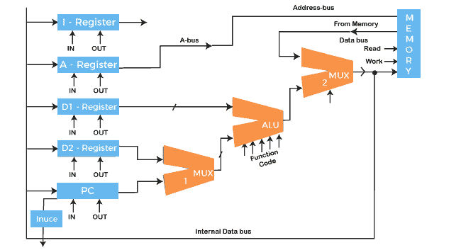
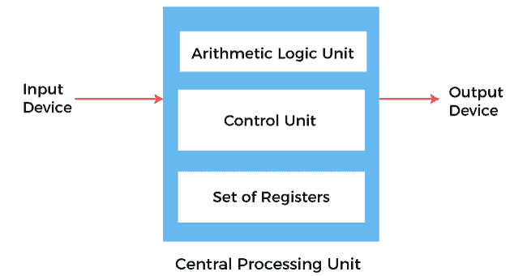
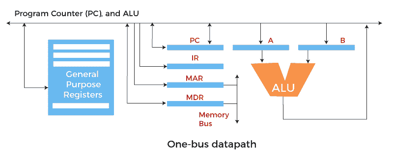
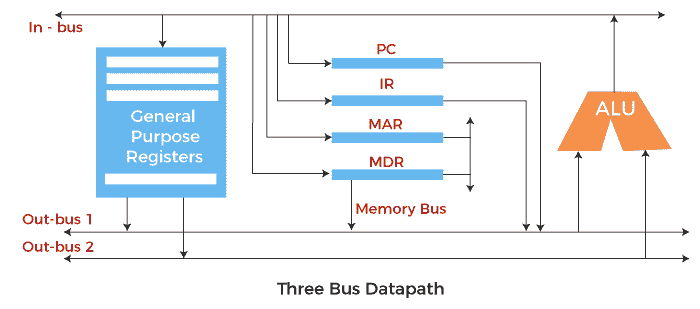

# 计算机组织中的算术逻辑单元和数据路径

> 原文：<https://www.javatpoint.com/alu-and-data-path-in-computer-organization>

早期，表示和存储数字是计算机的基本操作。但是当计算机有了计算，处理像加法、乘法运算这样的数字时，这些运算就由计算机的算术逻辑单元来处理。T3】

中央处理器可以分为两部分:

1.  **数据部分:**存储器、寄存器、加法器、算术逻辑单元和通信总线。每个步骤(获取、解码、执行、保存结果)都需要内存、寄存器和算术逻辑单元之间的通信(数据传输)路径。它也被称为 ***数据路径。***
2.  **控制部分:**每个步骤的数据路径由控制信号建立，控制信号在通信总线上建立数据流方向，并选择算术逻辑单元和存储器功能。控制信号由由一个或多个有限状态机组成的控制单元产生。

### 数据分支

假设任何数据处理操作都应该在中央处理器中执行，比如将寄存器的内容从一个地方转移到另一个地方，从一个寄存器转移到另一个寄存器，在算术逻辑单元中执行两个数字的加法，在内存中复制一些东西，并复制到寄存器中。所以，任何数据处理操作都发生在 CPU 中，然后对于那个数据操作，数据遵循一个特定的路径，称为 ***“数据路径”。*T3】**

数据路径是功能单元的集合，例如执行数据处理操作的算术逻辑单元 或乘法器、 ***寄存器、*** 和 ***总线。*** 与控制单元一起组成中央处理器(CPU)。通过使用多路复用器连接多个数据路径，可以形成更大的数据路径。

数据路径是 ***ALU、*** 一组 ***寄存器、*** 以及允许数据在它们之间流动的 CPU 内部总线。

最简单的 CPU 设计使用一条公共内部总线，高效的加法需要稍微复杂一点的三条内部总线结构。许多相对简单的中央处理器有一个 2 读 1 写寄存器文件，连接到算术逻辑单元的 2 个输入和 1 个输出。

### 1.算术逻辑单元

***ALU*** 是计算机的数学大脑。算术逻辑单元是一种提供算术和逻辑运算的数字电路。它是计算机中央处理器的基本构件。它存在于每个中央处理器中，执行加法、减法、除法、乘法等操作。

应用逻辑来执行特定的指令或程序是系统的主要组成部分。ALU 以两个操作数作为输入和函数代码，ALU 可以执行减法、X-NOR、除法等多种功能。

除了算术逻辑单元，现代的中央处理器还包含一个控制单元和一组寄存器。大多数操作由一个或多个从输入寄存器加载数据的算术逻辑单元执行。寄存器是 CPU 可用的少量存储空间，可以非常快速地访问这些寄存器。控制单元告诉算术逻辑单元对可用数据执行什么操作。在计算或操作之后，算术逻辑单元将输出存储在输出寄存器中。

### 2.登记

在这里，寄存器就像门，信号通过它被进一步发送到组件以进行微操作。寄存器受控制，寄存器的信号由控制单元控制。以下是用于存储输入输出信号数据的五个寄存器:

1.  **程序计数器**
    程序计数器(PC)是计算机处理器中的一个 CPU 寄存器，它具有从存储器中要执行的下一条指令的地址。当每个指令被提取时，程序计数器将其存储值增加 1。它是一个数字计数器，用于更快地执行任务和跟踪当前执行点。
2.  **指令寄存器**
    在计算中，指令寄存器(IR)是 CPU 控制单元的一部分，保存当前正在执行或解码的指令。指令寄存器是中央处理器控制单元的一部分，保存当前正在执行或解码的指令。指令寄存器专门保存指令，并将其提供给指令解码器电路。
3.  **内存地址寄存器**
    内存地址寄存器(MAR)是中央处理器寄存器，存储从中央处理器获取数据的内存地址或发送和存储数据的地址。它是中央处理器(中央处理器)中的一个临时存储组件，临时存储存储单元发送的数据的地址(位置)，直到特定数据的指令被执行。
4.  **内存数据寄存器**
    内存数据寄存器(MDR)是计算机处理器或中央处理器(CPU)中的寄存器，用于存储进出即时存取存储器的数据。内存数据寄存器(MDR)也称为内存缓冲寄存器(MBR)。
5.  **通用寄存器**
    通用寄存器用于存储微处理器内部的临时数据，是一个多用途寄存器。程序员或用户都可以使用它们。

### 3.公共汽车

在早期的计算机中，总线是具有多个硬件连接的并行电线。因此，总线是在计算机内部组件之间或计算机之间传输数据的通信系统。它包括电线、光纤等硬件组件。和软件，包括通信协议。

寄存器、ALU 和互连总线统称为 ***数据路径。*T3 以下是公交车的类型，例如:**

1.  **地址总线:**用于传送地址的总线。
2.  **数据总线:**用于传输数据的总线。
3.  **控制总线:**如果总线携带控制信号。
4.  **电源总线:**如果是承载时钟脉冲、电源信号，则称为电源总线。

总线可用于单一目的或多种目的。当我们拥有不同种类的公交车时，不同类型的 ***公交组织*** 就会发生，比如:

### 一个巴士组织

在一个总线组织中，单个总线用于多种目的。一组通用寄存器、程序计数器、指令寄存器、存储器地址寄存器和存储器数据寄存器与单一总线相连。内存读/写可以用 MAR 和 MDR 来完成。

该程序与下一条指令的提取位置相对应。指令寄存器将保存当前指令的副本。在一个总线组织中，一次只能从总线中读取一个操作数。

如果要求为操作读取两个操作数，那么读取操作需要执行两次。所以这就是为什么它让这个过程变得更长了。一个总线组织的优点之一是它是最简单的，而且实现起来非常便宜。

同时，它还有一个缺点，就是只有一条总线。所有通用寄存器、程序计数器、指令寄存器、MAR 和 MDR 都可以访问这种“一条总线”，使每个操作都是顺序的。如今没有人推荐这种建筑。

### 两个巴士组织

这克服了一个总线组织的缺点，并且开发了另一个被称为两个总线组织的体系结构。在两个总线组织中，有两条总线，通用寄存器可以从两条总线读取/写入。在这种情况下，由于两条总线，可以同时提取两个操作数。

一个总线取操作数用于 ALU，另一个总线取操作数用于寄存器。当两条总线都忙于获取操作数时，就会出现这种情况，输出可以存储在临时寄存器中。当总线空闲时，特定的输出可以放在总线上。

两种公交组织有两种版本，即车内公交和车外公交。从内部总线，通用寄存器可以读取数据，从外部总线，通用寄存器可以写入数据。在这里公共汽车是专用的。

### 三巴士组织

在三个总线组织中，我们有三个总线，输出总线 1、输出总线 2 和输入总线。从输出总线上，我们可以得到来自通用寄存器并在算术逻辑单元中计算的操作数，输出在输入总线上被丢弃，以发送到相应的寄存器。

这种实现很复杂，但速度更快，因为两个操作数可以并行流入和流出算术逻辑单元。它的开发是为了克服两个公交组织的“繁忙等待”问题。

在这种结构中，执行后，输出可以放在总线上，而无需等待，因为有一条额外的总线。多公交组织相对于单公交的主要*优势有:*

 **   增加寄存器的大小。
*   减少执行周期数。
*   提高执行速度，或者我们可以说更快的执行。

* * **