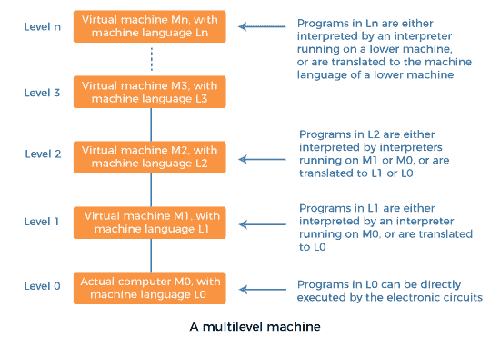
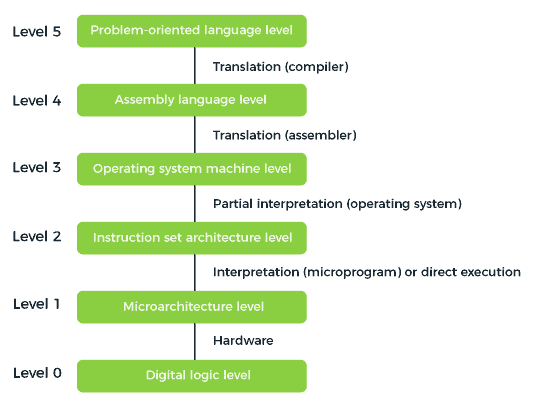

# 结构化计算机组织

> 原文：<https://www.javatpoint.com/structured-computer-organization>

数字计算机是一种机器，它可以通过执行给它的指令来为人们解决问题。计算机的原始指令形成了一种语言，人们可以用它与计算机进行交流。这种语言被称为 ***机器语言。*T3】**

当我们进入设计电脑的时代，人们面临着一个很大的问题:方便人们的东西和方便电脑的东西之间有很大的差距。这个问题导致将计算机构造成一系列抽象，每个抽象都建立在它下面的抽象之上。

通过这种方法，可以控制复杂性，并且可以系统地设计和组织计算机系统。这种方法被称为 ***结构化计算机组织。*T3】**

他们试图用机器语言使原始指令尽可能简单，这种语言对计算机的使用和性能要求是可靠的，以降低所需电子设备的复杂性和成本。

**比如**人要做 X 任务，电脑只能做 Y 任务。这给人们带来了一个问题，这就是为什么人们决定设计一种新的计算机，称为结构化计算机组织。

### 解决这个问题的方法

这个问题可以通过两种方式解决。这两种解决方案都涉及设计一套新的指令，更方便人们使用内置的机器指令。

假设有两种语言，L0(机器语言)和 L1(机器无法理解的机器语言)。现在我们有两种方法可以让 L1 在机器上执行。

**1 st 方法:**执行一个 L1 写的程序，在 L0 中用等价的指令序列替换每个指令。现在生成的程序完全由 L0 条指令组成。然后计算机执行新的 L0 程序，而不是旧的 L1 程序。这种手法叫做**翻译*。***

**2 nd 方法:**在该方法中，在 L0 中编写一个程序，该程序以 L1 的程序为输入数据，通过依次检查每个指令来执行，并直接执行 L0 指令的等价序列。它不需要在 L0 中生成新程序。这种技术被称为*，执行它的程序被称为 ***解释器。****

*

***翻译*** 和 ***解读*** 都差不多。在这两种方法中，计算机通过在 L0 中执行等价的指令序列在 L1 执行指令。主要区别在于，在翻译中，整个 L1 程序首先被转换成一个 L0 程序，而 L1 程序被扔掉，然后新的 L0 程序被加载到计算机的内存中。在执行过程中，新生成的 L0 程序在计算机的控制下运行。

在解释中，在每个 L1 指令被检查和解码之后，它被立即执行。不会生成任何已翻译的程序。在这里，解释器控制着计算机，而 L1 程序只是数据。这两种方法以及这两种方法的组合被广泛使用。

### 多级机器

我们想象的不是翻译或口译方面的思考，而是一台*或 ***虚拟机*** ，其机器语言是 L1。我们把虚拟机叫做 M1，把对应的虚拟机叫做 L0，M0。*

 *人们可以简单地在 L1 编写程序，然后由计算机直接执行。即使以 L1 为语言的虚拟机过于昂贵或复杂，无法用电子电路来构建，人们仍然可以为其编写程序。这些程序可以由用 L0 编写的程序解释或翻译。

*   要进行 ***翻译*** 或 ***口译，***L0 和 L1 的语言一定不能太不一样。这种限制意味着 L1 优于 L0，但对于大多数应用来说仍远非理想。与创建 L1 的最初目的相比，这个结果可能令人失望。
*   现在，我们发明了另一套指令，它比 L1 更以人为本，而不是机器为本。第三组也形成了一种语言，我们称之为 L2 与虚拟机 M2。人们可以在 L2 写程序。这些程序既可以翻译成 L1 语，也可以由 L1 的翻译来执行。
*   在整个系列的语言中，每一种都比它的前辈更方便。一直持续到找到合适的。每种语言都以其前身为基础，因此我们可以将使用这种技术的计算机视为一系列的 ***层*** 或 ***层，*** 层层叠叠，如上图所示。最底层的语言或层次最简单，最顶层的语言或层次最复杂。

在某种情况下，具有 n 个级别的计算机可以被视为 n 个不同的虚拟机，每个虚拟机使用不同的机器语言。电子电路可以直接只传送用 L0 语言编写的程序，而不需要翻译或口译。程序是在 L2 的 L1 编写的，...，Ln 必须由运行在较低级别的解释器进行解释，或者翻译成与较低级别相对应的另一种语言。

### 当代多级机器

当代多级机器中存在六个级别，如下图所示。底层的 0 级是机器真正的硬件，它的电路执行 1 级的机器语言程序。

1.  **数字逻辑电平:**由模拟元件构成，如门和晶体管。每个门都有一个或多个数字输入，并计算这些输入的一些简单函数，如“与”或“或”。每个栅极最多由一个晶体管构成。
    少量的门组合成一个 1 位存储器，存储在 0 或 1 中。1 位存储器以 16、32 或 64 为一组进行组合，形成寄存器。每个寄存器最多可以保存一个二进制数。盖茨也可以结合起来，形成主计算引擎本身。
2.  **微体系结构级别:**它有 8 到 32 个寄存器的集合，这些寄存器组成了一个本地存储器和一个称为 ALU(算术逻辑单元)的电路，它可以执行简单的算术运算。寄存器连接到算术逻辑单元，形成数据流动的数据路径。数据路径的基本操作包括选择一个或两个寄存器，让算术逻辑单元对其进行运算，并将结果存储回某个寄存器。
    在一些机器上，数据路径的操作由一个叫做 ***微程序的程序控制。*** 在其他机器上，数据路径由硬件直接控制。在用软件控制数据路径的机器上，微程序是二级指令的解释器。它使用数据路径一个接一个地获取、检查和执行指令。
3.  **指令集架构(ISA)级别:**如果计算机制造商为其一台机器提供两个解释器，并解释两个不同的 ISA 级别，则需要提供两个机器语言参考手册，每个解释器一个。
4.  **操作系统机器级别:**这个级别通常是混合级别，其语言的指令大部分也是 ISA 级别。还有新的指令、不同的内存组织、并发运行两个或多个程序以及各种其他功能。操作系统解释一些 3 级指令，一些直接由微程序解释。
5.  **汇编语言级别:**这个级别允许人们以不像虚拟机语言本身那么令人讨厌的形式编写 1、2、3 级的程序。汇编语言的程序首先被翻译成 1、2 或 3 级语言，然后由适当的虚拟或实际机器进行解释。执行翻译的程序叫做 ***汇编程序。***
6.  **面向问题的语言层面:**由应用程序员设计的解决问题的语言组成。这种语言通常被称为高级语言，用这些语言编写的程序通常被称为编译器的翻译器翻译成 3 级或 4 级。
    在某些情况下，第 5 级由特定应用领域的解释器组成，如符号数学。它为解决这一领域的问题提供数据和操作，以便人们能够容易地理解。

* * ***