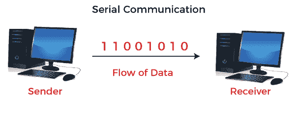
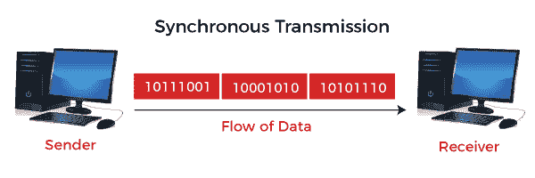
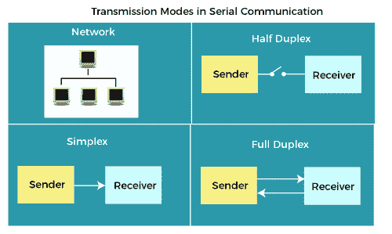
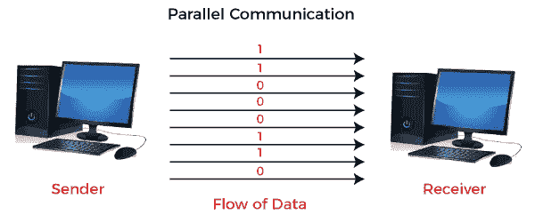
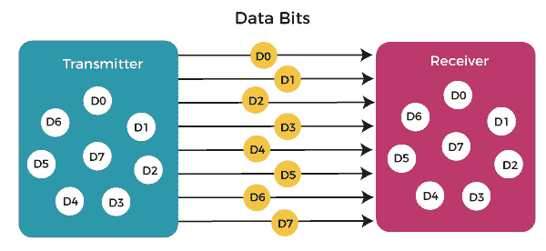
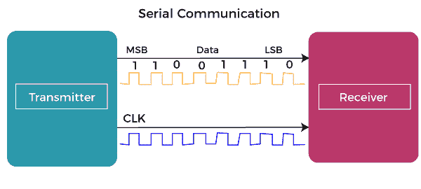
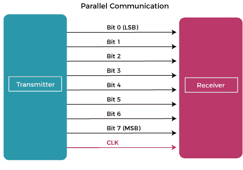

# 计算机组织中的串行通信

> 原文：<https://www.javatpoint.com/serial-communication-in-computer-organization>

串行通信是在同一通道上顺序传输信息/位的过程。因此，电线的成本会降低，但会降低传输速度。一般来说，交流可以被描述为个人之间以音频、视频、口头语言和书面文件的形式交换信息的过程。串行协议运行在每一个设备上，这些设备可以是我们的移动设备、个人电脑，还有许多其他设备，这些设备都有一些协议的帮助。该协议是一种可靠且安全的通信形式，包含一组在源主机和目标主机的帮助下处理的规则。在串行通信中，二进制脉冲用于显示数据。二进制包含两个数字 0 和 1。0 表示低电压或 0 伏，1 表示高电压或 5 伏。串行通信可以是异步的，也可以是同步的。

## 同步通信

在**同步通信中，**帧或数据将在组合位组的帮助下构建。这些帧将通过主时钟及时连续发送。它使用同步时钟频率来操作发送者或接收者的数据。在同步通信中，不需要使用间隙、开始位和停止位。发送方和接收方花费的时间是同步的，这就是为什么定时误差的频率会更低，数据移动会更快。在发送方和接收方设备之间正确同步定时的基础上，数据精度完全取决于。与异步串行传输相比，同步串行传输更昂贵。

## 异步通信

在**异步通信中，**比特组将被视为一个独立的单元，这些数据位将在任何时间点发送。为了使发送器和接收器之间同步，在数据字节之间使用停止位和开始位。这些位对于确保正确发送数据非常有用。发送方和接收方的数据位所花费的时间不是恒定的，传输之间的时间将由间隙提供。在异步通信中，我们不需要发送方和接收方设备之间的同步，这是异步通信的主要优势。这种方法也很划算。在这种方法中，可以有数据传输慢的情况，但不是强制的，这是异步方法的主要缺点。

根据数据传输速率和传输模式的类型，串行通信将采取多种形式。传输模式可分为单工、半双工和全双工。每种传输模式都包含源(也称为发送方或发送方)和目的地(也称为接收方)。

## 传输方式

传输模式描述如下:

### 单一的

在单纯形法中，数据传输只能在一个方向上进行。一次只能有一个客户端(发送方或接收方)处于活动状态。这意味着在两个设备中，一个设备只能传输链路，而另一个设备只能接收链路。发送方只能传输数据，接收方只能接受该数据。接收方无法回复发送方。在另一种情况下，如果接收者发送数据，发送者将只接受它。发送方无法回复接收方。

单纯形有各种各样的例子。**例 1:键盘**和 **CPU** 是单工的最佳例子。键盘总是将字符传输到中央处理器，但中央处理器不要求将字符或数据传输到键盘。**例 2:打印机**和**计算机**是单工的又一个例子。计算机总是向打印机发送数据，但是打印机不能向计算机发送数据。在某些情况下，打印机也可以回话，这种情况是个例外。单纯形中只有一条车道。

**例 3:图文电视**也是单工的一个例子。电视公司播放数据。同时，将使用天线，这将有助于在人们的家中以电视图像的形式广播数据。但是人们不能把信号传回天线。借助我们的手持电话或移动电话，我们可以将请求页面或频道设置到我们电视的特殊图文电视适配器。当请求的页面被广播时，特殊的图文电视适配器将捕获请求的图文电视页面。电视永远不会向发射机发回请求。**例 4:单行道**也是单行道的一个例子。单行道上的车辆只能往一个方向行驶，从相反方向来的车辆不允许从那个方向驶过。

### 半双工

在半双工模式下，发送方和接收方可以双向通信，但不能同时通信。如果发送方发送一些数据，接收方能够接受，但在那个时候，接收方不能向接收方发送任何东西。就像如果接收者向发送者发送数据，发送者不能发送一样。如果有一种情况，我们不需要同时在两个方向上通信，我们可以使用半双工。**比如****互联网**就是半双工的一个很好的例子。在互联网的帮助下，如果用户向网络服务器发送网页请求，服务器将处理该应用程序并将请求的页面发送给用户。

**一巷桥**也可以解释半双工。在单行道桥中，双向车辆将提供道路，以便他们可以通过。一次只有一端发送，另一端只接收。我们还可以执行纠错，这意味着如果接收方收到的信息被破坏，那么它可以再次请求发送方重新发送该信息。**对讲机**也是半双工的经典例子。对讲机的两端都有扬声器。我们可以使用每个手机或对讲机发送或接收信息，但我们不能同时做这两件事。

**铁路**通常包含半双工的场景，因为它更便宜，并且必须铺设一条轨道。火车司机必须把火车停在一条轨道的一端，直到另一列火车的司机通过，而另一列火车正朝另一个方向行驶。**打印机**也是半双工的一个好例子。在 IEEE-1284 中，打印机也能够向计算机发送消息。当计算机向打印机发送字符时，此时，打印机无法向计算机发送消息。当计算机成功发送所有消息并在此之后停止发送时，打印机可以将消息发送回计算机。半双工有一个优点，即与单线或单线相比，双线或双线的成本较高。

### 全双工

在全双工模式下，发送方和接收方能够同时发送和接收。全双工通信模式在世界范围内被广泛使用。在这种模式下，沿一个方向传播的信号能够与沿相反方向传播的信号共享链路容量。共享有两种方式，描述如下:

*   链路的容量分为双向信号。
*   或者链路具有两个物理上分离的传输部分。其中一部分可用于发送，另一部分可用于接收。

如果我们经常需要双向通信，在这种情况下，我们将使用全双工模式。通道的容量将被分成两个方向。

**示例:电话网络**是全双工模式的一个很好的例子。当使用电话或电话时，两个人能够同时说话和听到这两件事。**普通双车道公路**有助于说明全双工。如果交通非常拥挤，在这种情况下，铁路决定采取双重策略，允许列车双向通行。这种情况通常在网络通信中使用。光纤集线器用于在每个端口上包含两个连接器。全双工光纤是两种电缆的一种，它们连接在一起，可以形成双车道。

**音频通话或视频通话**也是全双工的一个例子。在音频或视频通话中，两个人可以同时通信。在音频通话中，他们能够同时说和听，在视频通话中，他们能够通过同时看到对方来交流。如果我们在全双工模式下工作，与单双工和半双工模式相比，它将提供最佳性能，因为它能够最大限度地利用可用带宽。

## 并行通信

还有一种称为并行通信的通信类型，描述如下:

**并行通信**用于一次在同一无线路径或电缆内的不同信道上同时传输海量数据信号。它用于包含大量并行的有线通道。在并行通信中，发送方和接收方之间的数据传输是在多个通道的帮助下完成的。与串行设备相比，并行设备中的数据总线更宽。这就是为什么它可以一次将数据从源传输到目标。与串行传输比特率相比，并行传输比特率更高。

与单线相比，多线的成本更高。并行电缆变长，这就是为什么它需要高成本。如果距离较大，多个通道之间的同步时序会变得更加敏感。恒定的时钟信号用于提供并行通信中的定时。信号是在并行电缆中的单独导线的帮助下发送的。所以我们可以说并行通信是同步的。

### 并行通信工作

并行通信使用各种并行路径(导线)在单个时钟的帮助下，在同一电缆内同步传输多个位。时钟使用这些并行路径，并以恒定时钟信号的形式指定传输时序。

在各种并行路径的帮助下，大量的比特被同时传输。接收位串的顺序有不同的方式，它取决于各种因素，如可用带宽、源距离和位置。视频通话和网络通话的跳跃就是一个例子。

## 串行通信和并行通信的区别

串行通信一次只能发送一位。这就是为什么串行通信需要更少的输入/输出线路。它还占据了更多的阻力和更少的串扰空间。串行通信的更大优势是构建整个嵌入式系统的成本变得非常便宜。它还可以通过一根电线或一条线路远距离传输数据。

在调制解调器等 DCE 设备(数据通信设备)中，大多使用串行通信。所有主要的计算机网络或通信大多倾向于串行通信。如今，最常见和最流行的小距离模式是串行总线，因为并行总线的缺点超过了它们简单的优点。

并行通信能够一次发送一大块数据(大约 32 位)。这就是为什么在并行通信中，每一位数据都需要单独的物理输入/输出。并行通信也有一个很好的优点:速度很快，但也需要更多的 I/O 线，这是并行通信的缺点。计算机使用并行通信，因此它们可以互连音频、视频、随机存取存储器、调制解调器、网络硬件和中央处理器。并行通信的配置非常冗长和复杂。这也是它成立成本也很高的原因。

## 串行通信优于并行通信

大多数人有一个误解，认为并行端口/总线比串行端口/总线快，因为在串行通信中，每单位时间的数据传输只有一位。与串行总线相比，即使并行总线的时钟速率也要慢得多。有各种因素用来说明串行通信优于并行通信，如下所述:

**不需要时钟:**如果存在异步和非时钟类型的串行通信的情况，则与通道之间的时钟偏差相关的问题将不存在。

**需要更少的空间:**在配置串行通信的时候，因为串行连接需要更少的电缆，所以需要更少的空间。因此，由于这一特性，我们将有一个额外的空间，可用于提供数据通道/通道与相邻通信组件的更好隔离。

**无串扰:**串行通信在附近空间包含较少数量的导体。这就是为什么相声的可能性很小。

**低成本:**串行通信包含串行链路。该链路的成本低于并行链路。

* * *