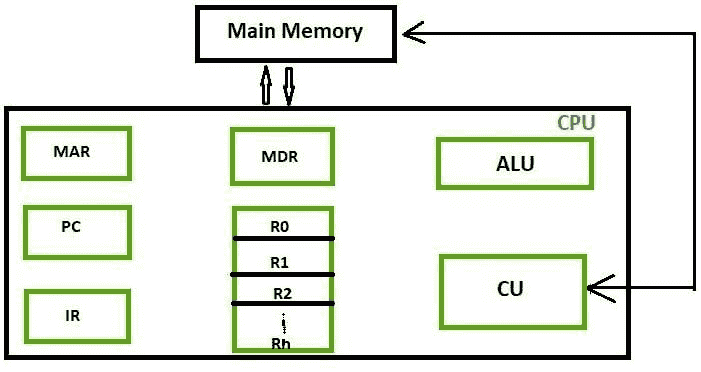

# 计算机组织中寄存器的类型

> 原文：<https://www.javatpoint.com/types-of-register-in-computer-organization>

在计算机组织中，寄存器用于确认、存储、移动中央处理器正在快速使用的信息和方向。出于不同的原因，使用了不同类型的寄存器。一些常用寄存器包括:

*   交流(蓄电池)
*   数据寄存器
*   地址寄存器
*   程序计数器
*   存储器数据寄存器
*   索引寄存器
*   内存缓冲寄存器

这些寄存器用于播放不同的操作。当我们执行一些操作时，中央处理器利用这些寄存器来执行操作。当我们为某个操作向系统提供输入时，所提供的信息或输入会存储在寄存器中。一旦算术逻辑单元处理了输出，经过处理的数据再次由寄存器提供给我们。

拥有寄存器的唯一原因是快速恢复中央处理器稍后将处理的信息。中央处理器可以使用内存而不是硬盘来检索内存，这是一个相对较快的选择，但是从内存中检索的速度仍然不够。因此，我们有比寄存器更快的捕获内存。这些寄存器与中央处理器内存(如 catch 和 RAM)一起工作，以快速完成任务。

### 寄存器执行的操作

寄存器执行以下主要操作，例如:

*   **提取:**提取操作用于客户端获取方向。存储在主存储器中供以后处理的指令由寄存器取出。
*   **解码:**该操作用于解密指令，意味着指令被解码，中央处理器将发现对指令执行哪个操作。
*   **执行:**CPU 执行此操作。此外，由中央处理器提供的结果然后存储在内存中，然后，它们显示在客户端屏幕上。

### 计算机组织中寄存器的类型

以下是计算机组织中的寄存器类型，例如:

| S.NO | 名字 | 标志 | 机能 |
| one | 蓄电池 | 英亩 | 累加器是最常用的寄存器，用于存储从内存中获取的信息。 |
| Two | 存储器地址寄存器 | 瑕疵 | 存储器的地址位置存储在该寄存器中，供以后访问。它由 MAR 和 MDR 一起调用 |
| three | 存储器数据寄存器 | minimum daily requirement 日最低需要量 | 所有应该写入的信息或应该从某个存储地址读取的信息都存储在这里 |
| four | 通用寄存器 | 政府公关（Goverment Public Relations 的缩写） | 由一系列寄存器组成，通常从 R0 开始，一直运行到 Rn - 1。这些寄存器倾向于存储在任何承接过程中发送到寄存器的任何形式的临时数据。
更多 GPR 使能寄存器对寄存器寻址，提高处理速度。 |
| five | 程序计数器 | 个人电脑 | 这些寄存器用于保存正在执行或正在执行的程序的记录。这些寄存器由要提取的下一条指令的存储器地址组成。
当前一条指令成功完成时，PC 指向下一条要从主存储器中取出的指令的地址。程序计数器(PC)也用于计算指令的数量。
个人电脑的增加取决于使用的架构类型。如果我们使用 32 位体系结构，每次获取下一条指令时，PC 都会递增 4。 |
| six | 指令寄存器 | 红外的 | 指令寄存器保存要执行的信息。从系统接收的即时指令被提取并存储在这些寄存器中。
一旦指令存储在寄存器中，处理器开始执行设定的指令，PC 将指向下一条要执行的指令 |
| seven | 条件代码寄存器 |  | 它们有不同的标志来描述操作的状态。如果运算结果为零或负，这些寄存器相应地设置标志 |
| eight | 临时寄存器 | 土耳其 | 保存临时数据 |
| nine | 输入寄存器 | INPR | 携带输入字符 |
| Ten | 输出寄存器 | OUTR | 携带输出字符 |
| Eleven | 索引寄存器 | 布朗克斯(Bronx) | 我们使用该寄存器存储地址信息中包含的值和数字，并将它们转换为有效地址。这些也被称为基址寄存器。
这些用于在执行时改变操作数地址，也称为 BX |
| Twelve | 存储器缓冲寄存器 | 主引导记录 | 内存缓冲寄存器用于存储数据内容或用于在磁盘上写入的内存命令。这些的基本功能是从内存中保存被调用的数据。
MBR 与 MDR 非常相似 |
| Thirteen | 堆栈控制寄存器 | 教员公用室 | 堆栈是一组位置存储器，数据以一定的顺序存储和检索。也叫后进先出(LIFO)，我们只能在取出第一个栈后，才能在第二个位置取出一个栈，栈控制寄存器主要用来管理计算机中的栈。
SP - BP 是堆栈控制寄存器。此外，我们可以使用 DI、SI、SP 和 BP 作为 2 字节或 4 字节寄存器。
EDI、ESI、ESP 和 EBP 是 4 字节寄存器 |
| Fourteen | 标志寄存器 | FR | 标志寄存器用于指示特定条件。注册标志的大小为 1 - 2 个字节，每个注册标志还被合成为 8 位。每个注册的标志定义一个条件或标志。
存储的数据被分成 8 个独立的位。
基本标志寄存器-
零标志
进位标志
奇偶标志
标志
溢出标志。 |
| Fifteen | 段寄存器 | 立体弧度 | 保存内存地址 |
| Sixteen | 数据寄存器 | 高级的（deluxe 的简写） | 保持内存操作数 |

* * *