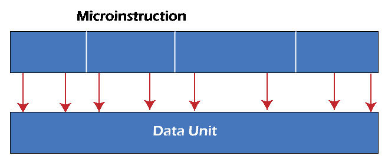
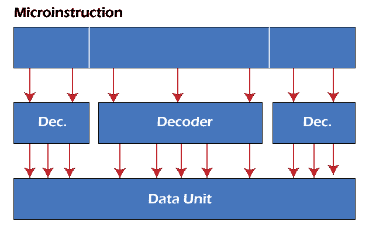

# 水平微编程控制单元与垂直微编程控制单元

> 原文：<https://www.javatpoint.com/horizontal-micro-programmed-vs-vertical-micro-programmed-control-unit>

为了理解水平和垂直控制单元，我们将首先了解控制单元，微编程，然后微编程控制单元。之后，我们将学习水平和垂直控制单元的区别。

### 控制部件

**控制单元**可以描述为中央处理器的一部分。它是一个引擎，使用适当的控制信号序列，使其能够运行系统或计算机的全部功能。它用于指导处理器的操作。CU 的工作是告诉系统的存储器、输入和输出设备以及算术或逻辑单元，它们应该如何响应那些已经发送到处理器的指令类型。

### 微编程

**微程序**可以描述为写微码控制 CPU 内存的过程。当计算机的配置和微程序控制单元的建立完美完成时，只有在这之后，才能产生控制存储器的微码。控制单元用于包含控制存储器，控制存储器可用于存储所有微程序。这些类型的微程序不能频繁修改。微指令可以在每一行微程序的帮助下指定，这些指令用于定义一个或多个微操作。

### 微编程控制单元

微编程控制单元用于在产生控制信号的帮助下执行每个指令。**微编程控制单元中使用了特殊的存储单元。**借助这个存储器，我们可以存储与操作相关的控制信号。我们可以假设一组控制信号，这些信号可以作为“微指令”来执行特定的微操作。借助内部控制单元，我们可以存储微指令序列。基于保存在控制存储器中的控制字，有两种类型的微编程控制单元。这些微编程控制单元是垂直微编程控制单元和水平微编程控制单元。现在我们将像这样逐一描述两个控制单元:

## 水平微编程控制单元

借助解码后的二进制格式，我们可以在水平微编程控制单元中表示控制信号，即 1 位/CS。这里，“n”个控制信号需要 n 位编码。在单个控制点的帮助下，每个位在水平微编程控制单元中被识别。该控制点用于显示相应的微操作将被执行。在这个控制单元中，每个微程序需要的微指令数量较少。在每一条微指令的帮助下，可以同时控制几个资源。它还有一个更大的优势，即它有能力利用更高效的硬件。

水平 CU 提供了更高的平行度。这种并行性包含一个单独的控制字段和最少数量的编码。在水平大学中，借助于有效和最佳地利用资源来开发微程序的任务是非常复杂的。水平微编程控制单元中的每个控制位彼此独立。这就是为什么这个 CU 提供了很大的灵活性。与垂直微指令相比，水平微指令包含更多的信息，因为水平微指令包含更大的长度。

**图:水平微码**

## 垂直微编程控制单元

与水平微编程控制单元相比，在垂直微编程控制单元中可以应用更高程度的编码和可变格式。借助于编码的二进制格式，我们可以表示垂直微编程控制单元中的控制信号。这里,“n”个控制信号需要 log2n 位编码。每个垂直微指令代表一个微操作。在垂直 CU 的帮助下，我们可以缩短微指令的长度，同时防止微指令的长度受到存储容量增加的直接影响。

微指令是在代码的帮助下执行的，这个代码将在解码器的帮助下被转换成各个控制信号。因为这里我们只指定了将要执行的微操作，微指令的字段被充分利用。基本上有 4 到 6 个字段，每个指令大约需要 16 到 32 位。与水平微编程相比，我们可以很容易地编写垂直微编程。与传统的机器语言格式一样，垂直微指令也包含几个操作数和一个操作。因此，我们可以很容易地使用垂直微指令进行微编程。

**图:垂直微码**

## 水平和垂直微程序控制单元的区别

垂直编程控制单元和水平编程控制单元之间有各种不同，描述如下:

| 水平微程序控制单元 | 垂直微编程控制单元 |
| 该控制单元能够支持**更长的控制字。** | 该控制单元能够支持**更短的控制字。** |
| 在这个 CU 中，我们不需要任何类型的额外硬件。 | 在这个控制单元中，我们需要额外的硬件来产生控制信号。这些类型的硬件必须是解码器的形式。 |
| 与垂直微编程控制单元相比，该控制单元**的灵活性较低。** | 与水平微编程控制单元相比，该控制单元**更加灵活。** |
| 相比垂直微编程控制单元，这个控制单元更快**。** | 与水平微编程控制单元相比，该控制单元慢**。** |
| 与垂直微编程控制单元相比，该控制单元使**只读存储器编码的**使用较少。**** | 与水平微编程控制单元相比，该控制单元使**更多地使用 **ROM 编码**的**，从而可以减少控制世界的长度。 |
| 水平微编程控制单元允许更高的并行度。如果有' n '个度数，一次将启用 n 个控制信号。 | 垂直微编程控制单元允许低平行度。这意味着并行度可以是 0 或 1。 |
| 水平微指令由水平微程序控制单元使用。这里控制线被控制字段的每一位攻击。 | 垂直微指令由垂直微编程单元使用。这里，每个动作都将在代码的帮助下执行，并且该代码将在解码器的帮助下被转换成各个控制信号。 |

**例如:**

在这个例子中，我们将假设 4k 个单词，这在假设的控制单元的帮助下得到支持。硬件中总共有 16 个标志和 64 个控制单元。现在，对于两种类型的编程，即水平和垂直编程，我们必须找到以字节为单位的控制存储器的大小和以位为单位的控制字的大小。

**解决方案:**

**用于水平编程**

64 个信号的 64 位

控制字的大小= 4 + 64 + 12 = 80 位

控制存储器的大小= 4kw =((4 * 80)/8)= 40k 字节

**用于垂直编程**

64 个信号的 6 位，即 log264

控制字的大小= 4 + 6 + 12 = 22 位

控制存储器的大小= 4kw =((4 * 22)/8)= 11k 字节

### 水平和垂直微程序控制单元之间的其他一些区别

现在我们将根据一些参数来描述这些差异，例如序列、编码、设计和灵活性。这些差异描述如下:

**编码**

更高的**编码度**和可变格式包含在**垂直微编程中。**这里使用代码对控制位进行编码。每个动作都将在该代码的帮助下执行，并且该代码将在指令解码器的帮助下被解码成一个以上的控制信号。与垂直微编程控制单元相比，**水平微编程控制单元**具有包含水平微指令的能力，水平微指令根本不使用任何类型的编码。水平 CU 用于显示数据路径中的每个控制位。这里一个单独的位以微指令格式分配给数据路径。控制线用于攻击控制字段中的每一位。

**序列**

在**水平微程序设计中，**我们可以借助**顺序方法指定微程序中的下一条指令。**传统的机器学习格式也使用相同的方法。单个控制点用于识别水平微编程中的每个位。该控制点用于显示相应的微操作将被执行。为了打破顺序，我们不得不使用特殊的条件和无条件微指令。**垂直微编程采用相对寻址方案。**根据这个方案，我们可以借助几个比特来指定后跳或者相对前跳。在这个过程中，每一步都需要进行地址计算。

**设计**

在**垂直微编程中有一个**更好的代码密度**。**由于这个特性，控店的规模得到了很多好处。与传统的机器语言格式一样，垂直微指令也包含几个操作数和一个操作。单个微操作借助于每个微指令来表示。数据接收器和资源在操作数的帮助下指定。相比之下，**水平微编程**代表将同时执行的不止一个微操作。如果有极端情况，每个水平 CU 可以同时控制多个硬件资源。

**灵活性**

**水平微编程**中的每个控制位相互独立。这就是为什么这个 CU 提供**改进的灵活性。**与垂直微指令相比，它包含的长度更大。因此，水平微程序控制单元能够包含更多的长度。最常用的水平微编程通常包含 48 位或更多位。该单元能够更有效地利用硬件，这是水平微编程的优点。水平控制单元中每个微程序所需的微指令数量越少。与水平微编程控制单元相比，**垂直微编程**更紧凑，但**不太灵活。**在微编程的情况下，因此容易使用的方法是垂直方法。

### 水平和垂直微编程概述

单个微操作可以用**垂直微指令**来表示，这个特征在水平微指令中是不可用的。更高的平行度由**水平微程序执行。**这种并行包含一个单独的控制字段和最少数量的编码。而垂直微程序用于编码控制位。在这两种方法之间进行选择时，我们应该非常小心。然而，在实践中，设计者借助于组合垂直和水平微指令的格式来制作紧凑而有效的结构。

* * *