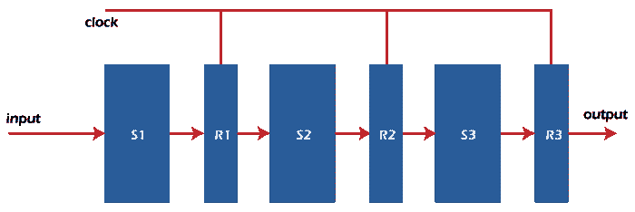
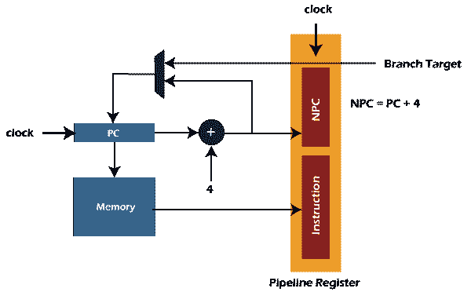
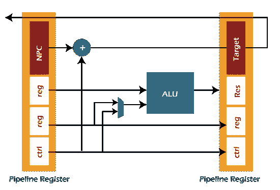
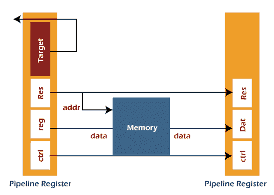
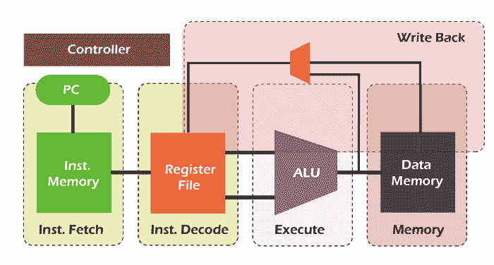

# 流水线中的执行、阶段和吞吐量

> 原文：<https://www.javatpoint.com/execution-stages-and-throughput-in-pipeline>

我们能够借助两种方式来提高 CPU 的性能，描述如下:

*   我们可以引入更快的电路来改进硬件。
*   在安排硬件的帮助下，我们可以同时进行多项操作。

由于速度较快的电路成本较高，而且硬件的速度也有限。由于这些缺点，第 2 <sup>和第 2</sup>选项对我们来说是好的。

### 管道铺设

流水线可以被描述为一种在执行时多个指令重叠的技术。管道中有五个阶段，所有这些阶段都相互连接，以便形成管状结构。流水线中有两端，一端用来输入指令，第二端用来退出指令。由于流水线，整体指令吞吐量增加。流水线系统的每个部分都有一个输入寄存器，后跟一个组合电路。数据在寄存器的帮助下被包含，并且对该数据的操作在该组合电路的帮助下被执行。组合电路的结果将被应用于下一段的输入寄存器。



管道系统也是各种类型工厂中现代装配线的一个设置。**举个例子:**假设有一个汽车制造行业，设置了大量的装配线，每个点都由机械臂执行某项任务。之后，汽车将向前移动到下一个臂。

在流水线化的过程中，CPU 的硬件元素会以一种可以提高整体性能的方式进行排列。在流水线的过程中，可以同时执行多个指令。

**例如:**在这里，我们将借助一个真实的例子来学习流水线操作的概念。在这个例子中，我们将假设一个水瓶包装厂。瓶子必须经过三个阶段。第一阶段是**插入**瓶子(一)。第二个阶段是**在瓶子(F)中注满**水。第三阶段是**密封**瓶子(S)。现在我们将这些阶段称为阶段 1、阶段 2 和阶段 3，以便于理解这个例子。我们将假设每个阶段的操作在 1 分钟内完成。

假设我们有一个非流水线操作。在第一阶段，瓶子首先被插入植物中。插入 1 分钟后，瓶子将进入第 2 阶段，在此阶段将水注入其中。此时，阶段 1 没有发生任何事情。与瓶子进入阶段 3 时相同，在这种情况下，阶段 2 和阶段 3 是空闲的。因此，在非管道操作中制造 1 瓶，平均时间为:

```

Without Pipelining: 9/3 minutes = 3m
I  F  S  |   |    |   |   |   |  
|   |   |   I   F  S  |   |   |
|   |   |   |    |   |   I   F S (9 minutes)

```

现在假设我们有一个管道操作。在这里，当一个瓶子处于阶段 2 时，同时，我们可以将另一个瓶子装入阶段 1。和一样，当瓶子在第三阶段的时候，在那个时候，第一阶段和第二阶段可以各有一个瓶子。所以在第三阶段结束时，我们会在每分钟后得到一瓶新的。因此，在流水线操作中制造 1 瓶，平均时间为:

```

With Pipelining = 5/3 minutes = 1.67m
I  F  S  |   |
|  I   F  S  |
|   |  I   F  S (5 minutes)

```

所以借助流水线操作，系统的效率提高了。

### 基本管道的设计:

*   一条流水线基本上包含两端:第一端是输入端，第二端是输出端。在流水线处理器中，这些端之间有许多级/段。这里，由每一级执行特定的操作，并且一级与下一级的输入相连。
*   两级之间的中间输出可以通过接口寄存器(也称为缓冲器或锁存器)来保持。
*   公共时钟用于连接接口寄存器和流水线中的所有级。

## 流水线处理器的执行

在流水线处理器中，我们可以使用时空有向图，这样我们就可以可视化指令的执行序列。**例如:**我们将假设处理器包含 4 个阶段，我们有 2 条指令要执行。借助下面的时空图，我们能够像这样可视化执行序列:

**现在重叠执行:**

| **阶段/周期** | **1** | **2** | **3** | **4** | **5** | **6** | **7** | **8** |
| **S<sub>1</sub>T3】** | 一 <sub>1</sub> |  |  |  | 一<sub>二</sub> |  |  |  |
| **S<sub>2</sub>T3】** |  | 一 <sub>1</sub> |  |  |  | 一<sub>二</sub> |  |  |
| **S<sub>3</sub>T3】** |  |  | 一 <sub>1</sub> |  |  |  | 一<sub>二</sub> |  |
| **S<sub>4</sub>T3】** |  |  |  | 一 <sub>1</sub> |  |  |  | 一<sub>二</sub> |

总时间= 8 个周期

**重叠执行:**

| **阶段/周期** | **1** | **2** | **3** | **4** | **5** |
| **S<sub>1</sub>T3】** | 一 <sub>1</sub> | 一<sub>二</sub> |  |  |  |
| **S<sub>2</sub>T3】** |  | 一 <sub>1</sub> | 一<sub>二</sub> |  |  |
| **S<sub>3</sub>T3】** |  |  | 一 <sub>1</sub> | 一<sub>二</sub> |  |
| **S<sub>4</sub>T3】** |  |  |  | 一 <sub>1</sub> | 一<sub>二</sub> |

总时间= 5 个周期

## 流水线级

在 RISC 处理器中，我们可以借助 5 个指令级来执行 RISC 指令集的所有指令。第一阶段是**取指令**，从内存中取出指令。第二阶段是**指令解码**，指令被解码，寄存器被读取。第三阶段是**指令执行**，我们在这里计算地址或者执行操作。第四阶段是**内存访问阶段**，在此访问内存操作数。第五阶段是**写回阶段**，结果写回寄存器。RISC 流水线的所有这 5 个阶段及其操作的详细说明如下:

**第一阶段:**

第一阶段是**取指令**。这里，从存储器(输入存储器)中读取指令。在这个阶段，程序计数器被用来包含内存的值。在增加当前电脑的帮助下，我们能够计算 NPC。流水线寄存器将通过将指令写入 PR 来更新。取指令阶段的过程描述如下:



**第二阶段:**

阶段 2 是**指令解码阶段**。这里，指令被解码，并且为操作码位生成控制信号。在此阶段，从寄存器文件中读取源操作数。在说明符的帮助下，完成了寄存器文件的索引。流水线寄存器将把操作数和立即值发送到下一级。它还将把 NPC 和控制信号传递给下一级。指令解码器阶段的过程描述如下:


**第三阶段:**

阶段 3 是**指令执行阶段**。算术逻辑单元操作在这个阶段执行。执行算术逻辑单元运算需要两个操作数。第一个操作数用于包含寄存器的内容，第二个操作数用于包含立即值或寄存器。在此阶段，可以借助以下公式计算分支目标:

```

Target = NPC + immediate 

```

流水线寄存器将更新算术逻辑单元结果、分支目标、控制信号和目的地。指令执行的过程描述如下:



**第四阶段:**

阶段 4 是**内存访问阶段**。这里，内存操作数能够读写内存，内存存在于指令中。流水线寄存器将更新执行的算术逻辑单元结果、目标寄存器和从数据存储器加载的数据。内存访问的过程描述如下:



**第五阶段:**

阶段 5 是**写回阶段**。这里，提取的值被写回到寄存器，该寄存器存在于指令中。这个阶段只需要一个写部分，可以用来将加载的数据写入寄存器文件，也可以将 ALU 的结果写入目标寄存器。



### 流水线处理器的性能

这里我们将假设一个分段流水线为“k”，时钟周期时间为“Tp”。假设流水线处理器需要完成‘n’个任务。现在，第一条指令将通过“k”循环从流水线中发出。另一方面，“n-1”指令每次只需要“1”个周期。这意味着“n-1”指令将占用整个“n-1”周期。在流水线处理器中，当我们试图执行“n”指令时，执行时间描述如下:

```
ET pipeline = k + n -1 cycle
         = (k + n -1) Tp

```

在非流水线处理器中，当我们采用相同的情况并尝试执行“n”个指令时，完成此操作所需的时间描述如下:

```
ET non-pipeline = n * k * Tp

```

因此，当我们在同一处理器上执行“n”个任务时，流水线处理器相对于非流水线处理器的加速比如下所述:

```
S = Performance of pipeline processor / Performance of Non-pipelined processor

```

因为执行时间和进程的性能是成反比的。所以我们有以下关系:

```
S = ET non-pipeline / ET pipeline
S = [n * k * Tp] / [(k + n -1) * Tp]
S = [n * k] / [k + n - 1]

```

如果 n 个任务的数量大于“k ”,则以下关系将包含 n >>k。

```
S = n * k / n
S = k

```

这里 K 用来表示流水线中的级数。

```
Also, Efficiency = S / Smax

```

这里 S 表示最大加速，Smax 表示最大加速。

```
We know that Smax = k 
So, Efficiency = S / k

```

现在吞吐量可以这样描述:

```
Throughput = Number of instruction / Total time to complete the instruction
So throughput = n / (k + n + 1) * Tp

```

#### 注意:对于理想的流水线处理器，每指令周期(CPI)的值是 1。

### 管道冲突

管道的性能受多种因素的影响。一些因素描述如下:

**定时变化**

我们知道，管道不可能为所有阶段花费相同的时间。如果我们正在处理一些指令，其中不同的指令需要不同的操作数，并且需要不同的处理时间，那么就会出现与时序变化相关的问题。

**数据危害**

当多个指令并行执行，并且这些指令引用相同的数据时，就会出现数据危害的问题。所以我们应该小心，下一条指令不要试图访问当前指令已经访问过的数据。如果出现这种情况，就会产生不正确的结果。

**分支**

在我们尝试获取并执行下一条指令之前，我们应该了解这条指令。假设有一种情况，当前指令包含条件分支，这个指令的结果将导致下一个指令。在这种情况下，只要当前指令还在继续，我们就无法知道下一条指令。

**中断**

由于中断，不需要的指令将被设置到指令流中。指令的执行也受到中断的影响。

**数据依赖**

当前一条指令的结果会导致下一条指令，而这个结果还不可用时，就会出现数据依赖的情况。

### 流水线的优势

*   管道具有增加系统吞吐量的能力。
*   我们可以在现代处理器中使用流水线。它也用于减少处理器的周期时间。
*   它用于使系统可靠。
*   它用于安排硬件，以便它可以同时执行多个操作。
*   假设有一个应用程序想要多次用其他数据集重复相同的任务。在这种情况下，这种技术将非常有效。

### 流水线的缺点

*   在这个流水线中，指令延迟更多。
*   设计管道的过程非常昂贵和复杂，因为它包含额外的硬件。

* * *