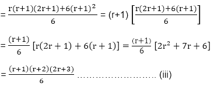

# 数学归纳法

> 原文：<https://www.javatpoint.com/mathematical-induction>

确定自然数普通结果有效性的过程是数学归纳法的原理。

## 操作惯例

设 n <sub>0</sub> 为固定整数。假设 P (n)是一个包含自然数 n 的陈述，我们希望证明 P (n)对于所有 n ≥n <sub>0</sub> 都是真的。

**1。归纳基础:** P (n <sub>0</sub> )为真，即 n = n<sub>0</sub>P(n)为真。

**2。归纳步骤:**假设 P (k)对于 n = k 是真的。
那么 P (K+1)也一定是真的。
那么 P (n)对所有 n ≥n <sub>0</sub> 都为真。

**例 1:**

用数学归纳法证明以下结论:

```
1 + 3 + 5 +.... + 2n - 1 = n2.

```

**解决方案:**我们假设。

```
P (n) = 1 + 3 + 5 +..... + 2n - 1 = n2.
For n = 1, 	P (1) = 1 = 12 = 1
It is true for n = 1................ (i)

```

**诱导步骤:**对于 n = r，

```
P (r) = 1 + 3 + 5 +..... +2r-1 = r2 is true......................... (ii)
Adding 2r + 1 in both sides
       P (r + 1) = 1 + 3 + 5 +..... +2r-1 + 2r +1
                = r2 + (2r + 1) = r2 + 2r +1 = (r+1)2..................... (iii)
As P(r) is true. Hence P (r+1) is also true.
From (i), (ii) and (iii) we conclude that.
        1 + 3 + 5 +..... + 2n - 1 =n2 is true for n = 1, 2, 3, 4, 5 ....Hence Proved.

```

**例 2:**
1<sup>2</sup>+2<sup>2</sup>+3<sup>2</sup>+.......+ n <sup>2</sup> = 

**解:**对于 n = 1，
P (1) = 1 <sup>2</sup> =  = 1

n = 1 时是真的。

**诱导步骤:**对于 n = r，...................(I)
P(r)= 1<sup>2</sup>+2<sup>2</sup>+3<sup>2</sup>+........+ r <sup>2</sup> = 为真...........㈡

两边加上(r+1) <sup>2</sup> ，我们得到
P(r+1)= 1<sup>2</sup>+2<sup>2</sup>+3<sup>2</sup>+.......+r<sup>2</sup>+(r+1)<sup>2</sup>=+(r+1)<sup>2</sup>



因为 P (r)为真，所以 P (r+1)为真。
从(I)、(ii)和(iii)我们得出结论

1<sup>2</sup>+2<sup>2</sup>+3<sup>2</sup>+......+ n <sup>2</sup> = 对于 n = 1，2，3，4，5 是真的.....因此被证明。

**例 3:说明对于任意整数 n**
11<sup>n+2</sup>+12<sup>2n+1</sup>可被 133 整除。

**解决方案:**

```
Let P (n) = 11n+2+122n+1
    For n = 1,
    P (1) = 113+123=3059=133 x 23
So, 133 divide P (1).................. (i)

```

**诱导步骤:**对于 n = r，

```
P (r) = 11r+2+122r+1=133 x s............ (ii)
 Now, for n = r + 1,
P (r+1) = 11r+2+1+122(r)+3=11[133s-122r+1] + 144\. 122r+1
        = 11 x 133s + 122r+1.133=133[11s+122r+1]=133 x t........... (iii)
As (i), (ii), and (iii) all are true, hence P (n) is divisible by 133.

```

* * *