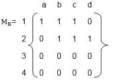
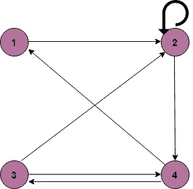
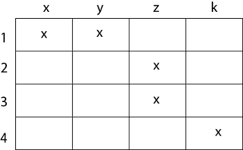

# 关系的表示

> 原文：<https://www.javatpoint.com/representation-of-relations>

关系可以有多种表现方式。其中一些如下:

**1。关系矩阵:**让 P =【a<sub>1</sub>，a <sub>2</sub> ，a <sub>3</sub> ，.......a <sub>m</sub> 和 Q =【b<sub>1</sub>，b <sub>2</sub> ，b <sub>3</sub> ......b <sub>n</sub> 是有限集合，分别包含 m 和 n 个数的元素。R 是从 P 到 q 的关系，关系 R 可以用 M×n 矩阵 M = [M <sub>ij</sub> 表示，定义为

```
Mij = 0      if  (ai,bj) ∉ R
       1     if   (ai,bj )∈ R

```

**例**

```

Let     P = {1, 2, 3, 4}, Q = {a, b, c, d}
and     R = {(1, a), (1, b), (1, c), (2, b), (2, c), (2, d)}.

```

关系式 R 的矩阵如图所示:



**2。作为有向图的关系:**当 R 是从有限集合到自身的关系时，还有另一种描绘关系 R 的方法。

**例**

```

A = {1, 2, 3, 4}
R = {(1, 2) (2, 2) (2, 4) (3, 2) (3, 4) (4, 1) (4, 3)}

```



**3。作为箭头图的关系:**如果 P 和 Q 是有限集合，R 是从 P 到 Q 的关系，关系 R 可以表示为如下的箭头图。

为集合 P 和 Q 画两个椭圆。用三个椭圆按列写下 P 的元素和 Q 的元素。然后画一个箭头，从第一个椭圆到第二个椭圆，如果 a 和 b 有关，a ∈ P 和 b ∈ Q。

**例**

```

Let P = {1, 2, 3, 4}
    Q = {a, b, c, d}
    R = {(1, a), (2, a), (3, a), (1, b), (4, b), (4, c), (4, d)

```

关系 R 的箭头图如图:


**4。关系如表:**如果 P 和 Q 是有限集合，R 是从 P 到 Q 的关系，关系 R 可以用表格形式表示。

制作一个表格，表格中的行相当于 P 的一个元素，列相当于 q 的一个元素。然后在代表 P 上的元素与 q 的关系的方框中打一个叉

**例**

```

Let P = {1, 2, 3, 4} 
    Q = {x, y, z, k}
    R = {(1, x), (1, y), (2, z), (3, z), (4, k)}.

```

关系的表格形式如图:



* * *