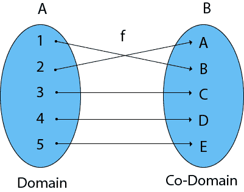
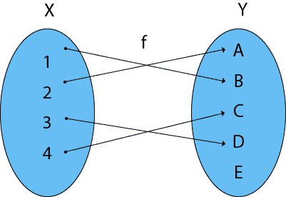
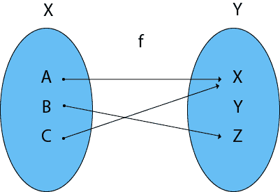

# 功能

> 原文：<https://www.javatpoint.com/functions>

它是集合 A 的每个元素在与集合 B 的元素处唯一相关联的映射。集合 A 称为函数的定义域，集合 B 称为共定义域。



## 函数的域、共域和范围:

**函数的定义域:**设 f 是从 P 到 q 的函数，集合 P 称为函数 f 的定义域。

**函数的共域:**设 f 是从 P 到 Q 的函数，集合 Q 称为函数 f 的共域。

**函数的范围:**函数的范围是其定义域的图像集合。换句话说，我们可以说它是其共域的子集。它被表示为 f(域)。

```

If f: P → Q, then f (P) = {f(x): x ∈ P} = {y: y ∈ Q | ∃ x ∈ P, such that f (x) = y}.

```

**例:**求函数的定义域、共定义域和值域。

```

Let x = {1, 2, 3, 4}
    y = {a, b, c, d, e}
    f = {(1, b), (2, a), (3, d), (4, c)

```



**解决方案:**

```
Domain of function: {1, 2, 3, 4}
Range of function: {a, b, c, d}
Co-Domain of function: {a, b, c, d, e}

```

## 功能集

如果 P 和 Q 是两个非空集，那么从 P 到 Q 的函数 f 是 P×Q 的子集，有两个重要的限制

1.  ∀ a ∈ P，(a，b) ∈ f 对于某些 b ∈ Q
2.  如果(a，b) ∈ f 和(a，c) ∈ f，则 b = c。

#### 注 1:Q 的某些元素可能与集合 p 的任何元素都不相关

#### 2.P 的每个元素都必须与 q 的至少一个元素相关联。

**例 1:** 如果一个集合 A 有 n 个元素，那么从 A 到 A 有多少个函数？

**解:**如果一个集合 A 有 n 个元素，那么从 A 到 A 有 n 个 <sup>n 个</sup>函数

## 函数的表示

两组 P 和 Q 用两个圆表示。函数 f: P → Q 由一组箭头表示，箭头连接代表 P 元素和对应 Q 元素的点

**示例 1:**

```

Let  X = {a, b, c} 	and Y = {x, y, z}   and f: X → Y such that
     f= {(a, x), (b, z), (c, x)}

```

那么 f 可以用图表表示如下



**例 2:** 设 X = {x，Y，z，k}和 Y = {1，2，3，4}。确定以下哪个功能。如果不是，请给出理由。如果是函数，则查找范围。

1.  f = {(x，1)，(y，2)，(z，3)，(k，4)
2.  g = {(x，1)，(y，1)，(k，4)
3.  h = {(x，1)，(x，2)，(x，3)，(x，4)
4.  l = {(x，1)，(y，1)，(z，1)，(k，1)}
5.  d = {(x，1)，(y，2)，(y，3)，(z，4)，(z，4)}。

**解决方案:**

1.  这是一种功能。范围(f) = {1，2，3，4}
2.  它不是一个函数，因为 X 的每个元素都与 Y 的某个元素不相关，即 Z 与 Y 的任何元素都不相关。
3.  h 不是函数，因为 h (x) = {1，2，3，4}即元素 x 在集合 y 中有多个图像。
4.  d 不是一个函数，因为 d (y) = {2，3}，即元素 y 在集合 y 中有多个图像。

* * *