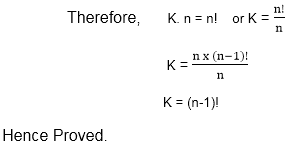

# 排列和组合:

> 原文：<https://www.javatpoint.com/permutation-and-combinations>

## 排列:

按给定顺序排列的一组 n 个对象称为对象的排列。这些物体中的任何 r ≤ n 以给定的顺序排列称为 r-排列或一次取 r 的 n 个物体的排列。

用 P (n，r)
P (n，r) = 表示

**定理:**证明一次全部取 n 个事物的排列数为 n！。

**证明:**我们知道

**例:4 x nP3T4】= n+1P3T8**

**解决方案:** 4 x 

4(n-2)=(n+1)
4n-8 = n+1
3n = 9
n = 3。

## 有限制的排列:

在 p 个特定对象不出现的时间，取 r 的 n 个不同对象的排列数是

在存在 p 个特定对象的时刻，取 r 的 n 个不同对象的排列数为

**例:**如果每个数字都以‘30’开头，没有重复的数字，用数字 0、1、2、3、4、5、6、7、8 可以组成多少个 6 位数？

**解法:**所有数字都以‘30’开头所以，我们必须从剩下的 7 位数中选择 4 位数。

∴以“30”开头的数字总数是
7p4T4 == 840。

## 重复对象的排列:

**定理:**证明每一个物体被允许重复任意次数时，n 个不同物体的不同排列数由 n r 给出。

**证明:**假设有 n 个对象，当允许重复该对象时，我们必须填充 r 处。

因此，第一名的填充方式数= n
第二名的填充方式数= n
.............................
.............................
填充 rth 位置的方式数= n
因此，用 n 个元素填充 r 位置的方式总数为
= n. n. n..............r 次=n r 。

## 圆形排列:

围绕一个圆进行的排列叫做循环排列。

**例:**用多少种方法可以让这些字母 a、b、c、d、e、f、g、h、I、j 排列成一个圆？

**解:** (10 - 1) = 9！= 362880

**定理:**证明 n 个不同物体的圆形排列数为(n-1)！

**证明:**让我们考虑 K 是所需的排列数。

对于 K 的每个这样的圆形排列，有 n 个对应的线性排列。如前所示，我们从循环排列中 n 个对象的每个对象开始。因此，对于 K 个圆形排列，我们有 K 个...n 个线性排列。

## 组合:

组合是从一组给定对象中选择一些或全部对象，其中对象的顺序无关紧要。n 个对象的组合数，在由 nCrT3】或 C (n，r)表示的时间取 r。

**证明:**n 个不同事物的排列数，一次取 r，由下式给出

由于没有关于物体排列顺序的问题，因此，对 r 事物的每一个组合，都有 r！布置，即，

**例:**一个农民从一个有 6 头牛、5 头猪和 8 只鸡的人那里购买了 3 头牛、2 头猪和 4 只鸡。找出农民的选择数 m。

农民可以选择 C (6，3)方式的奶牛，C (5，2)方式的猪，C (8，4)方式的母鸡。因此，选择的数量 m 如下:

* * *