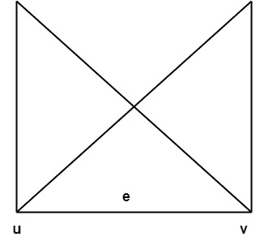
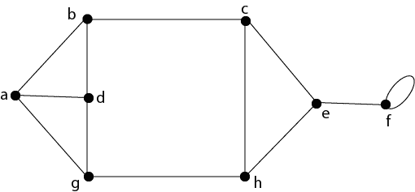
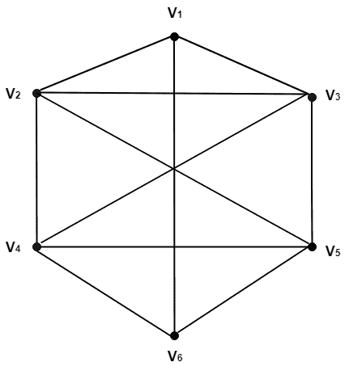
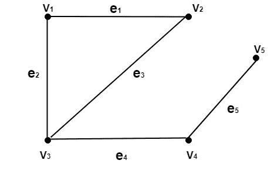
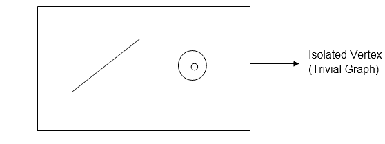
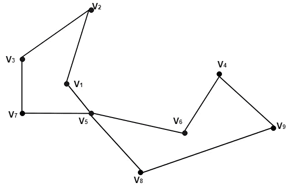
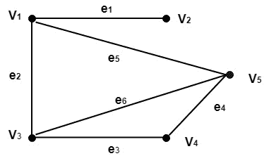
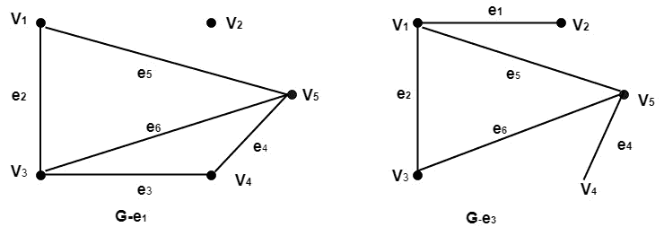
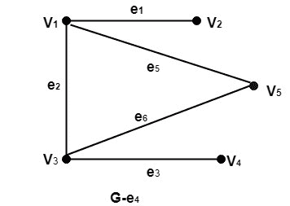

# 图表:

> 原文：<https://www.javatpoint.com/introduction-of-graphs>

图 G 由两件事组成:

1.一个集合 V=V(G)，其元素称为 G 的顶点、点或节点

2.称为 G 的边的一对无序的不同顶点的集合

3.我们用 G(V，E)来表示这样的图，如果有边 e ={u，v}，则顶点 u 和 V 是相邻的。

4.在这种情况下，u 和 v 被称为 e={u，v}的端点，e 被称为连接 u 和 v。

## 顶点的度数:

顶点的度数是入射到顶点 v 上的边的数量。自循环被计数两次。顶点的度数用 d(v)表示。

**例 1:** 考虑图中所示的图 G，确定每个顶点的度数。

**解:**每个顶点的度数如下:

d(a)= 3；d(b)= 5；d(c)= 2；d(d)=2。

**示例 2:** 验证对于图 1 所示的图，所有顶点的度数之和是偶数:

**解:**所有顶点的度数之和为:

= d(v1)+d(v2)+d(v3)+d(v4)+d(v5)+d(v6)+d(v7)+d(v8)
= 2+3+3+3+4+2+2 = 22

**示例 3:** 验证图中所示的图中有偶数个奇数度的顶点:

**解:**奇数度的顶点数为 8，在上图中各有一个三度。因此，我们有偶数个奇数度的顶点。

## 路径:

长度为 n 的路径是图的 n+1 个顶点的序列，其中每对顶点都是图的一条边。

1.  **简单路径:**如果路径中没有重复的边，即除了第一个顶点等于最后一个顶点之外，所有顶点都是不同的，则该路径称为简单路径。
2.  **一条基本路径:**如果路径中没有顶点重复，即所有顶点都是不同的，则该路径称为基本路径。
3.  **回路或闭合路径:**回路或闭合路径是在同一顶点开始和结束的路径，即 v 0 =v n 。
4.  **简单电路路径:**简单电路是简单的路径，它是一个电路。

**示例:**考虑图中所示的图表:给出以下示例:

1.  从 V 1 到 V 6 的简单路径。
2.  从 V 1 到 V 6 的基本路径。
3.  从 V 1 到 V 6 的非初等的简单路径。
4.  一条不简单的路，从 V 2 开始。
5.  从 V 1 开始的简单电路
6.  一个不简单的电路，从 V 2 开始。

**解决方案:**

1.  从 V 1 到 V 6 的简单路径。
    V 1、 V 2、 V 3、 V 4、 V 5、 V 6 。
2.  从 V 1 到 V 6 的基本路径。
    V 1、 V 2、 V 3、 V 5、 V 4、 V 6 。
3.  从 V 1 到 V 6 的非初等的简单路径。
    V 1、 V 2、 V 3、 V 5、 V 2、 V 4、 V 6 。
4.  一条不简单的路，从 V 2 开始。
    V 2、 V 3、 V 4、 V 5、 V 3、 V 4、 V 6 。
5.  从 V 1 开始的简单电路。
    V 1、 V 2、 V 4、 V 6、 V 5、 V 3、 V 1
6.  一个不简单的电路，从 V 2 开始。
    V 2、 V 3、 V 1、 V 2、 V 5、 V 4、 V 2 。

**悬垂顶点:**度数为 1 的顶点称为悬垂顶点。

**垂悬边:**唯一一条与垂悬顶点入射的边称为垂悬边。

**奇顶点:**度数为奇数的顶点称为奇顶点。

**偶顶点:**具有偶度的顶点称为偶顶点。

**入射边:**顶点相连的边称为入射边。

**相邻顶点:**如果有一条边连接两个顶点，则称它们相邻。如果有边(u，v)，那么我们可以说顶点 u 与顶点 v 相邻，顶点 v 与顶点 u 相邻。

**示例:**考虑如图所示的图表:

确定以下内容:

1.  在顶点期间
2.  边时
3.  奇数顶点
4.  偶数顶点
5.  入射边缘
6.  相邻顶点

**解决方案:**

1.  顶点 V 5 为垂悬顶点。
2.  边缘(V 4、 V 5 或 e 5 为吊坠边缘。
3.  顶点 V 3 和 V 5 是奇数顶点。
4.  顶点 V 1、 V 2、和 V 4 为偶数顶点。
5.  边缘 e 1 是 V 1、和 V 2 上的事件。
    边缘 e 2 为 V 1 和 V 3 上的入射。
    边缘 e 3 入射到 V 2 和 V 3 上。
    边缘 e 4 为 V 3 和 V 4 上的事件。
    边缘 e 5 为 V 4 和 V 5 上的入射。
6.  顶点 V 1 与 V 2 和 V 3 相邻。
    顶点 V 2 与 V 1 和 V 2 相邻。
    顶点 V 3 与 V 1 和 V4T20 相邻顶点 V 4 与 V 3 和 V5T27 相邻顶点 V 5 与 V 4 相邻。

**自环:**自环如果有相同的端点，就是边 e。

图中所示的图包含顶点 b 处的自循环，即 e=(b，b)。

孤立顶点:度数为 0 的顶点称为孤立顶点。

**割集:**考虑一个图 G=(V，E)。G 的割集是最小的边集，这样，集的移除使图断开，而这个集的任何适当子集的移除留下了连通子图。

**示例:**考虑图中所示的图形，确定该组的割集。

**解:**对于此图，边集{(V 1、 V 5 )、(V 7、 V 5 )为割集。移除集合后，我们留下了一个断开的子图。而在移除了它的任何适当子集之后，我们留下了一个连通子图。

**切割点或切割顶点:**考虑一个图 G=(V，E)。图 G 的切点是顶点 v，这样 G-v 比 G 有更多的连通分支或不连通分支。

子图 G-v 是通过从图 G 中删除顶点 v 并删除入射到 v 上的所有边而获得的。

**示例:**考虑图中所示的图，确定子图

(I)G-v1(ii)G-v3(iii)G-v5

**解决方案:**

1.  子图 G-v 1 如图
2.  子图 G-v 3 如图
3.  子图 G-v 5 如图

**桥(切边):**考虑一个图 G=(V，E)。图 G 的桥是这样一条边 e，使得 G-e 比 G 有更多的连通分量或不连通分量。

**示例:**考虑图中所示的图，确定子图

(I)G-e1(ii)G-e3(iii)G-e4

**解决方案:**

1.  子图 G-e 1 如图
2.  子图 G-e 3 如图
3.  子图 G-e 4 如图

* * *