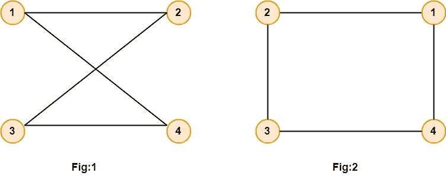
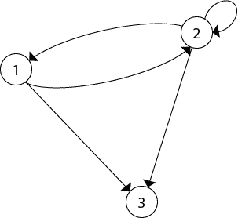
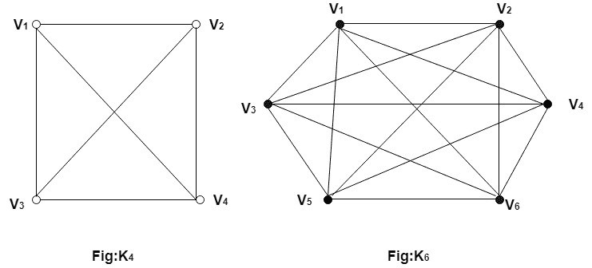
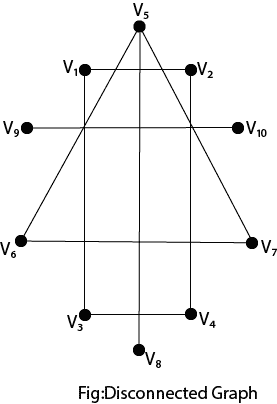
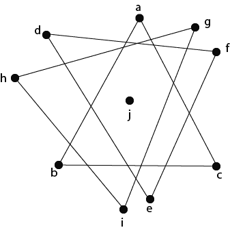
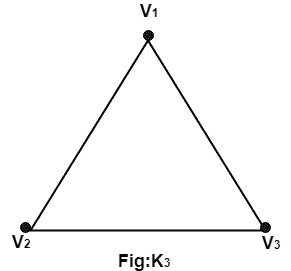
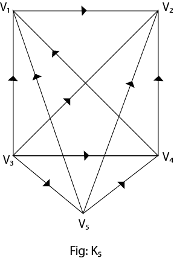
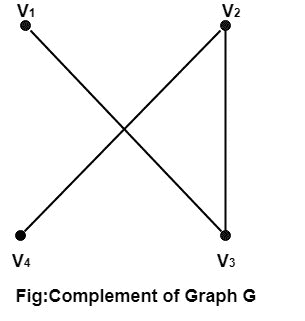
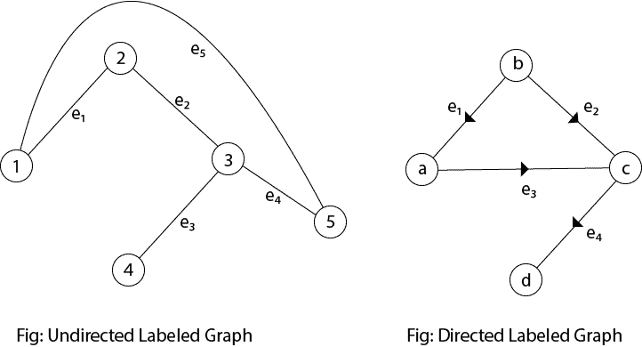
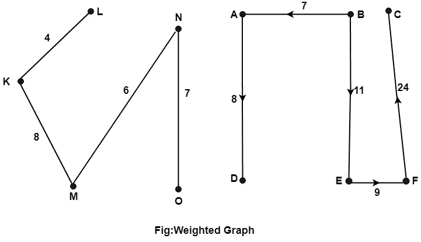

# 图形的类型:

> 原文：<https://www.javatpoint.com/types-of-graphs>

**1。空图:**空图被定义为仅由孤立顶点组成的图。

**示例:**图中所示的图为空图，顶点为孤立顶点。

**2。无向图:**无向图 G 由一组顶点 V 和一组边 e 组成，边集包含无序的一对顶点。如果(u，v)∈E，那么我们说 u 和 v 通过一条边连接，其中 u 和 v 是集合 v 中的顶点。

**例:**设 V = {1，2，3，4}和 E = {(1，2)，(1，4)，(3，4)，(2，3)}。画图表。

**解法:**图可以用几种方法画出来。

其中两个如下:

**3。多重图:**如果在一个图中同一组顶点之间允许有多条边，则称之为多重图。换句话说，它是一个至少有一个环或多条边的图。

**4。有向图:**有向图或有向图 G 定义为无序对(V，E)，其中 V 是称为顶点的点集，E 是边集。图 G 中的每条边都被分配了一个方向，并用一个有序对(u，v)来标识，其中 u 是初始顶点，v 是结束顶点。

**例:**考虑图 G = (V，E)如图确定图 G 的顶点集和边集。

**解:**图 G =(V，E)的顶点和边集如下

                G={{1,2,3},{(1,2),(2,1),(2,2),(2,3),(1,3)}}.

**5。无向完全图:**由 n 个顶点组成的无向完全图 G=(V，E)是其中每个顶点与每隔一个顶点相连的图，即每对不同的顶点之间存在边。用 K n 表示。一个有 n 个顶点的完整图将有边。

**例:**画无向图 k 4 和 k 6 。

**解:**k4的无向图如图 1 所示，k 6 的无向图如图 2 所示。

**6。连通和断开图:**

**连通图:**如果有一条从任意顶点 u 到 v 的路径，或者反之，则称该图为连通图。

**断开图:**如果一个图的任意两个顶点之间没有路径，则称该图为断开。

**示例:**考虑图中所示的图表，确定图表是否

**(a)** 断开图

**(b)** 连通图。

此外，编写它们的连接组件。

**解决方案:**

**(i)** 图中所示的图形是一个断开的图形，其连接的组件是

{V 1、 V 2、 V 3、 V 4 }、{V 5、 V 6、 V 7、 V 8 和{V 9、 V 10 }。

**(ii)** 图中所示的图形是一个断开的图形，其连接的组件是

{V 1、 V 2 }、{V 3、 V 4 }、{V 5、 V 6 }、{V 7、 V 8 }、{V 9、 V 10 和{V 11、 V

**(iii)** 图中所示图形为连通图。

**7。连通分量:**图 G 的一个子图被称为 G 的连通分量，如果它不包含在 G 的任何更大的子图中，那么它就是连通的。它是通过列出顶点来定义的。

**示例:**考虑图中所示的图形，确定其连接的组件。

**解:**这个图的连通分支是{a，b，c}、{d，e，f}、{g，h，i}和{j}。

**8。有向完全图:**n 个顶点上的有向完全图 G = (V，E)是其中每个顶点通过箭头与每隔一个顶点相连的图。用 K n 表示。

**示例:**绘制有向完全图 K 3 和 K 5 。

**解:**将顶点数放在合适的位置，然后从每个顶点到每隔一个顶点画一个箭头，如图:

**9。补图:**图 G 的补定义为与图 G 中顶点数相同，且有两个顶点连通的图，当且仅当它们在图中不相关。

**例:**考虑图中所示的图 G，找出这个图的补图。

**解:**上图补码如图:

**10。标记图:**如果一个图 G=(V，E)的边用某种名称或数据标记，则称它为标记图。所以，我们可以写这些标签来代替它的边集中的有序对。

**示例:**图中所示的图形是标记图形。

G= {{a，b，c，d}，{e 1、 e 2、 e 3、 e 4 }}

**11 时。加权图:**图 G=(V，E)如果图 G 的每条边都被赋予一个正数 w，称为边 E 的权重，则称之为加权图。

**示例:**图中所示的图是加权图。

* * *