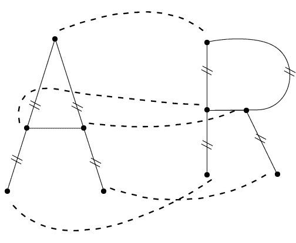
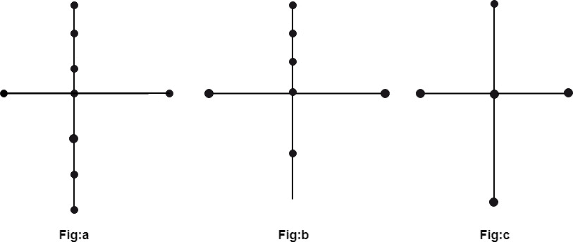
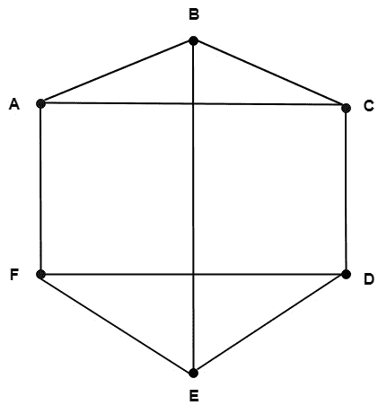
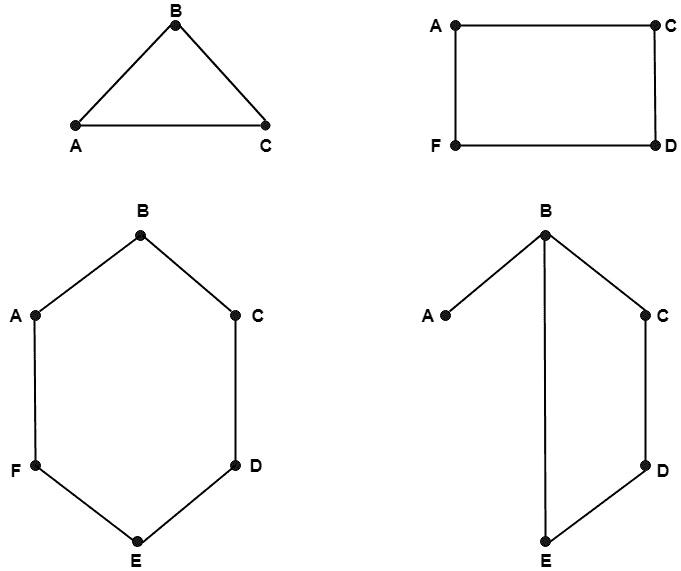
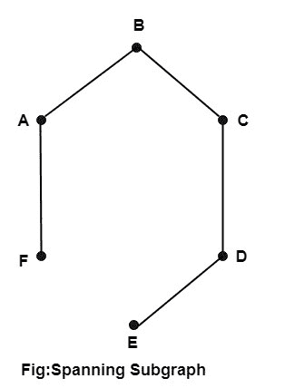

# 同构图

> 原文：<https://www.javatpoint.com/isomorphic-and-homeomorphic-graphs>

考虑一个图 G(V，E)和 G* (V*，E*)是同构的，如果存在一对一的对应关系，即 f:V→V*使得{u，v}是 G 的边当且仅当{f(u)，f(v)}是 G*的边。

图(a)的顶点数必须等于图(b)，也就是说，有些边是一对一对应的。

## 同胚图:

如果两个图 G 和 G*可以用这种方法从同一个图或同构图中得到，则称它们同胚。图(a)和(b)不是同构的，但是它们是同胚的，因为它们可以通过添加适当的顶点从图(c)中获得。

## 子图:

图 G=(V，e)的子图是这样的图 G'=(V，e ')，其中 V'⊆V 和 E'⊆E 以及 g '的每条边在 g '中具有与图 g 中相同的结束顶点

#### 注意:单个顶点是一个子图。

**例:**考虑图中所示的图 G 显示这个图的不同子图。

**解:**以下都是上图的子图，如图:

## 跨越子图:

一个图 G 1 如果 G 1 包含 G 的所有顶点，则称之为 G 的生成子图

**例:**下图是图中所示图的生成子图:

* * *