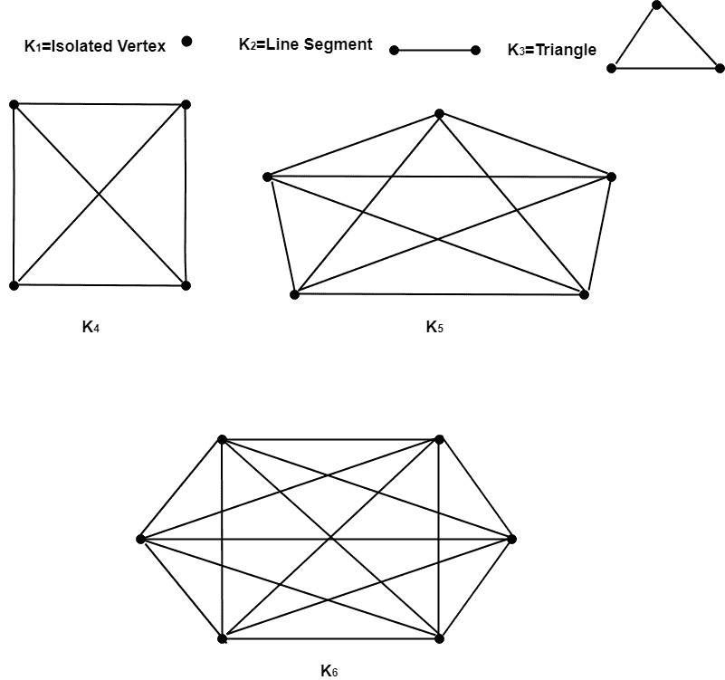
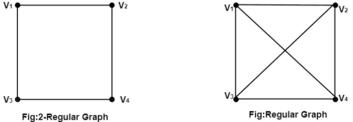
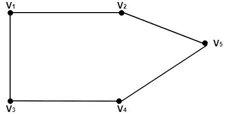
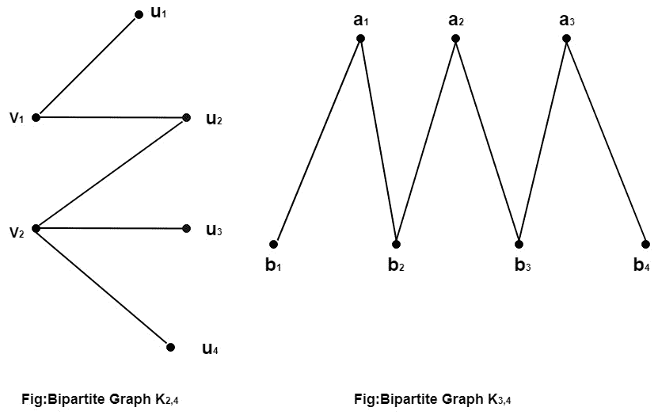
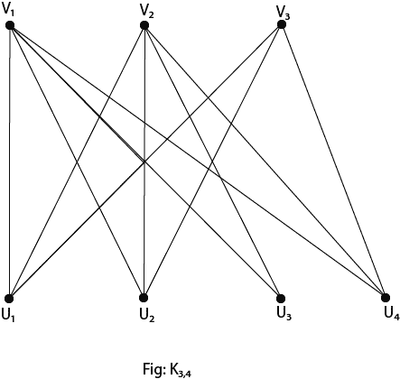
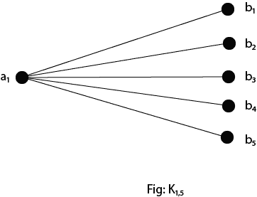
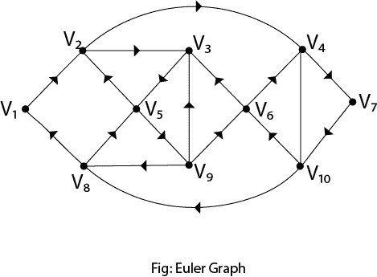
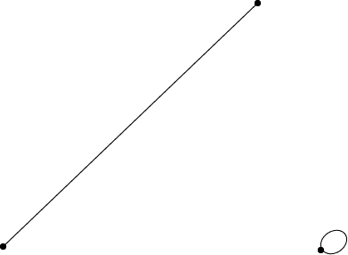
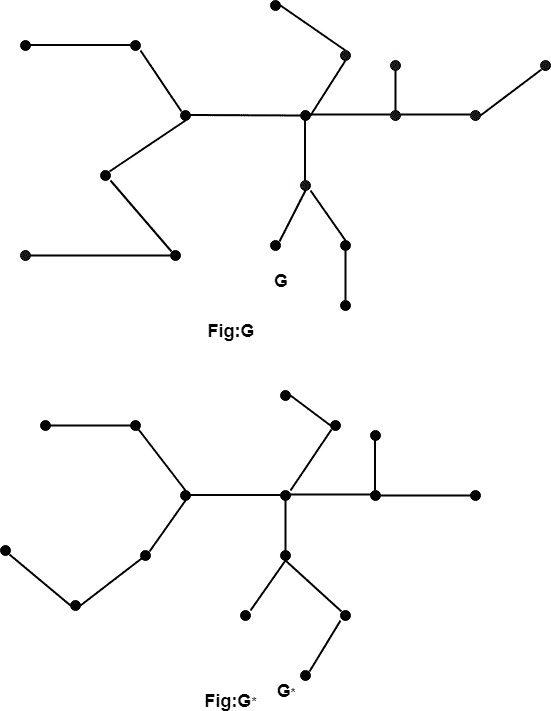
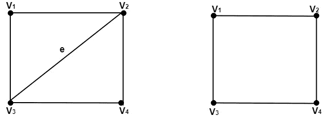

# 完全图

> 原文：<https://www.javatpoint.com/regular-and-bipartite-graphs>

如果图 G 中的每一个顶点都与图 G 中的每一个其他顶点相连，则称图 G 是完整的。因此，一个完整的图 G 必须是连通的。有 n 个顶点的完全图用 K n 表示。该图显示了图表 K 1 到 K 6 。

## 常规图形:

如果一个图的所有顶点都具有相同的度 K，则称该图为正则或 K-正则。所有顶点都具有度 2 的图称为 2-正则图。完全图 K n 是 n-1 度的正则图。

**例 1:** 画 2 度和 3 度的正则图。

**解:**2 度和 3 度的正则图如图:

**示例 2:** 绘制一个由五个顶点组成的 2-正则图。

**解:**五个顶点的 2-正则图如图:

**示例 3:** 绘制一个由五个顶点组成的 3-正则图。

**解:**不可能画出 5 个顶点的 3-正则图。3 正则图必须有偶数个顶点。

## 二分图:

如果一个图 G=(V，E)的顶点 V 可以被分成两个子集 V 1 和 V 2 ，使得 G 的每条边将 V 1 的一个顶点连接到顶点 V 2 ，则该图被称为二部图。用 K mn 表示，其中 m 和 n 分别是 V 1 和 V 2 中的顶点数。

**例:**画出二部图 K 2 ，4 和 K 3 ，4。假设有任意数量的边。

**解决方法:**首先在两个平行的列或行上绘制适当数量的顶点，并将一列或行中的顶点与另一列或行中的顶点连接起来。二部图 K 2，4 和 K 3，4 分别如图所示。

## 完全二部图:

如果一个图 G = (V，E)的顶点 V 可以被分成两个子集 V 1 和 V 2 ，使得 V 1 的每个顶点连接到 V 2 的每个顶点，则该图被称为完全二部图。完全二部图的边数是 m.n，因为 m 个顶点中的每一个都与 n 个顶点中的每一个相连。

**例:**画出完整的二部图 K 3，4 和 K 1，5 。

**解决方法:**首先在两个平行的列或行中绘制适当数量的顶点，并将第一列或行中的顶点与第二列或行中的所有顶点连接起来。K 3，4 和 K 1，5 如图所示:

## 欧拉路径:

通过图的欧拉路径是这样一种路径，它的边列表只包含图的每条边一次。

**欧拉回路:**欧拉回路是通过图的路径，其中初始顶点作为最终顶点第二次出现。

**欧拉图:**欧拉图是拥有欧拉回路的图。欧拉回路只使用每条边一次，但顶点可以重复。

**示例:**图中所示的图形是欧拉图形。确定该图的欧拉回路。

**解:**该图的欧拉回路为

V 、V 、V 、V 、3 、V 、5 、V 、2 、V 、4 、等等

我们可以为没有奇数度顶点的连通图产生一个欧拉回路。

## 陈述和证明欧拉定理:

**陈述:**考虑任何具有 R 区域、V 顶点和 E 边的连通平面图 G= (V，E)。那么 V+R-E=2。

**证明:**用边数上的归纳法证明这个定理。

**归纳基础:**假设每条边 e=1。然后我们有两种情况，其图表如图所示:

在图中:我们有 V=2 和 R=1。因此 2+1-1=2

在图中:我们有 V=1 和 R=2。因此 1+2-1=2。

从而验证了归纳的依据。

**归纳步骤:**我们假设公式对于 K 边的连通平面图成立。

设 G 是一个有 K+1 条边的图。

首先，我们假设 G 不包含电路。现在，取一个顶点 v，找到一条从 v 开始的路径，由于 G 是一个自由回路，每当我们找到一条边，我们就有了一个新的顶点。最后，我们将到达一个顶点 v，度数为 1。所以我们不能再前进了，如图:

现在移除顶点 v 和入射到 v 上的相应边。因此，我们剩下一个图 G*具有 K 条边，如图所示:

因此，通过归纳假设，欧拉公式适用于 G*。

现在，由于 G 比 G*多了一条边，比 G*多了一个顶点，区域数与 G*相同。因此，公式也适用于 g。

其次，我们假设 G 包含一个电路，e 是图 1 所示电路中的一条边:

因为 e 是两个区域边界的一部分。所以，我们只去掉了边，剩下的图 G*有 K 条边。

因此，通过归纳假设，欧拉公式适用于 G*。

现在，由于 G 比 G*多了一条边，比 G*多了一个区域，顶点数与 G*相同。因此，公式也适用于 G，它验证了归纳步骤，从而证明了定理。

* * *