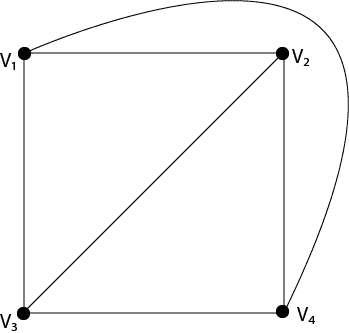
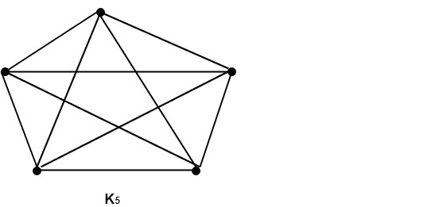
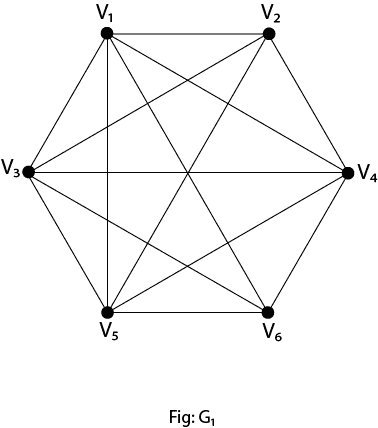
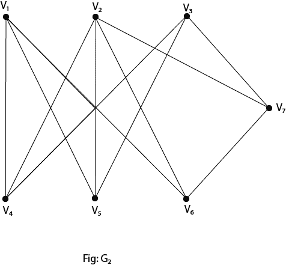
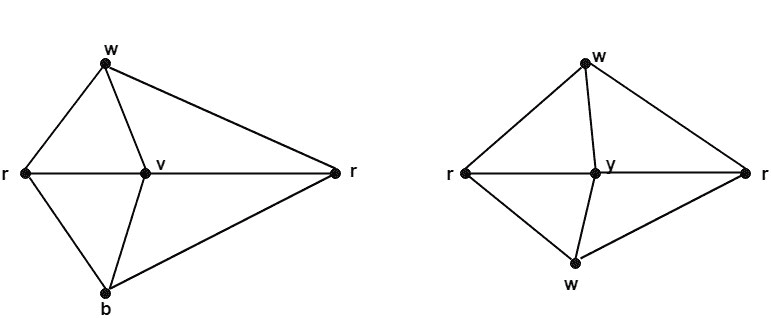
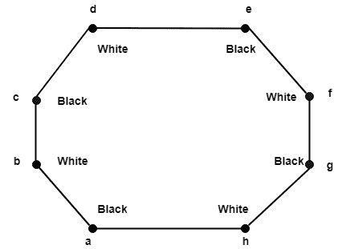

# 平面图:

> 原文：<https://www.javatpoint.com/planar-and-non-planar-graphs>

如果一个图可以画在一个平面上，所以没有边交叉，那么这个图就是平面的。

**例:**图中所示图形为平面图形。

**图的区域:**考虑一个平面图 G=(V，E)。区域被定义为平面上由边界定的区域，不能进一步细分。平面图将平面分成一个或多个区域。其中一个区域将是无限的。

**有限区域:**如果该区域的面积是有限的，那么该区域称为有限区域。

**无限区域:**如果该区域的面积是无限的，则该区域称为无限区域。平面图只有一个无限区域。

**示例:**考虑图中所示的图形，确定区域、有限区域和无限区域的数量。

**解决方案:**上图有五个区域，分别是 r 1 、r 2 、r 3 、r 4 、r 5 。

图中有四个有限区域，即 r 2 ，r 3 ，r 4 ，r 5 。

只有一个有限区域，即 r 1

## 平面图的性质:

1.  如果一个连通平面图 G 有 e 条边和 r 个区域，那么 r ≤  e。
2.  如果一个连通平面图 G 有 e 条边，v 个顶点和 r 个区域，那么 v-e+r=2。
3.  如果一个连通平面图 G 有 e 条边和 v 个顶点，那么 3v-e≥6。
4.  完整的图 K n 是平面的当且仅当 n < 5。
5.  完全二部图 K mn 是平面的当且仅当 m < 3 或 n > 3。

**例:**证明完全图 K 4 是平面的。

**解:**完整的图 K 4 包含 4 个顶点和 6 条边。

我们知道对于连通平面图 3v-e≥6。因此对于 K 4 ，我们有满足性质(3)的 3x4-6=6。

因此 K 4 是一个平面图。因此被证明。

## 非平面图:

如果一个图不能画在一个平面上，所以没有边交叉，那么这个图就是非平面的。

**示例:**图中所示的图是非平面图。

这些图不能画在平面上，所以没有边交叉，因此它们是非平面图。

## 非平面图的性质:

当且仅当一个图包含与 K 5 或 K 3，3 同胚的子图时，该图是非平面的

**示例 1:** 显示 K 5 是非平面的。

**解:**完整的图 K 5 包含 5 个顶点和 10 条边。

现在，对于一个连通平面图 3v-e≥6。

因此，对于 K 5 ，我们有 3 x 5-10=5(它不满足性质 3，因为它必须大于或等于 6)。

因此，K 5 是非平面图。

**示例 2:** 通过找到与 K 5 或 K 3，3 同胚的子图，显示图中所示的图是非平面的。

**解决方案:**如果我们去掉边(V 1 、V 4 )、(V 3 、V 4 )和(V 5 、V 4 )则图 G 1 变为与 K 5 同胚。因此它是非平面的。

如果我们去掉边 V 2，V 7)图形 G 2 变得与 K 3，3 同胚。因此它是非平面的。

## 图形着色:

假设 G= (V，E)是一个没有多重边的图。G 的顶点着色是将颜色分配给 G 的顶点，使得相邻的顶点具有不同的颜色。如果存在使用 M-颜色的图 G 的着色，则图 G 是 M-可着色的。

**适当着色:**如果任意两个相邻顶点 u 和 v 的颜色不同，则 A 着色是适当的，否则称为不适当着色。

**示例:**考虑以下图形和颜色 C={r，w，b，y}。使用所有颜色或更少的颜色给图表适当上色。

图中所示的图是最小 3-可着色的，因此 x(G)=3

**解决方案:**图显示了用所有四种颜色正确着色的图表。

图显示了用三种颜色适当着色的图表。

**G 的色数:**产生图 G 的适当着色所需的最小颜色数称为 G 的色数，用 x(G)表示。

**例:**Kn的色数为 n

**解决方案:**通过为每个顶点分配不同的颜色，可以使用 n 种颜色来构建 K n 的着色。没有两个顶点可以被分配相同的颜色，因为这个图的每两个顶点都是相邻的。因此 K n 的色数=n。

## 图着色的应用

图着色的一些应用包括:

*   寄存器分配
*   地图着色
*   二部图检查
*   移动射频分配
*   制作时间表等。

## 陈述并证明握手定理。

**握手定理:**图 G 中所有顶点的度数之和等于图中边数的两倍。

数学上可以表述为:

√t0]v∏v〖t1〗deg(v)= 2e

**证明:**设 G = (V，E)为一个图，其中 V = {v 1 ，v 2 ，。。。。。。。。。。}是顶点的集合，E = {e 1 ，e 2 。。。。。。。。。。}是边的集合。我们知道每条边都位于两个顶点之间，所以它为每个顶点提供了 1 度。因此，每条边对图形的贡献度为 2。所以所有顶点的度数之和等于 g 中边数的两倍。

因此，∑ v∈V 度(v)=2e

* * *