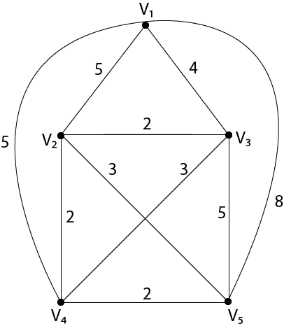
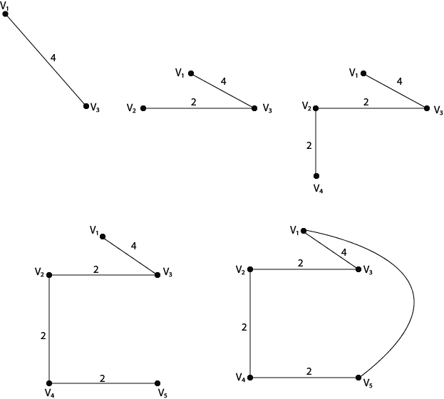

# 旅行推销员问题

> 原文：<https://www.javatpoint.com/discrete-mathematics-travelling-salesman-problem>

假设一个推销员想参观分配给他的一定数量的城市。他知道每对城市之间的距离。他的问题是选择一条路线，这条路线从他的家乡出发，经过每个城市一次，然后以最短的距离回到他的家乡。这个问题与寻找最小长度的哈密顿回路密切相关。如果我们用顶点和连接两个城市边的道路来表示城市，我们会得到一个加权图，其中每个边 e i 与一个数字 w i (权重)相关联。

对上述摘要的一个物理解释是:将一个图 G 看作 n 个城市的地图，其中 w (i，j)是城市 I 和 j 之间的距离。一个推销员希望在同一城市开始和结束的城市之旅包括访问其余 A 个城市中的每一个一次，并且只访问一次。

在图中，如果我们有 n 个顶点(城市)，那么就有(n-1)！n 个顶点的完整图中的边(路由)和哈密顿回路的总数将为。

## 最近邻法:

这个过程对于旅行推销员问题给出了相当好的结果。方法如下:

**步骤 1:** 选择任意一个顶点，找到离这个起始顶点最近的顶点，形成一条边的初始路径。

**步骤 2:** 让 v 表示添加到路径中的最新顶点。现在，在不在路径中的顶点的结果中，选择最接近 v 的一个，并添加路径、连接 v 的边和这个顶点。重复此步骤，直到图 G 的所有顶点都包含在路径中。

**第三步:**连接由一条边添加的起始顶点和最后一个顶点，形成回路。

**例:**对于图中从顶点 v 1 开始的图，用最近邻法求解以下旅行商问题。

**解决方案:**我们必须从顶点 v 1 开始。通过使用最近邻法，图中显示了巡回电路或哈密顿回路的逐顶点构造:

这条路线的总距离是 18。

* * *