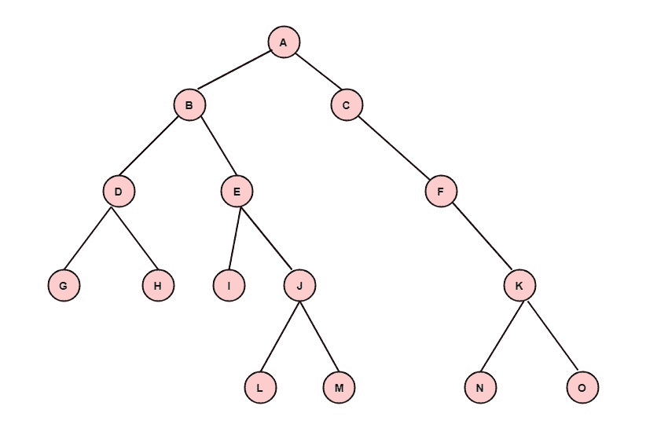
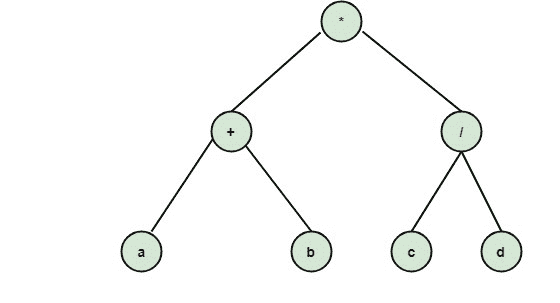
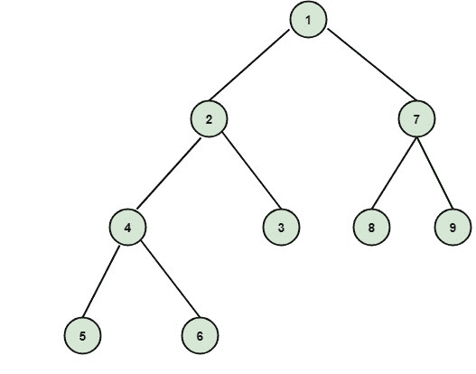
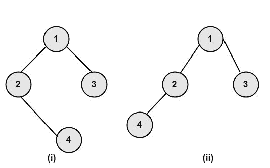

# 二叉树:

> 原文：<https://www.javatpoint.com/discrete-mathematics-binary-trees>

如果每个节点的外倾角小于或等于 2，在有向树中，该树称为二叉树。由节点组成的树(空树)也是二叉树。二叉树如图所示:

## 基本术语:

**根:**二叉树有一个唯一的节点叫做树根。

**Left Child:** 根左边的节点称为它的 Left Child。

**天子:**根右边的节点称为它的天子。

**父节点:**具有左子节点或右子节点或两者都有的节点称为节点的父节点。

**兄弟节点:**具有相同父节点的两个节点称为兄弟节点。

**叶:**没有子代的节点称为叶。二叉树中的叶子数量可以从一个(最小)到树中顶点数量的一半(最大)不等。

**后代:**如果一个节点是该节点的子节点或该节点的其他后代的子节点，则该节点被称为另一个节点的后代。树中的所有节点都是根的后代。

**左子树:**根是某个节点的左子的子树称为该节点的左子树。

**示例:**对于如图所示的树:

*   哪个节点是根？
*   哪些节点是叶子？
*   命名每个节点的父节点

**解:** (i)节点 A 为根节点。
(二)节点 G、H、I、L、M、N、O 为叶子。
(iii) **节点** **父节点**T8】B、C A
D、E B
F C
G、H D
I、J E
K F
L、M J
N、O K

**右子树:**根是某个节点的右子的子树称为该节点的右子树。

**节点的级别:**节点的级别是它与根的距离。根的级别被定义为零。所有其他节点的级别都比其父节点高一级。任意 N 级最大节点数为 2 N 。

**树的深度或高度:**树的深度或高度定义为树的一个分支中的最大节点数。这超过了树的最大级别，即根的深度为 1。深度为 d 的二叉树的最大节点数为 2 d -1，其中 d ≥1。

**外部节点:**没有子节点的节点称为外部节点或终端节点。

**内部节点:**有一个或多个子节点的节点称为内部节点或非终端节点。

## 二元表达式树:

一个代数表达式可以方便地用它的表达式树来表示。具有二进制运算符的表达式可以分解为
<左操作数或表达式>(运算符)<右操作数或表达式>

取决于评估的优先顺序。

表达式树是一个二叉树，其根包含运算符，其左子树包含左表达式，右子树包含右表达式。

**示例:**为表达式(a+b)*(d/c)构建二元表达式树

**解:**表达式(a+b)*(d/c)的二元表达式树如图:

**完全二叉树:**如果除了可能的最后一级之外，所有级别都有尽可能多的可能节点，则完全二叉树是二叉树。具有 n 个节点的完整二叉树的深度是 log 2 n+1。

**示例:**图中所示的树是一个完整的二叉树。

**全二叉树:**全二叉树是所有叶子都在同一层，每个非叶子节点都有两个子节点的二叉树。

## 区分普通树和二叉树

| 普通树 | 二叉树 |
| 1.没有这样的零节点树或空的一般树。 | 1.可能有一个空的二叉树。 |
| 2.如果某个节点有一个子节点，那么就没有这种区别。 | 2.如果某个节点有一个子节点，那么它被区分为左子节点或右子节点。 |
| 3.当我们把无花果树看作一般的树时，它们是一样的。 | 3.图中所示的树是不同的，当我们将它们视为二叉树时，因为在(4)中是 2 的右子树，而在(ii)中 4 是 2 的左子树。 |
|  |

* * *