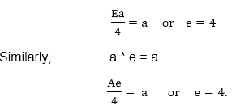
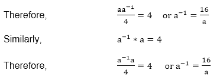

# 子组:

> 原文：<https://www.javatpoint.com/discrete-mathematics-subgroup>

如果群 G 的非空子集 H 在 G 的运算下本身就是群，我们说 H 是 G 的子群。

**定理:-** 群 G 的子集 H 是 G 的子群，如果:

*   恒等式元素 a∈ H
*   H 在 G 的运算下是闭的，即如果 a，b∈ H，那么 a，b∈ H 和
*   H 在逆项下是闭的，即如果 a∈ H，那么 a -1 ∈ H。

## 循环子群:-

如果存在元素 x∈ G，使得对于某个 n ∈Z，K 的每个元素都可以写成 x n 的形式，那么群 G 的子群 K 称为循环子群

元素 x 叫做 K 的生成器，我们写 K=

## 循环群:-

在 G= <x>的情况下，我们说 G 是循环的，x 是 G 的生成元。也就是说，如果有一个元素 x∈ G，使得 G 的每个元素都可以写成 x n 的形式，则称一个群 G 是循环的</x>

**例:**通常乘法下的群 G= {1，-1，I，-i}是以 I 为生成元的有限循环群，因为 i 1 =i，i 2 =-1，i 3 =-i 和 i 4 =1

## 阿贝尔群:

让我们考虑一个代数系统(G，*)，其中*是对 G 的二元运算。然后，如果系统(G，*)满足群的所有性质加上一个附加的下列性质，则称它是阿贝尔群:

(1)运算*是可交换的，即
a * b = b * a ∀ a，b ∈G

**例:**考虑一个代数系统(G，*)，其中 G 是所有非零实数的集合，而*是由下式定义的二进制运算

证明(G，*)是阿贝尔群。

**解决方案:**

**闭包性质:**集合 G 在运算*下是闭包，因为 a * b = 是实数。因此，它属于 g。

**关联属性:**操作*是关联的。让 a，b，c∈G，那么我们有

**恒等式:**为了找到恒等式元素，我们假设 e 是一个+ve 的实数。那么 e * a = a，其中 a ∈G。

因此，G 中的恒等式元素是 4。

**逆:**我们假设 a ∈G .如果 a -1 ∈Q，是 a 的逆，那么 a * a -1 =4

因此，G 中元素 a 的倒数为

**可交换:**G 上的运算*是可交换的。

因此，代数系统(G *)是封闭的、关联的、单位元的、逆的和可交换的。因此，系统(G *)是阿贝尔群。

## 组的乘积:

**定理:**证明如果(G 1 、* 1 )和(G 2 、* 2 )是群，那么 G = G 1 x G 2 即(G、*是具有由(a 1 、b 1 )*( a 2 定义的运算的群

**证明:**要证明 G 1 x G 2 是一个群，我们得证明 G 1 x G 2 有结合算子，有恒等式，也存在每个元素的逆。

关联性。让 a，b，c ∈ G 1 x G 2 ，那么

因此，a * (b * c) = (a 1 、a2)*(b1、b 2 )*(c 1 、c 1(b1*111)，a22(b 2【c】)
=(a】【1】【b】【1】，a【2】

**身份:**让 e 1 和 e 2 分别为 G 1 和 G 2 的身份。那么 G 1 x G 2 的身份就是 e=(e 1 ，e 2 )。假设相同的 a ∈ G 1 x G 2

然后，a * e = (a 1 ，a 2 )*( e 1 ，e2)
=(a1*1e1，a2*2e2)
=(a1【T26】

同样，我们有 e * a = a。

**逆:**要确定 G 1 x G 2 中某个元素的逆，我们将按分量来确定，即
a -1 =(a 1 ，a2)-1=(a1-1，a 2

现在为了验证这是精确的倒数，我们将计算 a * a -1 和 a -1 *a。

现在，a * a -1 =(a 1 ，a2)*(a1T8】-1，a2T12】-1)
=(a1*1a1T21】-1，a 2

同样，我们有一个 -1 *a=e。

这样，(G 1 x G 2 ，*)就是一个组。

一般来说，如果 G 1 ，G 2 ，....G n 为组，则 G = G 1 x G 2 x.....x G n 也是一组。

## 小事：

设 H 是群 G 的子群，G 中 H 的左陪集是 G 的子集，对于任意 x∈ G，其元素可以表示为 xH={ xh | h ∈ H }，元素 x 称为陪集的表示。类似地，对于任何 x∈G，G 中 H 的右陪集是可以表示为 Hx= {hx | h ∈H }的子集，因此复形 xH 和 Hx 分别称为左陪集和右陪集。

如果群运算是加法(+)，那么左陪集表示为 x + H={x+h | h ∈H}，右陪集表示为 H + x = {h+x | h ∈ H}

* * *