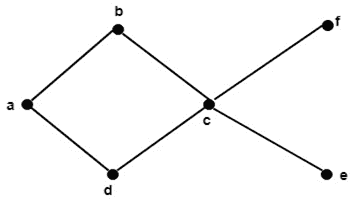

# 部分有序集

> 原文：<https://www.javatpoint.com/discrete-mathematics-partially-ordered-sets>

考虑满足下列性质的集合 S 上的关系 R:

1.  r 是自反的，即每个 x ∈ S 对应 xRx。
2.  r 是反对称的，即如果 xRy 和 yRx，那么 x = y。
3.  r 是传递的，即 xRy 和 yRz，然后是 xRz。

那么 R 称为偏序关系，集合 S 与偏序一起称为偏序集或 POSET，用(S，≤)表示。

### 示例:

1.  自然数的集合 N 在关系‘≤’下形成一个偏序集，因为首先 x ≤ x，其次如果 x ≤ y 和 y ≤ x，那么我们有 x = y，最后如果 x ≤ y 和 y ≤ z，它暗示 x ≤ z 对于所有 x，y，z ∈ N
2.  在可除性下的自然数的集合 N，即‘x 除 y’形成了一个偏序集，因为 x/x 对于每一个 x ∈ N .同样，如果 x/y 和 y/x，我们有 x = y .同样，如果 x/y，y/z，我们有 x/z，对于每一个 x，y，z ∈ N
3.  考虑一个集合 S = {1，2}，S 的幂集是 P(S)。集包含⊆关系是偏序关系。因为，对于 P (S)中的任何集合 a，b，c，首先我们有一个⊆ A，其次，如果 a 是⊆B 和 B⊆A，那么我们有 A = B。最后，如果 a 是⊆B，b 是⊆C,then A⊆C.，那么(P(S)，⊆)是偏序集。

## POSET 的要素:

1.  **极大元:**如果 A 中没有 c 中的元素，使得 a ≤ c，则 a ∈ A 的元素称为 A 的极大元。
2.  **极小元素:**如果 A 中 c 中没有元素使得 c ≤ b，那么元素 b ∈ A 称为 A 的极小元素。

#### 注意:可以有多个极大元素或多个极小元素。

**示例:**确定其哈斯图如图所示的偏序集的所有最大和最小元素:

**解:**最大元素为 b 和 f。

最小元素是 d 和 e。

## 可比元素:

考虑一个有序集合 A。集合 A 的两个元素 A 和 b 被称为可比较的，如果

a ≤ b 或 b ≤ a
R R

## 不可比元素:

考虑一个有序集合 A，集合 A 的两个元素 A 和 b，如果既不是 a ≤ b，也不是 b ≤ a，则称为不可比。

**例:**考虑 A = {1，2，3，5，6，10，15，30}按可除性排序。确定 a 的所有可比较和不可比较的元素对

**解决方案:**A 的可比元素对为:
{1，2}、{1，3}、{1，5}、{1，6}、{1，10}、{1，15}、{1，30}
{2，6}、{2，10}、{2，30}
{3，6}、{3，15}、{3，30}
{5，10}、{5，15}、{ 6 }

A 的不可比元素对是:
{2，3}、{2，5}、{2，15}
{3，5}、{3，10}、{5，6}、{6，10}、{6，15}、{10，15}

## 线性有序集:

考虑一个有序集 A。如果 A 中的每一对元素都是可比较的，则集合 A 被称为线性有序集或全有序集。

**例:**通常阶≤的正整数 I + 的集合是线性序集。

* * *