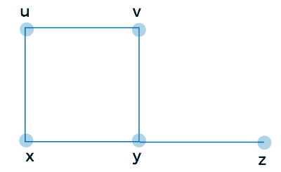
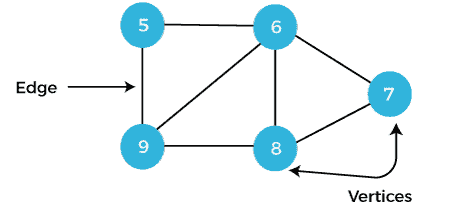

# 计算机科学中的离散数学

> 原文：<https://www.javatpoint.com/discrete-mathematics-for-computer-science>

离散数学被用来提供计算机科学各个领域的知识。在计算机科学中，离散数学的应用非常广泛，描述如下:

### 布尔代数

像 1 或 0 这样的位被用来在最基本的层次上表示计算机的所有数据。当计算机根据**布尔代数**定律对这些位进行一些修改时，它们就执行计算，该定律用于形成所有的数字电路。该图用于表示数字电路。

像‘and’、‘or’和‘not’这样的逻辑运算符用于开发低级编程语言。当软件开发人员开发任何项目时，他们大多更喜欢高级语言。有时，他们希望通过减少低级操作来优化代码，有时，他们还直接对位进行操作。程序员也可以使用布尔逻辑来控制程序流程。这意味着他们可以定义某些条件，然后控制哪些指令将被执行。

布尔代数有各种定律，描述如下:

### 交换律:

根据**交换律**，如果我们改变变量的顺序，不会影响结果。如果一个运算包含以下表达式，它将被称为交换运算:

```
1\. A.B = B.A
2\. A + B = B + A

```

### 结合律:

根据**结合律**，如果我们重新排列任意二进制表达式的括号，都不会改变逻辑电路的结果。如果二进制运算包含以下表达式，它将被称为关联运算:

```
1\. (A.B).C = A.(B.C)
2\. (A + B) + C = A + (B + C)  

```

### 分配定律:

根据**分配律**，如果我们将一个数乘以加在一起的一组数，如果我们分别进行每一次乘法，就会得到相同的结果。如果一个操作包含以下表达式，它将被称为分布式操作:

```
A.(B + C) = A.B + A.C

```

### 和法律:

如果二进制运算使用**和**，则称为 AND 定律，描述如下:

```
1.	A.0 = 0
2.	A.1 = A
3.	A.A = A
4.	A.Ā = 0 

```

### 或定律:

如果二进制运算使用**或**，则称为或定律，描述如下:

```
1.	A + 0 = A
2.	A + 1 = 1
3.	A + A = A
4.	A + Ā = 1  

```

### 逆定律:

根据**逆律**，如果我们对任意一个变量进行二次逆运算，就会输出原来的变量本身。该定律使用非运算。如果一个操作包含以下表达式，它将被称为逆操作:

```
A + Ā+= 1

```

布尔代数也有**德摩根定理**，它有两个定律:

### 德·摩根第一定律

根据**第一定律**，变量乘积的补数与它们各自的变量补数之和相等，描述如下:

```
 (A.B) = A + B  

```

### 德·摩根第二定律

根据**第二定律**，变量之和的补数与它们各自的变量补数的乘积相等，描述如下:

```
(A+B) = A.B

```

### 布尔代数的例子

在这个例子中，我们将求解表达式 **C + BC** 。

我们可以根据蒙瑞克根定律把上面的表达式写成下面这样:

```
C + (B + C)

```

现在我们将使用这样的交换律:

```
(C + C) + B

```

之后，我们将使用这样的补充定律:

```
1 + B = 1

```

因此，

```
C + BC = 1

```

### 可能性

**概率**不仅用于计算机科学，也用于定量领域。概率在软件工程中用于评估风险的大小。例如，假设我们正在设计一个系统，我们正在使用概率。在这种情况下，概率将告诉我们系统的容量，这意味着我们的系统可以处理多少负载，在峰值负载之后，系统将崩溃。我们也可以用概率来衡量网络的可靠性。在机器学习中，我们可以使用各种条件概率应用来完成从开发良好的医疗到垃圾邮件过滤器校准的任务。

随机化算法被认为是实践中更有效和最好的算法，因为它们提供了那些难以计算的任务的精确计算。概率可以被描述为数据科学和统计学的基础之一。它也被称为业内最热门的领域之一。如果学生在计算机科学的基础上学习概率，这将为他们提供一种定量的直觉，这在他们的日常生活和整个职业生涯中都是有用的。我们有公式来指定概率，

```
Probability of event to happen P(E) = Number of favorable outcomes/Total Number of outcomes

```

### 概率的例子

假设一家商店有 6 套西装，其中 3 套是绿色的，2 套是紫色的，1 套是橙色的。我们会找到选择橙色西装的概率。

**解决方案:**

概率将通过将商店中橙色套装的数量除以套装的总数来计算。因此

```
2/6 = 1/3 

```

### 命题逻辑

当开发人员开发任何项目时，重要的是他应该有信心通过运行他们的代码来获得期望的结果。我们可以用数学来描述程序。它们正确的原因是**命题逻辑**工具。计算机科学的核心领域被称为算法，很难利用这些关键技能来分析和设计算法。**数学归纳法**的原理被两大范式所使用:函数式编程和迭代式编程。这个原则用于分别验证它们的循环和递归函数调用。

最正式的规范语言可以称为**逻辑**，用于编程语言的基础和设计。例如，SQL 家族中的语言只是关系逻辑的实现，它有一些额外的特性。一些特定的逻辑演算和许多领域特定的语言具有相同的实现。在工业中，形式方法和程序验证的采用越来越多。它还与传统测试技术结合使用，以提高对软件性能和有效性的信心。

### 命题逻辑的例子:

```
3+3=5
Narendra Modi is the Prime Minister.
'a' is a vowel. 

```

这个例子有三个句子是命题。其中第一句为假或无效，最后两句为真或有效。

有些例子不是命题，描述如下:

```
1 + a = 5
Go on vacation and enjoy

```

这个例子有两句话不是命题，因为第一句可能是假的或真的，因为‘a’的值没有指定，所以我们不能说它是真的或假的，除非我们指定了值，最后一句没有真值。

### 归纳和递归

如果我们想知道编程的函数范式，将使用的关键概念是**归纳和递归**。递归是一种编程策略，用于解决大问题。我们将把大问题分解成同类的小问题。而归纳法是一种数学策略，用来证明与大集合事物相关的陈述。

许多行业和公司，如脸书(哈斯克尔)、亚马逊、微软研究(F*、哈斯克尔)、苹果(斯威夫特)、甲骨文(JavaScript、Java 8)和微软(F#)都增加了对通用和利基任务的功能范式的采用。数据结构和算法也可以使用**递归**轻松描述。在计算机科学的理论领域和许多计算模型中，它们被视为主干。更关键的部分，尤其是在敏感应用中，是软件的安全属性和正确性。

### 归纳示例:

利用数学归纳法，对所有正整数 n 显示 n < 2 <sup>n</sup>

**解决方案:**

我们将假设 n 的命题为 P(n): n < 2 <sup>n</sup>

**基本步骤:** P(1)自 1 < 2 <sup>1</sup> 起为真

**归纳步骤:**如果 P(n)为真，那么对于每个 n，P(n+1)为真。

我们将假设 P(n): n < 2 <sup>n</sup> 为真

然后我们会显示 P(n+1): n+1 < 2 <sup>n+1</sup> 为真。

```
n + 1 < 2n+ 1
< 2n + 2n
= 2n(1 + 1)
 = 2n(2)
= 2n+1

```

### 递归示例:

**例 1:**

我们将描述递归定义函数的例子:

```
f(0) = 5
f(n) = f(n-1) + 2

```

**解决方案:**

我们将这样计算该函数的值:

```
f(0) = 5
f(1) = f(0) + 2 = 5 + 2 = 7
f(2) = f(1) + 2 = 7 + 2 = 9
f(3) = f(2) + 2 = 9 + 2 = 11 

```

这个递归定义的函数相当于显式定义的函数，描述如下:

```
f (n) = 2n + 5

```

**例 2:**

我们将描述递归定义函数的例子:

```
f(0) = 0
f(n) = f(n-1) + 2n-1 

```

**解决方案:**

我们将这样计算该函数的值:

```
f(0) = 0
f(1) = f(0) + (2)(1) -1 = 0 + 2 - 1 = 1
f(2) = f(1) + (2)(2) -1 = 1 + 4 - 1 = 4
f(3) = f(2) + (2)(3) -1 = 4 + 6 -1 = 9 
f(4) = f(3) + (2)(4) -1 = 9 + 8 -1 = 16 

```

这个递归定义的函数相当于显式定义的函数，描述如下:

```
f (n) = n2

```

### 数论

在数论中，我们将学习可以是 1、2、3、4、5、6 等的正整数集合。它们也被称为一组**自然数**。在数论中，我们的主要重点是学习各种数字之间的关系。在计算机安全、密码学和区块链领域，关键应用包含在**数论**中。根据数学，在现代密码系统的帮助下，用户的数据完全不受各种类型的攻击和恶意对手的侵害。

哈希的数学基础是用模运算描述的，它是几种应用中最有用的工具。通过互联网传输的文件由校验和验证，它基于哈希。像哈希映射这样的数据结构通过使用模块化算法来执行高效的操作。在操作系统和计算机体系结构中，数论也提供了使用与记忆相关的东西的工具。数论有很多熟悉和不熟悉的例子，描述如下:

```
Even: 2, 4, 6, 8, 10, 12?..
Odd: 1, 3, 5, 7, 9??
Triangular: 1, 3, 6, 10, 15, 21?..
Prime: 2, 3, 5, 7, 11, 13, 17??
Fibonacci: 1, 1, 2, 3, 5, 8, 13, 21?..
Square: 1, 4, 9, 16, 25?.
Cube: 1, 8, 27, 64??.
Perfect: 6, 28, 496?.

```

### 计算

我们也可以通过使用**计数**技术来发展定量直觉。例如，假设用户通过使用一些定义的规则集来创建密码。现在我们可以通过计数技术得到有效密码的数量。该技术还用于确定攻击者强行破解所有密码所用的时间。现在我们将学习鸽子洞原理，它描述了为什么我们没有一个能够描述通用无损压缩的算法。当我们使用压缩算法时，它每次都会减少某些文件，并增加其他文件的数量。通过使用每种压缩算法，可以压缩不同类型的文件，如视频、音频、文本、图像等。借助计数可以很容易地确定算法的复杂度。

现实世界的应用程序有许多不同的可用资源，这些资源之间有着复杂的权衡。有些任务没有太多的空间，这就是为什么他们不得不牺牲时间来获得更多的空间，而另一些任务则需要一个快速的算法，因为他们可以承受巨大的空间来实现速度。在复杂的情况下，我们需要在资源使用方面达到最佳状态，这样系统就不会面临资源匮乏的问题，并保持完美运行。使用计数，我们能够以结构化的方式创建这些考虑。它还可以提供与资源使用相关的正式保证。

### 计数示例

**例 1:**

在这个例子中，我们将计算有多少个 3 位数可以由 2、3、4、5、7 和 9 位数组成。

**解决方案:**如我们所见，有 6 位可用数字。因此

```
(6)(6)(6) = 216

```

**例 2:**

假设杰克去一家披萨店，选择自己做披萨。店里有 4 种不同的酱料，4 种不同的面包，3 种不同的奶酪，但他只能从每一类中选择一种。现在我们必须发现一个披萨有多少种不同的制作方式。

**解决方案:**

```
(4)(4)(3) = 48

```

### 图形

**图形**可以描述为一组对象的图形表示，其中链接用于连接某对对象。它是一组顶点和边。其中顶点用于表示相互连接的对象，用 v 表示。边是一种链接，用于连接顶点，用 e 表示。Graph 被认为是一种强大的数据结构。

该图能够回答问题并建立关系模型。例如，当我们使用导航应用程序搜索从我们办公室到我们家的最快路线时，该应用程序使用图形搜索算法来搜索它。它还会根据我们的车辆显示时间。该图在计算机科学中广泛用于表示文件系统。它还用于数据库、深度学习、函数式编程和其他应用程序。

### 图形示例:

**例 1:** 假设有一对集合(V，E)，其中 V 用来包含顶点的集合，E 是边的集合，用来连接顶点对。现在我们将考虑下面的图，并找到顶点和边的数量。



在这张图表中，

```
V = {u, v, w, x, y}
E = {uv, uw, vx, wx, xy}

```

**例 2:** 我们要找到以下图的顶点和边。



在这张图表中，

```
V = {5, 6, 7, 8, 9}
E = {56, 67, 78, 89, 59, 69, 68}

```

* * *