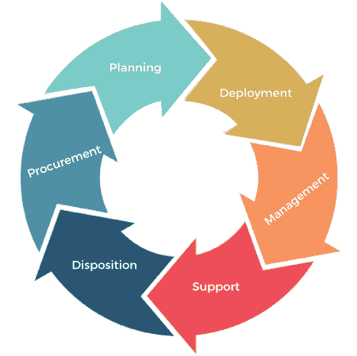
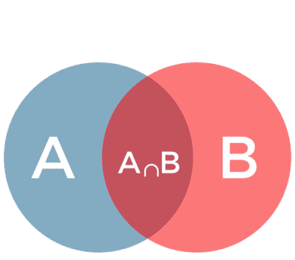
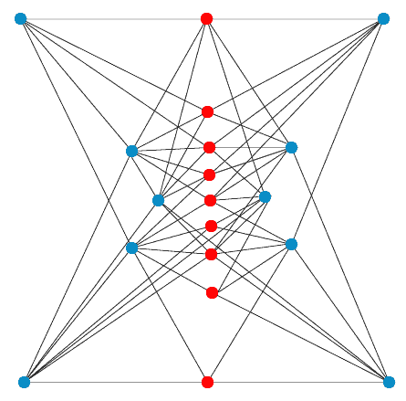
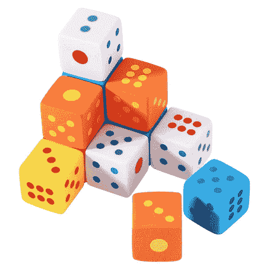
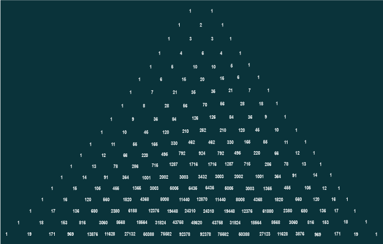
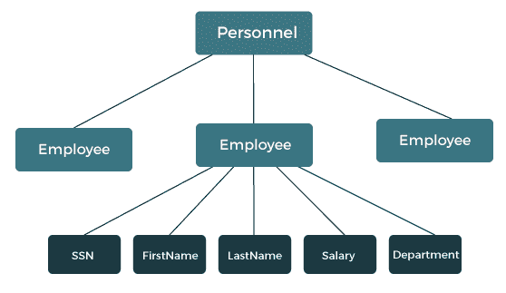

# 离散数学在计算机科学中的应用

> 原文：<https://www.javatpoint.com/applications-of-discrete-mathematics-in-computer-science>

离散数学在计算机科学中有各种各样的应用，描述如下:

### 理论计算机科学

离散数学被用来包括与计算相关的理论计算机科学。理论计算机科学大量借鉴逻辑和图论。利用理论计算机科学，我们可以通过研究算法很容易地计算出数学结果。在复杂性的情况下，我们将研究计算所花费的时间。而在可计算性的情况下，我们将研究遵循这个原则可以计算什么。可计算性与两种理论密切相关:形式语言理论和自动机理论。

我们将借助过程代数和 Petri 网为计算机科学建模，我们还可以用离散数学方法分析超大规模集成电路。在计算几何的情况下，算法将用于解决几何问题。而在计算机图像分析的情况下，将应用算法来表示图像。我们也可以研究理论计算机科学中的连续计算主题。

### 信息论

使用信息论来描述信息的量化。编码理论和信息论密切相关。它具有设计存储方法和可靠高效的数据传输的能力。信息论中还包括许多连续的主题，如模拟加密、模拟信号、数学逻辑和模拟编码。

信息论的主要关注点是在噪声信道上传输数据。利用信息论，我们可以找到一条信息的信息量。我们还可以发现，分布、事件和随机变量包含了多少信息。机器学习和人工智能广泛使用信息的度量。

### 数学逻辑

数理逻辑也可以称为形式逻辑。在逻辑学中，我们将学习有效推理和推理的原理。我们也可以研究完整性、一致性和合理性。在各种逻辑系统中，除直觉主义逻辑外，皮尔士定律(((P→Q)→P)→P)被认为是理论。在经典逻辑中，使用真值表可以非常容易地进行验证。当我们学习逻辑时，学习数学证明也很重要。

数学逻辑也有一些应用，用于软件的形式验证和自动定理证明。逻辑公式由离散结构描述，用于创建有向无环图结构和有限树。有限集合是由逻辑公式的真值产生的。有限集合受限于两个假值和真值，但是在模糊逻辑中，逻辑也会有连续的值。在无限逻辑中，我们也可以研究无限导子树或无限证明树。

### 集合论

集合论可以被描述为我们研究集合的数学分支。集合包含无限组素数或像绿色、橙色、黑色等对象。在几个领域中，我们有具有其他关系的集合和部分有序集合的各种应用。在离散数学中，我们主要关注可数集(包括有限集)。

格奥尔格·坎特的工作标志着集合论的开始，集合论被用来区分各种类型的无限集合。三角级数为描述不同类型的无穷集合提供了动力。无限集合理论的发展并不存在于离散数学的范围内。

### 组合学

组合学用来描述组合和排列离散结构的方法。在枚举组合学中，我们主要关心的是计算一些组合对象的数。例如，我们可以通过使用以十二倍方式提供的统一框架来计算分区、组合和排列。在分析组合学中，我们主要关注的是组合结构的计数。概率论和复杂分析有各种有助于分析组合学的工具。解析组合学被用来获得渐近公式。相比之下，枚举组合学用生成函数和组合公式来描述结果。

组合设计的研究将在设计理论中描述，该理论用于包含具有某些相交性质的各种子集。在划分理论中，我们将研究与特殊函数、q-级数、整数划分和正交多项式有关的各种渐近和计数问题。划分理论是分析和数论的一部分。现在它被认为是独立领域或组合学的一部分。我们可以在序理论中研究无限和有限的偏序集。

### 图论

图论可以看作是组合学的一部分。在本文中，我们将研究网络和图形，但是它已经变得足够清晰和庞大，有了自己的问题。在离散数学中，图形可以被描述为主要的研究对象。最普遍的人造和自然结构模型可以用图来描述。不同类型的关系可以用图表来建模。它还能够处理社会、生物和物理系统中的动态。

在计算机科学中，很多东西都是用图形来表示的，比如计算设备、通信网络、计算流程、数据组织等等。在数学中，图可以用于拓扑学的某些部分，即纽结理论和几何学。图论和代数理论都有着密切的联系。连续图还有另一种选择。离散数学领域将包含图论的大部分研究内容。

### 离散概率论

在可数样本事件中，会发生很多事件，离散概率论能够处理这些类型的事件。例如，假设我们正在观察鸟群中的鸟的数量以进行计数观察。在这种情况下，它将只包含{0，1，2，3}的自然数值。相比之下，假设我们正在观察鸟类的体重，以便进行连续观察。这种情况将包括实数值，像正态分布这样的连续概率分布将用于建模。

如果我们使用离散概率分布，它将近似连续概率分布，反之亦然。有些情况，比如用一副副牌做实验或者掷骰子，叫做高度约束的情况，在这些情况下，我们基本上会用枚举来计算事件发生的概率。

### 数论

在数论中，我们将主要研究数的性质，尤其是整数。它包含线性和二次同余、密码分析、丢番图方程、密码学、素数、主要测试、密码学，特别是关于模运算的几个应用。数论的其他离散方面包括了数的几何。连续数学的各种技巧也可以用于解析数论。我们也有一些超越离散对象的主题，这些主题包括丢番图逼近、超越数以及分析和函数域。

借助代数结构出现的例子有两类:连续例子和离散例子。离散代数用来包括很多东西，它们是:关系代数，用于数据库；布尔代数，用于编程和逻辑门；代数编码理论中使用的环、场、有限群和离散群；形式语言理论中出现的幺半群和离散半群。

### 计算几何和离散几何

组合几何和离散几何可以描述为几何对象离散集合的组合性质。在离散几何的情况下，一个长期存在的话题是平面的平铺。所有的几何问题都可以用计算几何的算法来解决。

### 树

树可以被称为非循环图。树通常包含非空的有限元素集，该元素集被称为节点或顶点，节点之间有连接线或边。该树没有多条边、简单的圆和循环。如果我们想找到任何实验的可能结果，树将是一个很好的选择。每个节点包含一些最小和最大度数。最小度数应为 1，最大度数可达 n，树的起始符号称为根，树的根不能为空。

### 拓扑学

拓扑学可以被描述为数学领域。它用于包含拓扑空间的子集。许多离散的主题仅仅因为使用拓扑学而兴起。我们可以通过做它们的部分来提供对拓扑不变量的关注。拓扑不变量通常取有限拓扑空间、拓扑图论、离散拓扑空间、组合拓扑、拓扑(化学)、计算拓扑等离散值。

* * *