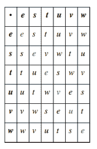

# 离散数学中的群序

> 原文：<https://www.javatpoint.com/order-of-group-in-discrete-mathematics>

在群论中，顺序这个术语可以分为两个密切相关的含义:

*   组的顺序可以用它的基数来描述，这意味着它的元素数量。
*   有时，一个订单可以被称为一个时期。所以在一个群中，元素‘a’的顺序是正整数‘m’。a 和 m 之间的关系描述如下:

am = e

**其中**

**amT3【用于指定 a 的 m 个副本的乘积**

**e** 用于指定一个组的身份元素

如果一个群的阶没有 m，那么已知 a 有无穷阶。在有限群中，所有元素都具有有限阶。

**|G|** 或**顺序(G)** 用于指定 G 组的顺序

**|a|** 或**顺序(a)** 用于指定元素 a 的顺序。

**例:**在本例中，我们将描述对称群 S 3 的乘法表。

上述组中有 6 个元素。所以顺序(S 3 ) = 6。当我们执行上表时，身份的顺序 e 是 1。s、t 和 w 中的每一个都与 e 成正方形，这意味着组元素 s、t 和 w 的阶数为 2。当枚举完成时，u 和 v 的顺序都是 u 2 = v，u 3 = vu = e，v 2 = u 和 v 3 = uv = e。

### 秩序与结构

可以使用组和元素的顺序来描述组的结构。换句话说，如果阶的因式分解是复杂的，那么群将是复杂的。

如果一个群的阶是 1，这个群将被称为平凡群。假设我们有一个元素 x，那么只有当阶(x) = 1 时，x 才会被称为恒等式。如果 x 群的每个元素都与其逆元素相等，那么群序(x)的阶将是 2，因此，群 G 将是阿贝尔的。因为 xy = (yy)xy(xx) = y(yx)(yx)x = yx。如果我们试图改变这种说法，那就不是真的。**例如**，如果循环群 Z 6 包含 6 个整数模，这个群将是阿贝尔的，但是数字 2 包含 3 的阶(2+2+2 = 6 = 0 (mod6))。

秩序的两个概念有某种关系，描述如下:

<a> = {ak : k ∈ Z}

如果生成子组，则

ord(a) = ord(<a>).

对于任意整数 k，如果我们有阶(a)除 k，只有这样我们才会有以下关系:

ak = e

一般来说，我们可以说 G 的阶除以 G 的子群阶，更准确地说:如果 G 群有 H 子群，那么它们将有以下关系:

ord(G) / ord(H) = [G : H]

**其中**

**【G:H】**用于表示 H 在 G 中的索引，为整数。这就是所谓的拉格朗日定理。

上述关系将产生一些直接的结果，其中一个组的顺序将被每个组的元素的顺序所划分。例如，在上面的对称群中，我们看到阶(S 3 ) = 6，元素的阶是 1、2 或 3。

对于有限群，下面的部分逆成立。如果 d 是一个质数，它除了群的 G 阶，在 G 中会有一个 d 阶的元素，这就是所谓的**柯西定理**。对于复合序，这种说法是不正确的，因为四阶元素在克莱因四群中不存在，这在归纳证明中有描述。这个定理产生了一些结果，即如果序(a)是 G 中每个‘a’的 p 的幂，那么群的序就是素数 p 的幂。

如果 a 具有有限阶，那么 a 的所有幂都是有限阶的。现在我们将描述幂‘a’阶的公式，如果它有有限阶:

ord(ak ) = ord(a) / gcd(ord(a), k)

在哪里

**k** 描述一个整数。

a(a -1 )和 a 的逆序相等或相同。

我们没有公式可以解释 a，b 的顺序，以及乘积 ab 的顺序。可以有这样一种情况，ab 有无限阶，但是 a 和 b 都有有限阶。可以有另一种情况，ab 有有限阶，但 a 和 b 都有无限阶。如果 a 和 b 的关系是 ab = ba，那么顺序(ab)有可能除以 lcm(顺序(a)，odr(b))。这种说法产生了一些结果，可以证明如果用 m 来指定阿贝尔群中群 s 元素的所有阶的最大值，那么每一阶元素都除 m。

### 按元素顺序计数

为了解释按元素顺序计数，我们将假设 G 用于指定 n 阶的有限群，d 用于指定 n 的除数。d 阶 G 中的元素数是φ(d)的乘积。其中φ用于指定欧拉全能函数，用于提供正整数的个数，但整数的值不会大于 d，比如我们有一个 S 3 的情况，其中φ(3) = 2，3 阶正好有两个元素。这个定理没有提供关于 2 阶元素的有用信息，因为φ(2) = 1。复合 d 只有一个有限的效用，即 d = 6，因为φ(6)=2。意思是在 S 3 中，6 阶有 0 个元素。

### 关于同态

借助群同态可以降低元素的阶。如果同态用关系 f 表示:G → H，且“a”是 G 元素，且具有有限阶，那么阶(a)将除以阶(f(a))。如果 f 是内射，则阶(f(a))将等于阶(a)或阶(f(a)) =阶(a)。我们可以用这个陈述来证明两个具体的给定群不包含同态(内射)。例如，关系 h: S3 → Z5 没有非平凡同态，因为 Z5 中除 0 之外的每个数字都包含 5 阶。在 S3，数字 0 不能划分元素的 1、2 和 3 的顺序。这有一些进一步的结果，通过这些结果共轭元素将包含相同的顺序。

### 类方程

类方程可以描述为关于阶的重要结果。它用于将有限群的阶 G 与其中心的阶 Z(G)及其非平凡共轭类的大小联系起来，描述如下:

|G| = |Z(G)| + ∑i di

在哪里

d i 用于指定非平凡共轭类的大小。这些也可以描述为|G|的适当除数，大于 1。它们也与 g 中的中心化子的指数相同。它也用于表示非平凡的共轭类。例如，平凡组可以用 S 3 的中心来表示，它只包含一个元素‘e’。S 3 的方程描述如下:

|S3 | = 1+2+3

* * *