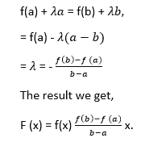
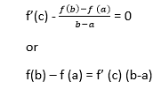
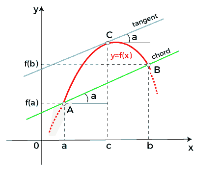
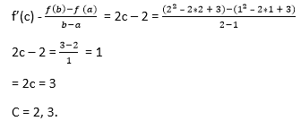
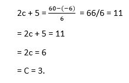

# 拉格朗德中值定理

> 原文：<https://www.javatpoint.com/lagranges-mean-value-theorem>

拉格朗日中值定理也被称为中值定理或 MVT 或 LMVT。它指出，如果函数 f (x)在闭区间[a，b]中是连续的，其中(a≤x ≤b)在开区间[a，b]中是可微的，其中(a < x< b)，那么在这个区间上至少有一个点 x = c，给定为

**f(b) - f (a) = f' (c) (b-a)**

上述定理称为第一中值定理。它能够通过线段中间点的导数值来表示给定区间内函数的增量。

**拉格朗日中值定理的证明**

考虑下面给出的辅助函数

F (x) = f (x) +？x

在这里，我们将选择一个数字？从而满足条件 F (a) = F (b)。然后

函数 F (x)在闭区间(a≤x ≤b)中是连续的，在开区间(a < x< b)中是可微的，并且在区间的端点取相等的值。所以，它满足罗尔定理的所有条件。那么，在区间(a，b)中存在一个点 c，给出为

F' (c) = 0。

因此

让我们借助一个例子来理解这个概念

例 1:

验证区间[4，6]中 f(x) = x 2 的中值定理

解决方法:在这里，首先需要检查函数在给定的封闭区间内是否连续；在我们的例子中，它是连续的。然后，您需要检查函数在开区间(4，6)中是否可微；在我们的例子中，它是可微的。

F' (x) = 2x

f(4) = 8

和 f(6) = 36

中值定理指出有一个点 c ε (4，6)这样

f' (c) = 14。

但是，

f' (x) = 2x

这意味着 c = 7。因此，在 c = 7 ε (4，6)时，我们有

f' (c) = 14

### 几何解释

拉格朗日中值定理的几何意义是，当穿过对应于线段 a 和 b 端点的图形点的弦的斜率等于

然后有一个点 x = c 位于区间[a，b]内，在此处图形的切线与弦平行。

### 物理解释

拉格朗日中值定理有一个非常清晰的物理解释。让我们考虑 f(p)代表物体沿直线运动的位置，取决于时间 p。的比值是物体在 b - a 周期内的平均速度。因为 f’(p)是瞬时速度，这个定理意味着存在时间 c 的一个时刻，其中瞬时速度等于平均速度。

拉格朗日中值定理在数学分析、计算数学等领域有着广泛的应用。让我们考虑两个不同的结果。

**输出 1**

在特定情况下，当线段[a，b]的端点处的函数 f (x)的值相等时，即 f(a) = f (b)，则中值定理意味着存在点 c ε (a，b)使得 f'(c) -  = 0

我们得到了罗尔定理，它可以看作是拉格朗日中值定理的一个特例。

**输出 2**

如果导数 f' (x)在区间[a，b]中的所有点都为零，则函数 f (x)在这个区间上是常数。毫无疑问，对于区间[a，b]中的任意两点 p1 和 p2，存在一个点 c ε (a，b)，这样

f(p2)-f(p1)= f '(c)(p2-p1)= 0。(x 2 -x 1 ) = 0

因此

F(p 1 ) = f (p 2

### 基于拉格朗日中值定理的问题

**例 1:**

从深冷柜中取出一个温度计，放入热水中。温度计从-5 摄氏度上升到 100 摄氏度需要 30 秒。求平均温度变化率。

**解决方案:**

给定；

T (t 1 ) = -5

T (t 2 ) = 100

t2-t1= 300C

正如我们所知，

平均温度变化率由拉格朗日中值定理给出的公式右侧描述。

**例 2:**

检查拉格朗日中值定理对函数的有效性

f(x) = (x 2 - 2x + 3)

在区间[1，2]上。如果定理成立，确定一个满足定理条件的点 x。

**解决方案:**

给定的二次方程在整组实数上是连续可微的。因此，我们可以在给定的方程中应用拉格朗日中值定理。函数的导数具有以下形式

F'(x) = (x 2 - 2x + 3) = 2x - 2

确定 c 点的坐标:

你可以看到点 c = 2，3 位于区间(1，2)中

**例 3:**

物体的位置由函数 s (t) = t 2 +5t - 6 给出。当物体的瞬时速度等于其在该区间内的平均速度时，确定 0 ≤t ≤6 区间内的时间 t = c。

**解决方案:**

给定的函数 s (t)满足中值定理原理，所以我们可以写

其中，s = 0，b = 6

取导数:

s'(x) = (t 2 +5t -6)' = 2t + 5

代入我们得到的方程，

* * *