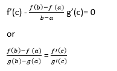
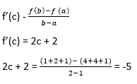
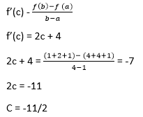

# 柯西中值定理

> 原文：<https://www.javatpoint.com/cauchys-mean-value-theorem>

柯西中值定理是正规中值定理的推广。这个定理也被称为扩展或第二中值定理。正常中值定理描述了如果函数 f (x)在闭区间[a，b]中是连续的，其中(a≤x ≤b)在开区间[a，b]中是可微的，其中(a < x< b)，那么在这个区间上至少有一个点 x = c，给定为

**f(b) - f (a) = f' (c) (b-a)**

它建立了两个函数的导数和这些函数在有限区间上的变化之间的关系。

让我们考虑函数 f(x)和 g(x)在区间[a，b]上是连续的，在(a，b)上是可微的，并且 g'(x)对于所有的 x ε (a，b)都不等于 0。那么在这个区间中有一个点 x = c，给定为

## 柯西中值定理的证明

这里柯西公式左边的分母不为零:g(b)-g(a) ≠ 0。如果 g(b) = g(a)，那么由罗尔定理可知，有 d 点吗？(a，b)，其中 g'(d) = 0。因此，与 g'(x) ≠ 0 为所有 x 的假设相矛盾？(a，b)。

现在，我们应用辅助函数。

f(x)= f(x)+g(x)

并以满足给定条件的方式选择λ

F (a) = f (b)。我们得到，

f (a) + λg(a) = f (b) + λg(b)

= f(b)-f (a) = λ[g(a)- g(b)]

函数 F (x)以形式存在

函数 F (x)在闭区间(a≤x ≤b)中是连续的，在开区间(a < x< b)中是可微的，并且在区间的端点取相等的值。所以，它满足罗尔定理的所有条件。那么，在区间(a，b)中存在一个点 c，给出为

F' (c) = 0。

因此

通过将 g (x) = x 放入给定的公式中，我们得到拉格朗日公式:

柯西中值定理具有给定的几何意义。考虑参数方程给出一条曲线？X = f (t)和 Y = g (t)，其中参数 t 位于区间[a，b]内。

当我们改变参数 t 时，给定图中曲线的点从 A (f (a)开始。g(a)至 B (f(b)，g (b))。

根据柯西中值定理，曲线上有一点(f(c)，g(c))？其中切线平行于连接曲线两端 A 和 B 的弦。

## 基于柯西中值定理的问题

问题 1:

计算 x 的值，它满足下列函数的中值定理

F(x) = x 2 + 2x + 2

解释:

考虑到

f(x) = x 2 + 2x + 2

根据中值定理，

2c = -7

C = -7/2

问题 2:

计算满足下列函数中值定理的 x 的值

F(x) = x 2 + 4x + 7

解释:

考虑到

f(x) = x 2 + 4x + 7

根据中值定理，

* * *