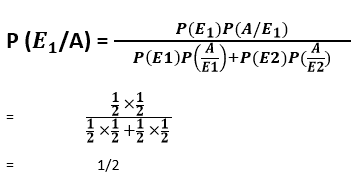

# 条件概率的贝叶斯公式

> 原文：<https://www.javatpoint.com/bayes-formula-for-conditional-probability>

贝叶斯定理指出，事件的概率是基于可能与事件相关的条件的先验知识。它也被用来考察条件概率的情况。如果我们知道条件概率，我们可以使用贝叶斯公式来计算反向概率。让我们借助一个例子来理解这个概念。假设我们必须确定从三个不同的球袋中的第二个袋中取出一个黑球的概率，其中每个袋包含三个不同的球，例如红色、蓝色、黑色。在这种情况下，根据其他条件计算事件发生的概率称为条件概率。本文将结合实例讨论贝叶斯定理、公式、推导的表述和证明。

假设事件 B 已经发生，A 发生的概率等于事件 A 发生的概率和事件 B 发生的概率的乘积，除以事件 B 发生的概率。

如果你抛两个硬币，它们都是反面朝上的概率是多少？有四种可能的结果；

硬币 1:正面，硬币 2:正面

硬币 1:正面，硬币 2:反面

硬币 1:尾部，硬币 2:头部

硬币 1:尾部，硬币 2:尾部

这些结果中只有一个和“两者都是尾部”是一回事。因此，我们有四分之一的机会得到两条尾巴，这是简单概率的基本例子。

“有条件的”部分是我们开始向组合中加入额外信息的地方。现在，让我们问一个问题:“如果硬币 1 正面朝上，我们得到两个正面的概率是多少？”经历这些:

硬币 1:正面，硬币 2:正面

硬币 1:正面，硬币 2:反面

所以，在硬币 1 正面朝上的情况下，有二分之一的概率是正面朝上。

### 贝叶斯定理的陈述

让 E 1 ，E 2 ，E 3 ，……。En 是与样本空间 S 相关的一组事件，其中所有事件 E 1 ，E 2 ，E 3 ，……。En 有非零的出现概率，它们构成 S 的一个划分，假设 A 是与样本空间 S 相关的事件，那么根据 Baye 定理。

对于变量 k = 1，2，3，…..n

### 贝叶斯定理的证明

根据条件概率公式

基于贝叶斯定理的例子

例 1

一个包 P 包含 6 个白色和 6 个蓝色的球，而另一个包 Q 包含 3 个白色和 3 个蓝色的球。从其中一个袋子里随机抽出一个球，发现是蓝色的。计算从 p 袋中取出的概率。

解决方案:

设 E 1 为选袋 P 事件，E 2 为选袋 Q 事件，A 为抽蓝球事件。

然后，

p(e1= p(e2)= p

还有，

P(A/E 1 ) = P(从 P 袋中抽出一个蓝色的球)= 6/12 =

P(A/E 2 ) = P(从 Q 袋中抽出一个蓝色的球)= 3/6 =

利用贝叶斯定理，从两个袋子 P 和 Q 中抽出一个蓝色球的概率如下。

**例 2**

众所周知，一个人说真话的次数是 5 次中的 3 次。他掷出一个骰子，报告说他得到的数字是五。计算得出的数字实际上是 5 的概率。

**解决方案:**

设 A 为该男子报告获得第五名的事件。

让 E 1 为获得四的事件，E 2 为其互补事件。

那么，P (E 1 ) =五发生的概率= 1/6

P(E2)= 5 不发生的概率= 1 - P(E 1 ) = 1 - 1/6 = 5/6

还有，P (A/E 1 ) =人报五的概率，是五= 3/5

P (A/E 2 ) =人报五，不是五的概率，

= 2/5

利用贝叶斯定理，得到的数实际上是 5 的概率，

* * *