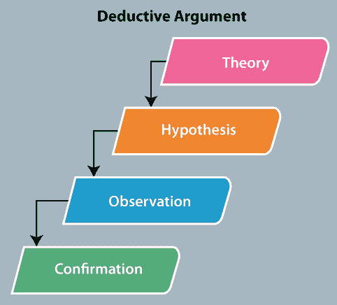
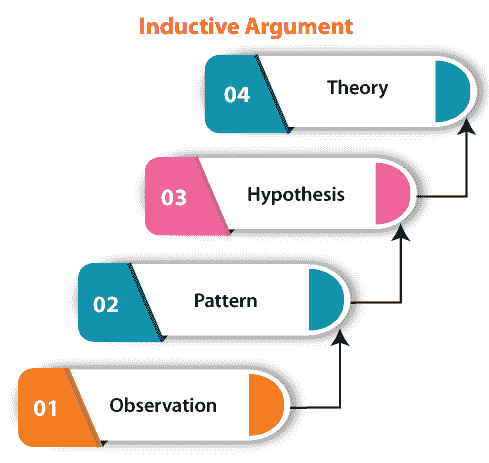
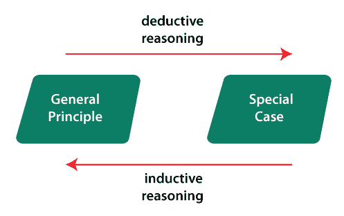

# 离散数学中的论点

> 原文：<https://www.javatpoint.com/arguments-in-discrete-mathematics>

在离散数学中，论证可以被描述为哲学和逻辑推理的一部分。它也可以用于数学证明。在这一节中，我们将展示逻辑推理和一般生活中的论点。在逻辑推理中，数学逻辑被用来证明逻辑证明。该证明可以描述为一种有效的参数，用于确定数学陈述的真值(真或假)。**论点**可以描述为一系列陈述或命题。它通常有前提和结论。前提用来表示剩余陈述，结论用来描述结束陈述。

**前提**将由 p1、p2、p3、？、pk 和**结论**或最终陈述将由 q 表示。最终陈述可以借助符号“∴".”进行处理该参数将以下列形式表示:

```

p → q
p
______________
∴ q

```

如果一个论点的陈述是**前提，**在这种情况下，前提可以用来提供支持。如果一个论点的陈述是结论，在这种情况下，结论用于表明前提旨在提供支持。

一般来说，争论的目标是说服某人某事。如果有人不同意或怀疑我们的观点或主张，借助论据，我们必须说服他同意我们的观点。**例如:**为了开始论证，我们需要一个读者有所怀疑的具体观点。读者必须在这场争论结束时被说服，他们必须不再对这一观点有任何怀疑。最后或结束语句也称为结论，其余语句也称为前提。

如果我们必须辩论得好，我们必须把自己放在读者的位置上，把读者对我们观点的怀疑放在一边。当我们听到论点这个词时，我们有时会认为它相当具有攻击性和敌意，但事实并非如此。如果一个论点是好的，它将是相当平静的，公平的，合理的。

## 论据示例

**例 1:**

```

No, you can't go to a college picnic for 2 days.
All my college friends are going!
And if all your friends jumped from the bridge, would you also jump too?

```

这种说法很常见，父母一直用在孩子身上。它使用了一种被称为修辞的技术，我们试图证明另一个人(在这个例子中，另一个人是儿子)的推理在得出其逻辑结论时是无效的。在这个例子中，儿子正在和父母争论:我的朋友要去野餐，所以我也想去。父母表明儿子的论点是如何失败的。

## 参数的类型

论证基本上有三种类型:有效论证、演绎论证和归纳论证。

### 有效参数

一个有效的论点可以被描述为这样一个论点:如果它的所有前提都是真的，那么这个论点的结论也将是真的。如果真前提包含在有效参数中，则该参数将被称为声音。这些论点可以是合理的，也可以是不合理的，可以是有效的，也可以是无效的，我们没有中间立场。假设有效参数包含前提 p1、p2、p3，...，pk 和结论为 q。那么有效参数将描述如下:

```

(p1 ∩ p2 ∩ p3 ... ∩ pk) → q is a tautology. 

```

**例如:**

```

((p → q) ∩ p) → q is a topology

```

我们可以通过检查真值表中的关键行来检查参数的有效性。关键行是一种类型的行，其中真值由所有前提显示，这些真值也对应于结论的真值。

**有效参数示例**

**例 1:** 我们要检查自变量(p∞q，p → r，q → r，∴ r)是否有效。

**解:**在这种情况下，前提用 p∞q，p → r，q → r 表示，结论用 r 表示，如果所有前提都为真，真前提也对应结论的真值，这种说法才成立。为了区分前提和结论，我们将使用不同的颜色。灰色为前提，红色为结论。我们将借助真值表来证明这一点，真值表描述如下:

| P | q | 稀有 | p∞q | p → r | q → r |
| T | T | T | T | T | T |
| T | T | F | T | F | F |
| T | F | T | T | T | T |
| T | F | F | T | F | T |
| F | T | T | T | T | T |
| F | T | F | T | T | F |
| F | F | T | F | T | T |
| F | F | F | F | T | T |

在该表中，所有灰色阴影位置都包含真实值。这就是为什么所有这些阴影行都是关键行，这些行对应于 r 的真值，所以在这个表中，如果前提(p∞q，p → r，q → r)为真，那么结论(r)也为真。因此，上述参数(p∞q，p → r，q → r，∴ r)是**有效的。**

**例 2:** 我们要检查自变量(p → q，∴∨p→∞q)是否有效。

**解:**这种情况下，前提用 p → q 表示，结论用∨p→∞q 表示，如果所有前提都是真的，真前提也对应结论的真值，这个说法才成立。为了区分前提和结论，我们将使用不同的颜色。灰色为前提，红色为结论。我们将借助真值表来证明这一点，真值表描述如下:

| P | q | p。p | 问你个问题 | p → q | p→q |
| T | T | F | F | T | T |
| T | F | F | T | F | T |
| F | T | T | F | T | F |
| F | F | T | T | T | T |

在该表中，关键行失败，因为在第三行中，前提(p q)为真，而结论的值为假。因此，上述论点无效。

**例 3:** 我们要检查自变量(p → q，q → r，∴p∞q→r)是否有效。

**解:**在这种情况下，前提用 p → q，q → r 表示，结论用 p∞q→r 表示，如果所有前提都为真，真前提也对应结论的真值，这种说法才成立。我们将借助真值表来证明这一点，真值表描述如下:

| p | q | r | p∞q | p → q | q → r | p∞q→r |
| T | T | T | T | T | T | T |
| T | T | F | T | T | F | F |
| T | F | T | T | F | T | T |
| T | F | F | T | F | T | F |
| F | T | T | T | T | T | T |
| F | T | F | T | T | F | F |
| F | F | T | F | T | T | T |
| F | F | F | F | T | T | T |

在该表中，所有关键行对应于结论的真实值。因此，参数(p → q，q → r，∴p∞q→r)是**有效的。**

在逻辑上，“有效”和“真”的含义是不同的。在有效性中，我们将检查结论是否来自前提，而在真实性中，我们将看到陈述是否在构成论点。根据前提的真值，一个错误的结论可能包含在完全有效的论点中。与基于前提的真值一样，一个真实的结论也可能包含在无效的论证中。

**例如:**在这个例子中，我们将采取上面的论点，即

```

p → q 
q → r 
∴ p ∨ q → r

```

正如我们在上面的例子 3 中看到的，这个论点是完全有效的。所以我们会假设 p 是“我睡得很多”，q 是“我学习不多”，r 是“我会考得很好”。因此，这种说法会被翻译成:“如果我睡得多，那么我就不会学习很多。如果我学习不多，那么我会在考试中取得好成绩。因此，如果我睡得多或者学习不多，我考试就会考得很好。”

我们已经看到，这个论点是完全有效的，但它显然不是一个真正的结论。因为借助第一个假设，它是真的，而第二个假设是假的。那个；这就是为什么结论也是错误的。

### 演绎论证

在离散数学中，演绎论证是一种论证类型，其中如果前提具有真值，那么结论的结果将总是真值。永远不会有前提具有真值而产生结论的假值的情况。所以我们可以说，有前提成功保证的论点，在这种情况下，结论将被称为演绎或有效论点。



**演绎论证示例:**

**例 1:**

```

All dogs barks
Jackson is a dog
______________
Jackson barks

```

**例 2:**

```

Bachelors are unmarried men
John Smith is unmarried
______________
John Smith is a bachelor. 

```

**例 3:**

```

The students must have 120 credits if they want to get their bachelor's degree at Delhi University.
Marry has 140 credits.
______________
Marry has a bachelor's degree. 

```

所有例子的前两个陈述都是真的，这就是为什么结论也会是真的。

**例 4:** 有效演绎论证

```

It's winter in Canada. 
If it is winter in Canada, then she must be carrying woolen clothes. So, she must be carrying woolen clothes.     

```

在这个例子中，我们可以看到结论跟在单词“So”后面。如果上述两个前提为真，则为结论的真实性提供了保证。没有办法帮助我们确定这两个前提是否成立。所以我们不能说这个论点是演绎合理的还是不合理的。它是其中之一，但我们不知道它是哪一个。如果我们发现给定的论点包含错误的前提，因此是不合理的，就不可能改变它有效的事实。

### 归纳论点

归纳论证旨在借助论述者。如果所有的前提都表明了真值，那么这个论点就会被认为是强有力的，那么结论就不可能是假的。在归纳论证中，前提的真实性为我们提供了一个很好的理由，这样我们就可以相信结论可能是正确的。在本节中，我们将使用术语“强”来表示成功的归纳论证，但实际上，这并没有标准术语。如果归纳论证不强，就会被称为弱。但是没有一条能够区分强者和弱者的锋利的线。

**例如:**假设有“狗咬我”的说法。如果我们不能想出任何相关的条件来解释为什么下一次与上一次相比会有所不同，这个论点将被称为更强有力的。如果有“我确实遛狗了”的案例，这种说法会变得更加有力。如果出现“我曾经遛狗”的情况，论证会越时间越弱。如果下一个时间条件不同于与过去时间相关的相关条件，则论证会更弱。比如狗在过去的时间里一直坐在一扇关着的门后面，但是下一次门会被打开。



如果我们获得一些新的前提(证据)，在这种情况下，归纳论证会受到影响，但在演绎论证中不会发生这种情况。**例如:**这里我们将这样描述一个强归纳论证:

```

Today, Jackson confess that he likes Marry 
So, Jackson likes Marry today. 

```

但是当增加以下前提时，上述归纳论证的强度将发生根本变化:

```

Jackson confesses to Smith that he did not really like Marry. 

```

**示例:**

```

"Everyone knows that the sun has rises in the east and set in the west. Therefore, the same process is going to be happened tomorrow". 

```

上述论点几乎肯定是正确的。这种论点很容易被大多数人接受。然而，就像演绎论证一样，我们注意到这不是逻辑确定性的问题，而是**概率的问题。**因为外星人有可能来毁灭太阳。由于这种破坏，太阳再也不会落下或升起。这种情况极不可能，但也不是逻辑上不可能。

因此，在严格的逻辑条件下，演绎论证似乎比归纳论证更有力。归纳论点更重要，归纳论点有一个至关重要的优势。在日常生活中，我们几乎所有的决策都是借助于这样的归纳推理做出的:

```

The distance from my house to my workplace is half an hour, so if I leave at 8:30 AM, I will be able to probability reach there by 9\. 
Jack is my best friend, and he gave me the advice to be regular in classes, and his advice is usually good, so I decided to follow his advice. 
Yesterday I got punishment for coming late, so I will go on time today. 
All the above inferences are inclusive, and it is also based on reasonable certainty. The conclusions of these inferences are often trivial.  

```

借助于论证中使用的词语，我们无法区分归纳论证和演绎论证。我们可以通过了解论证者的意图来做到这一点。可以借助论证者所相信的前提和结论之间的关系来确定。如果论证者认为一个结论的真理肯定是由前提的真理建立的，那么这个论证将被称为**演绎**。如果论证者相信前提的真理为我们提供了一个很好的理由，使我们能够相信结论可能是正确的，那么这个论证将被称为**归纳**。假设有一些人正在评估论证的质量，他们没有任何与论证者意图相关的信息。在这种情况下，他们必须检查两个参数。在这里，我们访问参数，以便我们可以看到它是归纳性强还是演绎性有效。



## 论点的重要性

日常生活中最重要的技能还是离散数学，还有很多地方，就是论证。如果我们获得了说服艺术的硕士学位，我们就能够非常容易地说服人们。因为这项技能，我们在事业、大学或学校都会非常成功。假设我们非常擅长做论点，并且有说服力，那么我们可以说服我们的父母、老师、经理、老板或领导我们的观点。在这种情况下，我们将是无敌的。所以我们已经意识到论证的力量是非常巨大的。

我们还应该知道好的论点和坏的论点之间的区别。我们能够在我们的新闻频道、日常生活或学校谈话中看到好的和坏的争论。在批判性思维的情况下，一个论点可以被描述为一项基本任务。假设一个人没有辩论的技巧。在这种情况下，广告商或政客很容易误导他，因为他们总是试图说服他购买他们的产品，即使产品不好，或者试图说服他投他们的票

## 争论和战斗的区别

在新闻频道看体育分析和政治辩论的时候，很多人有时候会给人一种争论带有攻击性和敌意的印象。他们认为他们的主要目标是击败对手，而不是说服任何人。但这是否总是真的并不重要。事实上，如果一场争论来自友谊和同情的地方，它将被认为是最好的。如果我们的朋友和我们的观点不同，他们总是试图用一种可以建立理解的方式来解释他们观点背后的原因。正因为如此，才会产生友好的辩论或争论。

我们在生活中绝对应该学习和遵循的最重要的技能是辩论。无论是个人的还是职业的，我们都无法避免人际关系中一定程度的分歧和冲突。这种冲突可能发生在你的老板、员工、妻子、父母或任何人身上。如果我们不能用理性和逻辑进行辩论，我们将永远以战斗结束我们的辩论。争论结束时，我们必须达成协议。如果没有达成一致的可能性，我们至少应该明白为什么不可能达成一致的原因。而在**打架的情况下，**我们会表达自己受到伤害、愤怒等情绪。在战斗的时候，我们从不在乎另一个人的观点。生气的时候，我们通常会对着对方大喊大叫。相反，如果我们能做正确的论证，这个问题是可以解决的。在战斗的情况下，情况通常会变得更糟。

* * *