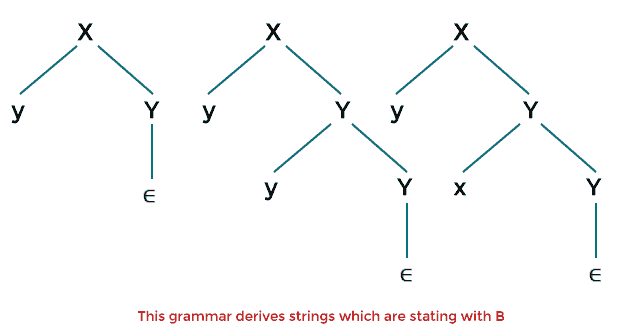
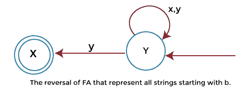
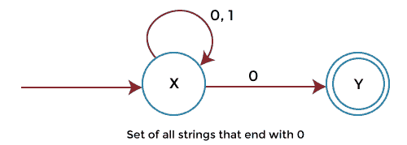

# 离散数学中的正则语法

> 原文：<https://www.javatpoint.com/regular-grammar-in-discrete-mathematics>

常规语言可以由常规语法生成。在常规语法中，左侧总是由一个非终结符组成。左侧不能有多个非终端变量或任何终端变量。右侧可以有一个终端，也可以有一个终端后跟一个非终端。

常规语法的生成将采用以下形式:

```

X → xY 
X → x
X → Yx 

```

**其中**

x 和 Y 用来表示变量(V)。

“x”用于表示端子串(T*)

## 正则语法的类型

常规语法有两种类型，描述如下:

*   左线性语法(LLG)
*   右线性语法(RLG)

### 左线性语法

在左线性语法中，产品必须是以下形式。

```

X → xY 
X → x

```

在哪里

x，Y 属于一个变量(V)，' x '属于 T*。

### 右线性语法

在正确的线性语法中，产品必须是以下形式。

```

X → Yx 
X → x

```

**其中**

x，Y 属于一个变量(V)，' x '属于 T*。

正则语言可以被描述为由类型 3 语法生成的语言，并且可以为其设计有限自动机。它能够将 FA 转换成 3 型语法。

**示例:**在本例中，我们将展示有限自动机接受以符号 y 开头的字符串。


```

∑ = {x, y}
Initial State (q0) = X
Final State (F) = Y

```

FA 对应的右线性语法描述如下:

```

X → yY 
Y → ∈/xY/yY

```

我们可以看到，上面的语法是右线性语法。这个语法可以通过有限自动机直接编写。



可以在上面的 RLG 的帮助下生成一个字符串，它以 b 开头。在 b 之后，这个字符串可以接受任何输入符号(即∑ = {x，y})。

```

The regular language which corresponds to the right linear grammar is described as follows:
L = {y, yx, yy, yxx, yxy, yyx, yyy ......}

```

如果我们颠倒右上方线性语法(RLG)的产生，我们将得到下面的语法:

```

X → Yy
Y → ∈/Yx/Yy

```

该语法推导出所有字符串都以 b 结尾的语言，描述如下:

```

L' = {y, yy, xy, xxy, yxy, xyy, yyy .......}

```

总之，我们可以说假设我们有表示语言 L 的有限自动机，我们把它转换成右线性文法，右线性文法也表示同一个语言 L，在这种情况下，当我们把 RLG(右线性文法)反过来，就会得到表示语言 L’的左线性文法，这就是 L 的反过来。

### 将 RLG 改为 LLG

当我们将语言 l 的右线性语法转换为左线性语法时，将使用以下步骤。

**第一步:**对于语言 L，我们要反向 FA(有限自动机)。

**第二步:**之后，我们要为它写出正确的线性语法。

**第三步:**现在，我们将逆转 RLG。

在第三步之后，我们将得到生成语言的语法，它能够表示相同语言 l 的左线性语法。


这里 L 用于描述 FA(有限自动机)的语言，L <sup>R</sup> 用于描述语言 L 的反转。

**示例:**

在这个例子中，我们将使用上面的有限自动机表示语言 L，并接受所有以符号 y 开头的字符串，这种语言包含输入符号(即∑ = {x，y})。这里我们将把这个自动机转换成左边的线性语法。

**解决方案:**

**第一步:**有限自动机的反转描述如下:



**第二步:**对于这个反转 FA，对应的右线性语法描述如下:

```

Y → xY / yY / yX  
X → ∈ 

```

**第三步:**

现在我们将颠倒上面的右线性语法，得到下面的语法:

```

Y → Yx / Yy / Xy  
X → ∈ 

```

这个语法是左线性语法，用来表示所有以符号 y 开头的字符串

```

L = {y, yx, yy, yxx, yxy, yyx, yyy ......}

```

### RLG(右线性语法)到 FA(有限自动机)的转换:

我们将从第一次生产开始。

从每一个左边的变量/字母表，我们将转到它后面的符号。

**开始状态:**第一个生产状态称为开始状态。

**最终状态:**所有以终端结束而没有跟随任何其他非终端的状态。

**示例:**

在这个例子中，我们有正确的语言 l 的线性语法。这个语法显示了所有以 0 结尾的字符串。

```

X → 0X / 1Y / 0Y  
Y → ∈ 

```

因此对应于右线性语法的有限自动机描述如下:

这里我们将从变量 X 开始，并像这样使用它的生产:

*   生产 X → 0X 意味着当转换得到‘0’作为输入符号时，那么状态转换将始终保持在相同的状态 X。
*   生产 X → 1Y 意味着当转换得到‘1’作为输入符号时，那么状态转换将从状态 X 进入状态 Y。
*   生产 X → 0Y 意味着当转换得到‘0’作为输入符号时，那么状态转换将从状态 X 进入状态 Y。
*   生产 Y → ∈意味着该状态不需要任何类型的状态转换。在相应的 FA(有限自动机)中，这种类型的生产将是最终状态，因为它的 RHS 是终端。

因此，对于相应的右线性语法，最终的 NFA(非有限自动机)描述如下:



**LLG 转 FA:**


**说明:**

这里我们首先把 LLG 转换成 RLF 语法。这里 LLG(左线性语法)代表语言 L，RLG(右线性语法)代表语言 L 的反转，即 L <sup>R</sup> 。之后我们会设计这个反转语言对应的 FA(L<sup>R</sup>)。之后，我们将反转有限自动机(FA)。逆转 FA 是 l 语言的最终 FA。

**LLG 转化为 RLG**

为了解释这一点，我们将采用上面用来表示语言 L 的语法，并接受以变量 y 开头的所有字符串集。该语法的左线性语法描述如下:

```

Y → Yx / Yy / Xy  
X → ∈ 

```

**第一步:**

在这一步，我们将把 LLG 转化为英足总。有与上述相同的转换过程。因此


**第二步:**

在这一步，我们将逆转足总。这意味着我们将初始状态转换为最终状态，最终状态转换为起始状态。我们还将反转所有边缘，如下所示:


**第三步:**

在这一步中，我们将编写与反向有限自动机相对应的 RLG。

```

X → yY  
Y → xY/yY/ ∈

```


* * *